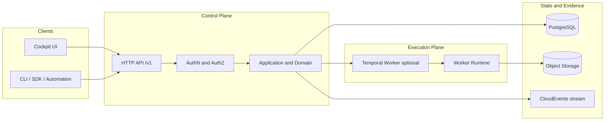

# Portarium

**Open-source multi-tenant control plane for governable business operations.**

Portarium is the public product name. You will also see **VAOP** in technical documentation and domain modelling.

> Status: early and actively built.
>
> - Runtime entrypoints are available for a control plane and execution-plane worker.
> - The OpenAPI v1 contract is defined and evolving.
> - Some persistence and integration paths are intentionally stubbed during scaffold phases.

## Badges

[](https://github.com/45ck/Portarium/actions/workflows/ci.yml)
[](https://github.com/45ck/Portarium/actions/workflows/nightly.yml)
[](https://github.com/45ck/Portarium/actions/workflows/ci-infra.yml)

## What Portarium Is

Portarium coordinates governable work across systems of record through Ports and Adapters.

- Domain-first modelling with a shared canonical language
- Control plane policies, approvals, and audit-ready evidence
- Execution-plane worker runtime for durable orchestration and machine actions

If you are new, start here:

- `docs/index.md`
- `docs/getting-started/local-dev.md`
- `docs/getting-started/dev-workflow.md`

## Architecture Overview



## Installation

Prerequisites:

- Node.js `>=22`
- Docker + Docker Compose
- npm

```bash
npm ci
```

## Quickstart

Start local infrastructure:

```bash
docker compose up -d
```

Run control plane:

```bash
npx tsx src/presentation/runtime/control-plane.ts
```

Check health:

```bash
curl -s http://localhost:8080/healthz
```

Run execution-plane worker:

```bash
PORTARIUM_ENABLE_TEMPORAL_WORKER=true npx tsx src/presentation/runtime/worker.ts
```

Check health:

```bash
curl -s http://localhost:8081/healthz
```

## API Notes

- Base path: `/v1`
- Workspace scope: `/v1/workspaces/{workspaceId}/...`
- Error envelope: `application/problem+json`
- Auth defaults to `401` on protected routes when JWT/JWKS is not configured

Source of truth:

- `docs/spec/openapi/portarium-control-plane.v1.yaml`

## Developer Workflow

1. Read `CLAUDE.md` and `docs/development-start-here.md`.
2. Track work in Beads (`npm run bd -- issue next --priority P1`).
3. Implement with tests.
4. Run full gates before PRs:

```bash
npm run ci:pr
```

Migration checks:

```bash
npm run migrate:ci
npm run migrate:deploy
```

## Documentation Map

- `docs/index.md` - entry point
- `docs/tutorials/` - guided learning
- `docs/how-to/` - task recipes
- `docs/reference/` - contracts and factual references
- `docs/explanation/` - architecture and rationale

## Contributing

See `CONTRIBUTING.md` for contribution flow, quality gates, and review expectations.

## License

License is being finalised. Until a `LICENSE` file is added, treat repository content as all rights reserved.
