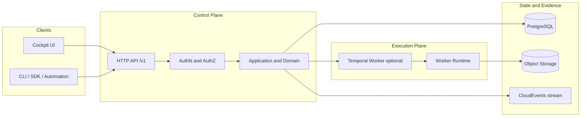

# Portarium

**Open-source control plane for governable operations across your existing systems.**

Portarium is the product name. **VAOP** is the internal architecture acronym used in technical docs and domain modelling.

Portarium helps teams automate real operational work without losing control:
policies stay enforceable, approvals stay explicit, and every run produces evidence you can audit.

> Status: early and actively built
>
> - Runtime entrypoints are available for a control plane and execution-plane worker.
> - The OpenAPI v1 contract is defined and evolving.
> - Some persistence and integration paths are intentionally stubbed during scaffold phases.

## Badges

[](https://github.com/45ck/Portarium/actions/workflows/ci.yml)
[](https://github.com/45ck/Portarium/actions/workflows/nightly.yml)
[](https://github.com/45ck/Portarium/actions/workflows/ci-infra.yml)

Badge links target the upstream repository (`45ck/Portarium`).

## Why Portarium

Most automation stacks force a tradeoff:

- move fast, but lose traceability and policy control
- enforce control, but slow everything down with manual process

Portarium is designed to close that gap.
It is a governance-first control plane that coordinates workflows across systems of record through stable Ports and provider-specific Adapters.

## What You Get

- Policy-aware execution tiers (`Auto`, `Assisted`, `Human-approve`, `Manual-only`)
- Workspace-scoped API with RFC 7807 error envelopes
- Durable execution model with control-plane + execution-plane runtime split
- Evidence-oriented operation history for review and auditability
- Domain-first model and strict architecture boundaries

## Typical Use Cases

- Introduce approval gates for high-risk operational actions
- Orchestrate cross-system business workflows without rewriting your SoRs
- Centralize operational evidence and decision history
- Build internal automation with explicit tenancy and RBAC boundaries

## Current Scope (and Non-Goals)

Portarium is currently focused on API/runtime foundations and governance primitives.
It is not trying to replace ERP/CRM/helpdesk systems or become a full BPM suite UI.

If you are new, start here:

- `docs/index.md`
- `docs/getting-started/local-dev.md`
- `docs/getting-started/dev-workflow.md`

## Architecture Overview



## Installation

Prerequisites:

- Node.js `>=22`
- Docker + Docker Compose
- npm

```bash
npm ci
```

## Quickstart

Start local infrastructure:

```bash
docker compose up -d
```

Run control plane:

```bash
npx tsx src/presentation/runtime/control-plane.ts
```

Check health:

```bash
curl -s http://localhost:8080/healthz
```

Run execution-plane worker:

```bash
PORTARIUM_ENABLE_TEMPORAL_WORKER=true npx tsx src/presentation/runtime/worker.ts
```

```powershell
$env:PORTARIUM_ENABLE_TEMPORAL_WORKER = "true"
npx tsx src/presentation/runtime/worker.ts
```

Check health:

```bash
curl -s http://localhost:8081/healthz
```

What success looks like in scaffold stage:

- both runtimes respond on `/healthz`
- protected `/v1` routes return `401` until JWT/JWKS auth is configured

## API Notes

- Base path: `/v1`
- Workspace scope: `/v1/workspaces/{workspaceId}/...`
- Error envelope: `application/problem+json`
- Auth defaults to `401` on protected routes when JWT/JWKS is not configured

Source of truth:

- `docs/spec/openapi/portarium-control-plane.v1.yaml`

## Developer Workflow

1. Read `CLAUDE.md` and `docs/development-start-here.md`.
2. Track work in Beads (`npm run bd -- issue next --priority P1`).
3. Implement with tests.
4. Run full gates before PRs:

```bash
npm run ci:pr
```

Migration checks:

```bash
npm run migrate:ci
npm run migrate:deploy
```

## Documentation Map

- `docs/index.md` - choose-your-path entrypoint
- `docs/getting-started/` - first run + contributor workflow
- `docs/tutorials/` - guided examples
- `docs/how-to/` - task-oriented guides
- `docs/reference/` - contracts, runtime/env, schemas, CI gates
- `docs/explanation/` - architecture and rationale

## Contributing

See `CONTRIBUTING.md` for contribution flow, quality gates, and review expectations.

## License

License is being finalised. Until a `LICENSE` file is added, treat repository content as all rights reserved.
