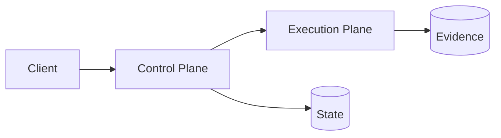

# Architecture Template

---

title: Architecture
kind: explanation
last_reviewed: YYYY-MM-DD
owners: ["@owner"]

---

## System goals

## High-level diagram

## Trust boundaries

## Data and control flow

## Operational concerns

## Open questions
