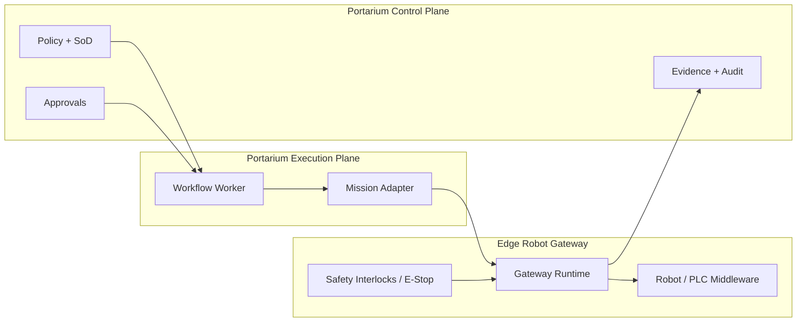

# ADR-0066: Robotics Integration Architecture Boundary

## Status

Accepted

## Context

Portarium needs a clear robotics integration boundary so workflow automation can safely include robot actions without taking ownership of real-time control loops or local safety enforcement.

Without an explicit split, control-plane policy and approval logic can leak into latency-sensitive edge execution paths, and edge-specific protocol concerns can leak back into the domain model.

## Decision

Portarium uses a three-layer architecture for robotics integrations:

1. Control and decision plane (Portarium control plane)
2. Execution plane (Portarium workers and adapters)
3. Edge robot gateway (robotics middleware / PLC-facing runtime)

Portarium issues high-level mission goals and policy-gated intents only. Servo loops, emergency stop handling, and local interlocks remain at the edge gateway.

### Layer responsibilities

- Control and decision plane:
  - policy evaluation, SoD, approvals, evidence, audit, tenancy boundaries
  - records command intent and outcome evidence
- Execution plane:
  - invokes registered mission adapters with containment and retries
  - normalizes telemetry/events into Portarium contracts
- Edge robot gateway:
  - translates mission intent into robot-native commands
  - enforces local safety interlocks and real-time constraints
  - owns protocol/session behavior against robot networks

### Protocol selection by integration class

- gRPC: default general-purpose gateway protocol for typed command/response APIs
- ROS 2 Action bridge: robot-native mission execution in ROS-based fleets
- MQTT: IoT/PLC-style command and telemetry transport
- OPC UA: industrial control and plant integration

### Architecture diagram

## Consequences

- Keeps safety-critical control local to the edge while retaining policy and evidence integrity in Portarium.
- Enables multiple robotics protocol adapters without changing core workflow/policy semantics.
- Establishes stable boundaries for mission APIs, telemetry normalization, and governance controls.

## References

- `bead-0497` Domain Atlas robotics taxonomy
- `bead-0505` ADR implementation bead
