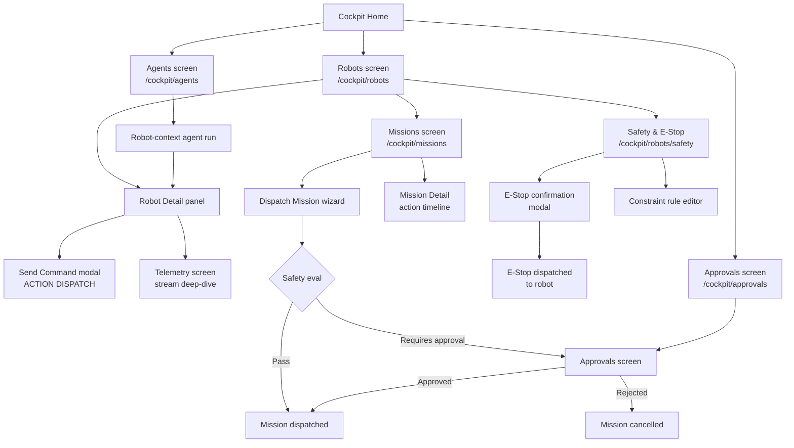

# Domain Atlas: Robotics Cockpit UX Taxonomy

> Version 1.0 · 2026-02-18 · bead-0504

This document defines the UX-facing data models, screen inventory, navigation flows, and RBAC matrix for the robotics extension to Portarium Cockpit.

---

## 1. Data Models

### 1.1 Robot

Represents a single physical device enrolled in a Portarium tenant workspace.

```typescript
interface Robot {
  robotId: RobotId; // branded primitive
  tenantId: TenantId;
  displayName: string; // human label, e.g. "AMR-07 (Bay 3)"
  robotClass: RobotClass; // AMR | AGV | MANIPULATOR | UAV | PLC | HUMANOID
  manufacturer: string;
  modelName: string;
  serialNumber: string;
  firmwareVersion: string;
  gatewayId: RobotGatewayId;
  fleetId?: FleetId;
  enrolledAt: Timestamp;
  lastSeenAt: Timestamp;
  operationalStatus: RobotOperationalStatus; // ONLINE | OFFLINE | DEGRADED | ESTOP
  currentMissionId?: MissionId;
}
```

### 1.2 Fleet

A named group of robots within a workspace, managed as a unit.

```typescript
interface Fleet {
  fleetId: FleetId;
  tenantId: TenantId;
  displayName: string;
  description?: string;
  robotIds: RobotId[];
  gatewayId: RobotGatewayId; // primary gateway for this fleet
  createdAt: Timestamp;
  operatorIds: UserId[]; // users with operator access to this fleet
}
```

### 1.3 Mission

A high-level task dispatched to a robot or fleet by a Portarium workflow.

```typescript
interface Mission {
  missionId: MissionId;
  tenantId: TenantId;
  robotId?: RobotId; // null if fleet-dispatched
  fleetId?: FleetId;
  assignedRobotId?: RobotId; // resolved after fleet dispatch
  missionType: string; // e.g. "navigate_and_pick", "inspection_tour"
  parameters: Record<string, unknown>; // mission-type-specific params
  status: MissionStatus; // PENDING | DISPATCHED | EXECUTING | COMPLETED | ABORTED | FAILED
  requestedByUserId: UserId;
  approvedByUserId?: UserId;
  workflowRunId?: WorkflowRunId;
  createdAt: Timestamp;
  startedAt?: Timestamp;
  completedAt?: Timestamp;
  evidenceBundleId?: EvidenceBundleId;
}
```

### 1.4 ActionExecution

A single discrete action dispatched within a mission or directly to a robot.

```typescript
interface ActionExecution {
  actionId: ActionId;
  missionId?: MissionId;
  robotId: RobotId;
  capability: string; // e.g. "robot:execute_action", "actuator:set_state"
  parameters: Record<string, unknown>;
  status: ActionStatus; // PENDING | EXECUTING | SUCCEEDED | FAILED | CANCELLED
  dispatchedAt: Timestamp;
  completedAt?: Timestamp;
  errorMessage?: string;
  safetyConstraintEvalResult?: SafetyEvalResult;
}
```

### 1.5 TelemetryStream

A named stream of sensor/state data published by a robot.

```typescript
interface TelemetryStream {
  streamId: TelemetryStreamId;
  robotId: RobotId;
  streamType: TelemetryStreamType; // POSITION | JOINT_STATE | BATTERY | DIAGNOSTICS | VIDEO | CUSTOM
  topic: string; // e.g. "/amcl_pose", "/battery_state"
  unit?: string; // SI unit where applicable
  frequency?: number; // Hz
  latestValue?: unknown;
  latestTimestamp?: Timestamp;
  isActive: boolean;
}
```

### 1.6 SafetyConstraints

A set of policy rules that must pass before an action is dispatched to a robot.

```typescript
interface SafetyConstraints {
  constraintSetId: SafetyConstraintSetId;
  tenantId: TenantId;
  robotId?: RobotId; // null = applies to all robots in tenant
  fleetId?: FleetId;
  rules: SafetyRule[];
  enforcementMode: 'block' | 'warn' | 'log';
  version: number;
  updatedAt: Timestamp;
  updatedByUserId: UserId;
}

interface SafetyRule {
  ruleId: string;
  description: string;
  condition: string; // OPA Rego expression or CEL
  blockOn: 'any_match' | 'all_match';
}
```

### 1.7 Approval (robot-specific)

Extends Portarium's existing `Approval` aggregate with robotics context.

```typescript
interface RoboticsApproval extends Approval {
  missionId: MissionId;
  robotId: RobotId;
  safetyConstraintEvalResult: SafetyEvalResult;
  approvalReason?: string; // required for high-risk missions
}
```

### 1.8 EvidenceBundle (robotics)

An aggregated evidence record for a completed mission.

```typescript
interface RoboticsEvidenceBundle extends EvidenceBundle {
  missionId: MissionId;
  robotId: RobotId;
  actionExecutions: ActionExecutionSummary[];
  telemetrySnapshotRefs: TelemetrySnapshotRef[];
  safetyEvalLogs: SafetyEvalLog[];
  operatorSignoffs: OperatorSignoff[];
}
```

---

## 2. Screen Inventory

### Screen 1 — Robots (Fleet Overview)

**Route**: `/cockpit/robots`
**Purpose**: Top-level view of all enrolled robots and fleets.

**Key components**:

- Fleet selector (sidebar or tabs for multi-fleet tenants)
- Robot card grid: status badge, robot class icon, last-seen timestamp, current mission pill
- Bulk action bar: emergency stop all, dispatch mission to selection
- Robot status legend: ONLINE (green), DEGRADED (amber), OFFLINE (grey), E-STOP (red)
- "Enroll robot" button → opens enrollment wizard

**Data sources**: `Robot[]`, `Fleet[]`

**Interactions**:

- Click robot card → Robot Detail panel (slide-over)
- Click fleet tab → filters grid to fleet members
- Emergency stop all → confirmation modal → dispatches `robot:estop_request` to all ONLINE robots

---

### Screen 2 — Robot Detail (slide-over panel)

**Route**: (panel overlay on `/cockpit/robots`)
**Purpose**: Single robot deep-dive.

**Key components**:

- Header: display name, class badge, status indicator, last-seen
- Live telemetry panel: selected stream types, sparkline charts (position trace, battery %)
- Current mission card: mission type, status, elapsed time, "Abort" button
- Action history table: last 20 `ActionExecution` records
- Safety constraints summary: active rules count, last eval result
- "Send command" button (OPERATOR+ only) → opens action dispatch modal

**Data sources**: `Robot`, `TelemetryStream[]`, `Mission`, `ActionExecution[]`, `SafetyConstraints`

---

### Screen 3 — Missions

**Route**: `/cockpit/missions`
**Purpose**: Mission dispatch, monitoring, and history.

**Key components**:

- Status filter tabs: Active · Pending Approval · Completed · Failed
- Mission table: mission type, robot/fleet, status, requested by, created at, evidence link
- "Dispatch mission" button → opens mission builder wizard
- Mission detail panel (row expand): parameters, action execution timeline, approval record

**Data sources**: `Mission[]`, `ActionExecution[]`, `RoboticsApproval`

**Interactions**:

- Pending Approval tab → approver sees safety eval summary + approve/reject buttons
- Failed mission row → shows error summary + option to retry or create incident ticket

---

### Screen 4 — Telemetry

**Route**: `/cockpit/robots/telemetry`
**Purpose**: Live and historical telemetry monitoring.

**Key components**:

- Robot/stream selector (left panel)
- Time-series chart area (up to 4 streams simultaneously)
- Stream type selector: POSITION (2D map overlay), JOINT_STATE, BATTERY, DIAGNOSTICS, VIDEO feed
- Snapshot export button → downloads timestamped snapshot as evidence artifact
- Anomaly highlight: streams deviating >2σ from baseline are flagged amber/red

**Data sources**: `TelemetryStream[]`, `Robot`

---

### Screen 5 — Safety & E-Stop

**Route**: `/cockpit/robots/safety`
**Purpose**: Safety constraint management and emergency stop controls.

**Key components**:

- Global E-Stop banner (always visible in red at top when any robot is in E-STOP state)
- Per-robot E-stop controls: "Send E-Stop" button with confirmation, "Clear E-Stop" button
- Safety constraint rule editor: create/edit rules, set enforcement mode, test against mock action
- Constraint evaluation log: last 100 evaluations with pass/fail result and matched rules
- Safety incident history: actions blocked by constraints

**Data sources**: `SafetyConstraints`, `ActionExecution[]`, `Robot`

**RBAC note**: `robot:estop_request` requires OPERATOR or ADMIN. Constraint rule editing requires SAFETY_ADMIN.

---

### Screen 6 — Approvals (robot-specific)

**Route**: `/cockpit/approvals?context=robotics` (extends existing Approvals screen)
**Purpose**: Review and approve/reject pending mission approvals.

**Key components**:

- Filtered view of pending robotics approvals
- Approval card: mission type, target robot, requester, safety eval result summary
- "View full safety report" expansion → shows per-rule eval details
- Approve / Reject with required comment for high-risk missions
- Approval history timeline

**Data sources**: `RoboticsApproval[]`, `Mission`, `SafetyConstraints`

---

### Screen 7 — Agents (AI orchestration, extends existing Agents screen)

**Route**: `/cockpit/agents?context=robotics`
**Purpose**: View and manage AI agent workflows that dispatch robot missions.

**Key components**:

- Agent run list filtered to runs involving `RoboticsActuation` port calls
- Run detail: action log, robot capability calls made, evidence bundle link
- "Pause agent + E-stop robots" emergency action (ADMIN only)

**Data sources**: `WorkflowRun[]`, `Mission[]`, `Robot[]`

---

## 3. Navigation Flow



---

## 4. RBAC Matrix

Role definitions follow Portarium's existing `PolicyRole` model. New robot-specific roles are additive.

| Screen / Action               | `viewer` | `operator` | `safety_admin` | `mission_manager` | `admin` |
| ----------------------------- | -------- | ---------- | -------------- | ----------------- | ------- |
| View robot list & status      | ✓        | ✓          | ✓              | ✓                 | ✓       |
| View robot detail & telemetry | ✓        | ✓          | ✓              | ✓                 | ✓       |
| Send action (non-safety)      |          | ✓          |                | ✓                 | ✓       |
| Send e-stop request           |          | ✓          | ✓              |                   | ✓       |
| Clear e-stop                  |          |            | ✓              |                   | ✓       |
| Dispatch mission              |          | ✓          |                | ✓                 | ✓       |
| Approve/reject mission        |          |            |                | ✓                 | ✓       |
| View safety constraint rules  | ✓        | ✓          | ✓              | ✓                 | ✓       |
| Edit safety constraint rules  |          |            | ✓              |                   | ✓       |
| Override safety constraint    |          |            |                |                   | ✓       |
| View telemetry streams        | ✓        | ✓          | ✓              | ✓                 | ✓       |
| Export telemetry snapshot     |          | ✓          | ✓              | ✓                 | ✓       |
| View evidence bundles         | ✓        | ✓          | ✓              | ✓                 | ✓       |
| Enroll / decommission robot   |          |            |                |                   | ✓       |
| Manage fleet membership       |          |            |                | ✓                 | ✓       |
| Pause agent + e-stop all      |          |            |                |                   | ✓       |

### Role descriptions

| Role              | Description                                                                             |
| ----------------- | --------------------------------------------------------------------------------------- |
| `viewer`          | Read-only access; can see robot status, telemetry history, mission history              |
| `operator`        | Can dispatch commands and missions to assigned robots; can send e-stop but not clear it |
| `safety_admin`    | Manages safety constraint rules; can clear e-stop; cannot dispatch missions             |
| `mission_manager` | Approves/rejects missions; can dispatch fleet-level missions; cannot edit safety rules  |
| `admin`           | Full access including robot enrollment, constraint override, agent emergency stop       |

---

## 5. ADR Cross-References

| Reference                             | Relevance                                                   |
| ------------------------------------- | ----------------------------------------------------------- |
| taxonomy.md                           | Robot class taxonomy, data model foundation                 |
| project-inventory.md                  | OSS projects underpinning the UX data flows                 |
| bead-0505 — Architecture ADR          | System architecture that determines screen data boundaries  |
| bead-0525 — Robots/Fleet UI screen    | Implementation of Screen 1 + Screen 2                       |
| bead-0526 — Missions UI screen        | Implementation of Screen 3                                  |
| bead-0527 — Safety/E-stop UI screen   | Implementation of Screen 5                                  |
| ADR-0031 — SoD as Policy Primitives   | Basis for the RBAC matrix above                             |
| ADR-0057 — Cockpit Presentation Layer | Existing cockpit architecture; robotics screens extend this |
