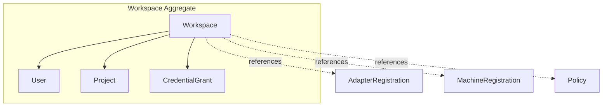
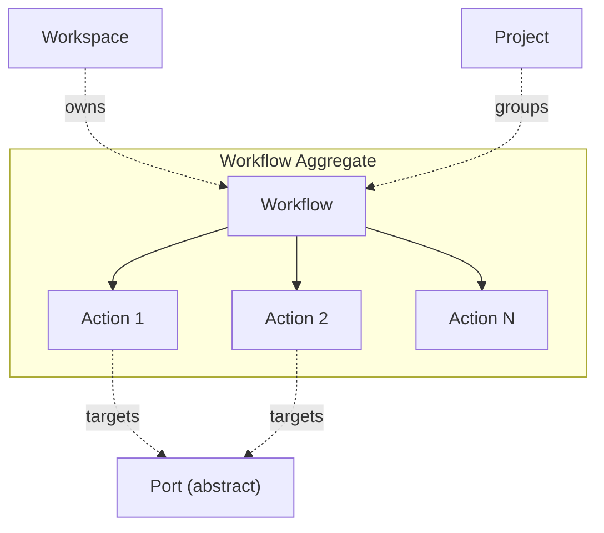
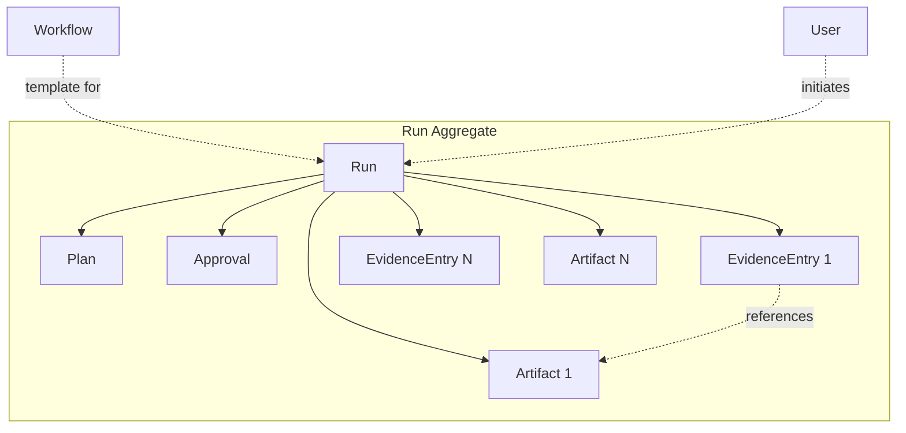
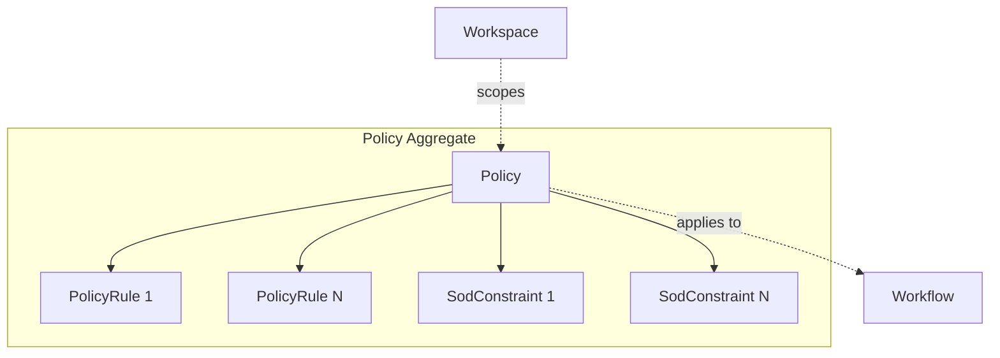
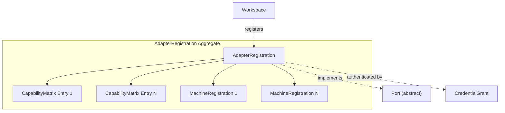

# VAOP Domain -- Aggregate Boundaries & Invariants

> Detailed documentation of each aggregate root, its consistency boundary, invariants, and domain events.

## Overview

The VAOP domain is organised into five aggregates. Each aggregate defines a transactional consistency boundary -- all entities within an aggregate are modified atomically, while cross-aggregate references use IDs and eventual consistency.

| Aggregate Root          | Boundary Contains                       | Primary Purpose                                   |
| ----------------------- | --------------------------------------- | ------------------------------------------------- |
| **Workspace**           | User, Project, CredentialGrant          | Tenancy isolation and configuration               |
| **Workflow**            | Action (ordered)                        | Runbook definition and action ordering            |
| **Run**                 | Approval, Plan, EvidenceEntry, Artifact | Workflow execution and evidence chain             |
| **Policy**              | PolicyRule, SodConstraint               | Approval rules and separation-of-duty constraints |
| **AdapterRegistration** | CapabilityMatrix, MachineRegistration   | Adapter capabilities and machine endpoints        |

---

## Aggregate 1: Workspace

The tenancy isolation boundary. All data in VAOP is scoped to a Workspace.

### Boundary Diagram



### Root Entity

**Workspace** -- `WorkspaceId`

### Contains

| Entity          | Relationship | Notes                                         |
| --------------- | ------------ | --------------------------------------------- |
| User            | One-to-many  | Members of the workspace with roles           |
| Project         | One-to-many  | Lightweight grouping containers for workflows |
| CredentialGrant | One-to-many  | Vault references for adapter authentication   |

### References (outside boundary)

- `AdapterRegistration[]` -- registered adapters for this workspace
- `MachineRegistration[]` -- registered machines for this workspace
- `Policy[]` -- governance policies scoped to this workspace

### Invariants

1. **Unique tenant** -- Each Workspace has exactly one `TenantId`. No two Workspaces share a `TenantId`.
2. **Email uniqueness** -- User email addresses must be unique within a workspace.
3. **Credential scoping** -- CredentialGrants must reference an AdapterRegistration that belongs to the same workspace.
4. **User role assignment** -- Every User must have at least one role (e.g., `admin`, `operator`, `viewer`).
5. **Workspace-scoped queries** -- All queries are workspace-scoped. The domain layer never permits cross-workspace data access.

### Consistency Boundary

User creation/removal, project creation, and credential grant management are transactionally consistent within the Workspace aggregate. AdapterRegistration and Policy are separate aggregates referenced by ID.

### Domain Events

| Event                      | Trigger                                           |
| -------------------------- | ------------------------------------------------- |
| `WorkspaceCreated`         | New workspace provisioned                         |
| `WorkspaceUpdated`         | Workspace name or plan changed                    |
| `UserAddedToWorkspace`     | New user joins workspace                          |
| `UserRemovedFromWorkspace` | User removed from workspace                       |
| `UserRolesUpdated`         | User roles changed within workspace               |
| `CredentialGrantIssued`    | New credential grant created                      |
| `CredentialGrantRevoked`   | Credential grant removed or expired               |
| `CredentialGrantRotated`   | Credential grant rotated with new vault reference |
| `ProjectCreated`           | New project created in workspace                  |

---

## Aggregate 2: Workflow

The runbook definition. Workflows are templates that define what a Run will execute.

### Boundary Diagram



### Root Entity

**Workflow** -- `WorkflowId`

### Contains

| Entity | Relationship          | Notes                                                    |
| ------ | --------------------- | -------------------------------------------------------- |
| Action | One-to-many (ordered) | Steps in the workflow, strictly ordered by `order` field |

### Invariants

1. **At least one action** -- A Workflow must contain at least one Action.
2. **Ordered actions** -- Actions have a strictly ordered sequence (no gaps, no duplicates in `order`).
3. **Valid port targeting** -- Each Action must target a valid `PortFamily` and operation name.
4. **Tier must be set** -- The Workflow must declare an `ExecutionTier` (Auto, Assisted, HumanApprove, or ManualOnly). Individual actions can override the workflow-level tier but cannot escalate below it.
5. **Version immutability** -- Once a Workflow version is published (active), its Actions are immutable. Changes create a new version.
6. **Active uniqueness** -- Only one version of a Workflow (by name within a tenant) can be active at a time.

### Consistency Boundary

The Workflow and its Actions are transactionally consistent. Adding, removing, or reordering actions is atomic. The Workflow is independent of Runs -- modifying a Workflow does not affect in-flight Runs (they execute against the version they were started with).

### Domain Events

| Event                        | Trigger                                             |
| ---------------------------- | --------------------------------------------------- |
| `WorkflowCreated`            | New workflow defined                                |
| `WorkflowUpdated`            | Workflow metadata changed (name, description, tier) |
| `WorkflowActivated`          | Workflow marked as active (available for runs)      |
| `WorkflowDeactivated`        | Workflow marked as inactive                         |
| `WorkflowVersionIncremented` | Workflow definition changed, version bumped         |
| `ActionAddedToWorkflow`      | New action appended to workflow                     |
| `ActionRemovedFromWorkflow`  | Action removed from workflow                        |
| `ActionReordered`            | Action order changed within workflow                |

---

## Aggregate 3: Run

A single execution of a Workflow. The Run captures everything about what happened during execution.

### Boundary Diagram



### Root Entity

**Run** -- `RunId`

### Contains

| Entity        | Relationship               | Notes                                          |
| ------------- | -------------------------- | ---------------------------------------------- |
| Plan          | One-to-one                 | Proposed changes the Run will make             |
| Approval      | Zero-to-many               | Human/policy gates on the Plan                 |
| EvidenceEntry | Zero-to-many (append-only) | Immutable audit log of everything the Run does |
| Artifact      | Zero-to-many               | Binary outputs produced by the Run             |

### Invariants

1. **Valid status transitions** -- Run status follows a strict state machine:
   ```
   Pending -> Running -> Succeeded
                     \-> Failed
                     \-> Cancelled
   Running -> WaitingForApproval -> Running
   Running -> Paused -> Running
   ```
   No backward transitions. Terminal states (`Succeeded`, `Failed`, `Cancelled`) are final.
2. **Plan before approval** -- A Plan must exist before any Approval can be requested. Approvers review the Plan, not raw execution data.
3. **Evidence is append-only** -- EvidenceEntry records are immutable once written. They cannot be modified or deleted (only subject to retention schedule expiry).
4. **Evidence is content-addressed** -- Each EvidenceEntry carries a `hashSha256` of its data for tamper detection.
5. **Artifact retention** -- Every Artifact must have a `RetentionSchedule` governing its lifecycle.
6. **Approval completeness** -- If the Workflow tier requires approval, the Run cannot proceed past the approval gate until all required Approvals have a decision of `Approved`.
7. **Correlation chain** -- Every Run has a `correlationId` that links all events, evidence, and artifacts for end-to-end traceability.

### Consistency Boundary

The Run, its Plan, Approvals, EvidenceEntries, and Artifacts are transactionally consistent. Status transitions, evidence appends, and approval decisions are atomic within the Run. The Run references its source Workflow by `WorkflowId` but does not modify the Workflow.

### Domain Events

| Event                  | Trigger                                         |
| ---------------------- | ----------------------------------------------- |
| `RunStarted`           | Run transitions to Running                      |
| `RunSucceeded`         | Run completes successfully                      |
| `RunFailed`            | Run fails (unrecoverable action failure)        |
| `RunCancelled`         | Run cancelled by user or policy                 |
| `RunPaused`            | Run paused (rate limit, manual hold)            |
| `RunResumed`           | Run resumed from paused state                   |
| `PlanGenerated`        | Plan created for the Run                        |
| `ApprovalRequested`    | Approval gate activated, assignee notified      |
| `ApprovalDecisionMade` | Approver submits Approved/Denied/RequestChanges |
| `EvidenceRecorded`     | New evidence entry appended to the Run          |
| `ArtifactProduced`     | New artifact stored and linked to evidence      |
| `ActionDispatched`     | Action sent to adapter for execution            |
| `ActionCompleted`      | Action finished successfully                    |
| `ActionFailed`         | Action failed                                   |
| `DiffComputed`         | Plan vs actual diff calculated                  |

---

## Aggregate 4: Policy

Governance rules that control execution behaviour across workflows.

### Boundary Diagram



### Root Entity

**Policy** -- `PolicyId`

### Contains

| Entity        | Relationship | Notes                                                            |
| ------------- | ------------ | ---------------------------------------------------------------- |
| PolicyRule    | One-to-many  | Individual rules that evaluate against execution context         |
| SodConstraint | Zero-to-many | Segregation of duties constraints (role separation requirements) |

### Referenced By

- **Workspace** -- policies are scoped to a workspace
- **Workflow** -- policies are associated with workflows they govern

### Invariants

1. **SoD consistency** -- Segregation of duties constraints must not be contradictory (e.g., a role cannot be both required and prohibited for the same action).
2. **Evaluable rules** -- Every PolicyRule must have a valid expression that can be evaluated against a run context (workflow, action, user roles, tier).
3. **Versioned** -- Policies are versioned. When a policy is updated, the version increments. Active runs evaluate against the policy version in effect when the run started.
4. **Priority ordering** -- PolicyRules within a policy have a priority order. When multiple rules match, higher-priority rules take precedence.
5. **Active scope** -- Policies can be active or inactive. Inactive policies are not evaluated.
6. **Valid SoD pairs** -- A SodConstraint must reference two distinct roles. A role cannot be constrained against itself.

### Consistency Boundary

The Policy, its PolicyRules, and SodConstraints are transactionally consistent. Rule and constraint modifications are atomic within the Policy. Policies are evaluated at approval-routing time and tier-selection time -- they do not modify Runs or Workflows directly.

### Domain Events

| Event                      | Trigger                                            |
| -------------------------- | -------------------------------------------------- |
| `PolicyCreated`            | New policy defined for a workspace                 |
| `PolicyUpdated`            | Policy rules or metadata changed                   |
| `PolicyActivated`          | Policy enabled for evaluation                      |
| `PolicyDeactivated`        | Policy disabled                                    |
| `PolicyVersionIncremented` | Policy definition changed, version bumped          |
| `SodConstraintAdded`       | New SoD constraint added to policy                 |
| `SodConstraintRemoved`     | SoD constraint removed from policy                 |
| `PolicyEvaluated`          | Policy evaluated against a context (result logged) |
| `SodViolationDetected`     | SoD constraint violated during evaluation          |

---

## Aggregate 5: AdapterRegistration

The registration and capability declaration for a concrete adapter implementing a port.

### Boundary Diagram



### Root Entity

**AdapterRegistration** -- `AdapterId`

### Contains

| Entity              | Relationship | Notes                                               |
| ------------------- | ------------ | --------------------------------------------------- |
| CapabilityMatrix    | One-to-many  | Declared capabilities for the adapter's port family |
| MachineRegistration | Zero-to-many | Machine endpoints hosted by this adapter            |

### Invariants

1. **Valid capabilities** -- Declared capabilities must be valid for the adapter's port family. An adapter for `FinanceAccounting` cannot declare capabilities from `CustomerSupport`.
2. **One active adapter per port per workspace** -- At most one adapter can be active (enabled) for a given port within a workspace. Multiple adapters for the same port can be registered but only one can be active.
3. **Valid credential references** -- If the adapter requires authentication, its credential grant must reference a valid, non-expired CredentialGrant in the same workspace.
4. **Machine endpoint validity** -- MachineRegistrations must have valid endpoints and reference credential information scoped to the adapter.
5. **Capability matrix completeness** -- The capability matrix must declare support or non-support for all standard operations in the port family.

### Consistency Boundary

The AdapterRegistration, its CapabilityMatrix entries, and MachineRegistrations are transactionally consistent. Enabling/disabling an adapter and updating capabilities are atomic. The adapter is managed independently of workflow execution -- runtime provider selection reads the adapter registry but does not modify it.

### Domain Events

| Event                        | Trigger                                       |
| ---------------------------- | --------------------------------------------- |
| `AdapterRegistered`          | New adapter registered for a port family      |
| `AdapterEnabled`             | Adapter activated for use                     |
| `AdapterDisabled`            | Adapter deactivated                           |
| `AdapterCapabilitiesUpdated` | Capability matrix changed                     |
| `AdapterUpgraded`            | Provider version updated                      |
| `MachineRegistered`          | New machine endpoint registered under adapter |
| `MachineDeregistered`        | Machine endpoint removed                      |
| `MachineEndpointUpdated`     | Machine endpoint or credentials changed       |

---

## Cross-Aggregate Reference Summary

Aggregates reference each other by ID only. The following table summarises all cross-aggregate references:

| From                | To                  | Reference                            | Direction                                  |
| ------------------- | ------------------- | ------------------------------------ | ------------------------------------------ |
| Workflow            | Workspace           | `workspaceId: WorkspaceId`           | Workflow belongs to Workspace              |
| Workflow            | Project             | `projectId?: ProjectId`              | Workflow optionally grouped in Project     |
| Run                 | Workflow            | `workflowId: WorkflowId`             | Run executes a Workflow                    |
| Run                 | User                | `initiatedBy: UserId`                | Run started by a User                      |
| Policy              | Workspace           | `workspaceId: WorkspaceId`           | Policy scoped to Workspace                 |
| Policy              | Workflow            | many-to-many by reference            | Policy applies to Workflows                |
| AdapterRegistration | Workspace           | `workspaceId: WorkspaceId`           | Adapter registered in Workspace            |
| AdapterRegistration | CredentialGrant     | `credentialGrantId`                  | Adapter authenticated by grant             |
| Action              | AdapterRegistration | resolved at runtime via `portFamily` | Action targets a port, resolved to adapter |
| EvidenceEntry       | Action              | `actionId: ActionId`                 | Evidence records outcome of an action      |
| Artifact            | EvidenceEntry       | `evidenceId: EvidenceId`             | Artifact referenced by evidence            |

## Eventual Consistency Patterns

Cross-aggregate operations use domain events for eventual consistency:

```
1. Run starts -> ActionDispatched
   -> Application layer resolves adapter via ProviderSelectionService
   -> Adapter executes against SoR
   -> ActionCompleted/ActionFailed
   -> EvidenceEntryAppended (within Run aggregate)

2. Run reaches approval gate -> ApprovalRequested
   -> Application layer evaluates Policy aggregate
   -> PolicyEvaluated (cross-aggregate event)
   -> Approval routed to assignees
   -> ApprovalGranted/Denied
   -> Run resumes or fails

3. Credential rotated (Workspace) -> CredentialGrantRotated
   -> Application layer checks AdapterRegistration
   -> Adapter re-authenticated
   -> AdapterEnabled/Disabled based on result

4. Policy SoD violation -> SodViolationDetected
   -> Run receives violation
   -> ApprovalDenied (automatic)
   -> RunFailed with evidence
```

### Event Ordering Guarantees

- Events within a single aggregate are **strictly ordered** (by timestamp and sequence number).
- Events across aggregates are **eventually consistent** -- the application layer ensures causal ordering via `correlationId`.
- All events carry `tenantId` for workspace isolation and `correlationId` for end-to-end tracing.

## Entity Reference Summary

| Entity              | Aggregate                  | Role               | ID Type        |
| ------------------- | -------------------------- | ------------------ | -------------- |
| Workspace           | Workspace (root)           | Tenancy boundary   | `WorkspaceId`  |
| User                | Workspace                  | Member             | `UserId`       |
| CredentialGrant     | Workspace                  | Vault reference    | (composite)    |
| Project             | Workspace                  | Workflow grouping  | `ProjectId`    |
| Workflow            | Workflow (root)            | Runbook definition | `WorkflowId`   |
| Action              | Workflow                   | Operation step     | `ActionId`     |
| Run                 | Run (root)                 | Workflow execution | `RunId`        |
| Approval            | Run                        | Gate decision      | `ApprovalId`   |
| Plan                | Run                        | Intended operation | (value object) |
| EvidenceEntry       | Run                        | Audit log entry    | `EvidenceId`   |
| Artifact            | Run                        | Binary payload     | `ArtifactId`   |
| Policy              | Policy (root)              | Rule set           | `PolicyId`     |
| PolicyRule          | Policy                     | Conditional rule   | (value object) |
| SodConstraint       | Policy                     | Duty separation    | (value object) |
| AdapterRegistration | AdapterRegistration (root) | Adapter config     | `AdapterId`    |
| CapabilityMatrix    | AdapterRegistration        | Supported ops      | (value object) |
| MachineRegistration | AdapterRegistration        | Machine endpoint   | `MachineId`    |
