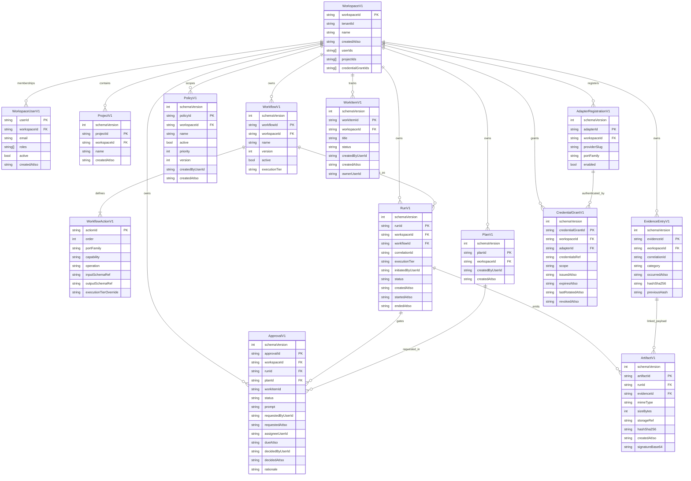

# Portarium Domain -- ERD (As Implemented)

> Runtime-aligned model snapshot based on parser contracts in `src/domain/*/*-v1.ts` and repository/query ports in `src/application/ports/*`.

## Aggregate and Entity Map

## Repository ID and Reference Invariants

- `tenantId` is the top-level storage partition key for all repository reads/writes.
- Stores that accept `(tenantId, workspaceId, id)` return `null` when parsed payload `workspaceId` does not match the requested `workspaceId`.
- Save paths persist aggregate IDs and workspace references from the parsed aggregate, not from caller-provided free-form fields.
- Cross-aggregate links are ID references only:
  - `RunV1.workflowId`
  - `ApprovalV1.runId`, `ApprovalV1.planId`, optional `ApprovalV1.workItemId`
  - `ArtifactV1.runId`, optional `ArtifactV1.evidenceId`
  - `WorkItemV1.links.{runIds,workflowIds,approvalIds,evidenceIds}`
  - `EvidenceEntryV1.links.{runId,planId,workItemId}` (optional, not top-level foreign keys)
- Aggregate-level uniqueness/consistency guards live in `src/application/services/repository-aggregate-invariants.ts`:
  - workspace name uniqueness
  - run ID uniqueness
  - single active workflow version
  - single active adapter per required port family

## Notes

- This ERD is intentionally aligned to implemented parser contracts, not aspirational future models.
- `PlanV1` and `EvidenceEntryV1` are run-correlated by application/orchestration context; their run reference is not a required top-level field in the domain type.
