# VAOP Domain -- Entity-Relationship Diagram

> Complete ERD covering all aggregate roots, entities, canonical objects, and their relationships.

## Overview

The VAOP domain is organised around five aggregate roots (Workspace, Workflow, Run, Policy, AdapterRegistration) that collectively govern multi-tenant workflow execution against external Systems of Record. Canonical objects bridge across SoR boundaries, and ExternalObjectRef provides a first-class deep link for anything not captured in the canonical model.

## Full Domain ERD

```mermaid
erDiagram
    %% ===== AGGREGATE ROOTS =====

    Workspace {
        WorkspaceId id PK
        TenantId tenantId UK
        string name
        string plan
        Date createdAt
    }

    Workflow {
        WorkflowId id PK
        WorkspaceId workspaceId FK
        string name
        string description
        ExecutionTier tier
        boolean isActive
        int version
        Date createdAt
        Date updatedAt
    }

    Run {
        RunId id PK
        WorkflowId workflowId FK
        RunStatus status
        ExecutionTier tier
        UserId initiatedBy FK
        Date startedAt
        Date completedAt
        string correlationId
    }

    Policy {
        PolicyId id PK
        WorkspaceId workspaceId FK
        string name
        string description
        PolicyScope scope
        boolean active
        int priority
        int version
        Date createdAt
    }

    AdapterRegistration {
        AdapterId id PK
        WorkspaceId workspaceId FK
        PortId portId FK
        PortFamily portFamily
        string providerName
        string providerVersion
        boolean enabled
        json aclMetadata
        Date registeredAt
    }

    %% ===== ENTITIES (within aggregates) =====

    User {
        UserId id PK
        WorkspaceId workspaceId FK
        string email UK
        string displayName
        string[] roles
        boolean active
        Date createdAt
    }

    Project {
        ProjectId id PK
        WorkspaceId workspaceId FK
        string name
        string description
        Date createdAt
    }

    Action {
        ActionId id PK
        WorkflowId workflowId FK
        PortFamily portFamily
        string operation
        json parameters
        int order
        ExecutionTier tier
        string description
    }

    Approval {
        ApprovalId id PK
        RunId runId FK
        ApprovalDecision decision
        UserId assigneeId FK
        UserId decidedBy FK
        string comment
        Date requestedAt
        Date decidedAt
        Date slaDeadline
    }

    Plan {
        RunId runId FK
        json actions
        json diff
        string description
        string expectedOutcome
    }

    EvidenceEntry {
        EvidenceId id PK
        RunId runId FK
        ActionId actionId FK
        string eventType
        string summary
        json data
        string hashSha256
        Date timestamp
        RetentionSchedule retention
    }

    Artifact {
        ArtifactId id PK
        RunId runId FK
        EvidenceId evidenceId FK
        string mimeType
        int size
        string storageRef
        string hashSha256
        RetentionSchedule retentionSchedule
        Date createdAt
    }

    CredentialGrant {
        string id PK
        WorkspaceId workspaceId FK
        AdapterId adapterId FK
        string vaultRef
        string scope
        Date grantedAt
        Date expiresAt
        Date lastRotatedAt
    }

    MachineRegistration {
        MachineId id PK
        AdapterId adapterId FK
        string name
        string endpoint
        string credentialsRef
        string runtimeType
        boolean active
        Date registeredAt
    }

    CapabilityMatrix {
        AdapterId adapterId FK
        string capability
        boolean supported
    }

    PolicyRule {
        PolicyId policyId FK
        string ruleType
        string expression
        int priority
    }

    SodConstraint {
        PolicyId policyId FK
        string constraintType
        string leftRole
        string rightRole
    }

    %% ===== CANONICAL OBJECTS =====

    Party {
        PartyId id PK
        TenantId tenantId FK
        string displayName
        string email
        PartyRole[] roles
    }

    Ticket {
        TicketId id PK
        TenantId tenantId FK
        string title
        TicketStatus status
        string priority
        PartyId assignee FK
    }

    Invoice {
        InvoiceId id PK
        TenantId tenantId FK
        string direction
        InvoiceStatus status
        number total
        string currency
        json lineItems
    }

    Payment {
        PaymentId id PK
        TenantId tenantId FK
        string type
        PaymentStatus status
        number amount
        string currency
    }

    Task {
        TaskId id PK
        TenantId tenantId FK
        string title
        string status
        PartyId assignee FK
        Date dueDate
    }

    Campaign {
        CampaignId id PK
        TenantId tenantId FK
        string name
        string type
        string status
        Date startDate
        Date endDate
    }

    Asset {
        AssetId id PK
        TenantId tenantId FK
        string name
        string type
        string status
        string serialNumber
    }

    Document {
        DocumentId id PK
        TenantId tenantId FK
        string name
        string mimeType
        string url
    }

    Subscription {
        SubscriptionId id PK
        TenantId tenantId FK
        string status
        Date startDate
        Date endDate
        Date renewalDate
    }

    Opportunity {
        OpportunityId id PK
        TenantId tenantId FK
        string name
        string stage
        number amount
        string currency
        number probability
    }

    Product {
        ProductId id PK
        TenantId tenantId FK
        string name
        string sku
        number unitPrice
        string currency
    }

    Order {
        OrderId id PK
        TenantId tenantId FK
        string type
        OrderStatus status
        number total
        string currency
        json lineItems
    }

    Account {
        FinancialAccountId id PK
        TenantId tenantId FK
        string name
        AccountType type
        string currency
    }

    ExternalObjectRef {
        string system
        string objectType
        string objectId
        string url
        string displayLabel
    }

    %% ===== RELATIONSHIPS =====

    %% Workspace aggregate
    Workspace ||--o{ User : "has members"
    Workspace ||--o{ Project : "contains projects"
    Workspace ||--o{ CredentialGrant : "stores credentials"
    Workspace ||--o{ AdapterRegistration : "registers adapters"
    Workspace ||--o{ Policy : "governs with"

    %% Project contains workflows
    Project ||--o{ Workflow : "contains"

    %% Workflow aggregate
    Workflow ||--|{ Action : "ordered sequence"
    Workflow ||--o{ Run : "executed as"

    %% Run aggregate
    Run ||--o{ EvidenceEntry : "records"
    Run ||--o{ Artifact : "produces"
    Run ||--o{ Approval : "requires"
    Run ||--|{ Plan : "proposes"
    Run }o--|| User : "initiated by"

    %% Adapter registration aggregate
    AdapterRegistration ||--|{ CapabilityMatrix : "declares capabilities"
    AdapterRegistration ||--o{ MachineRegistration : "hosts machines"
    AdapterRegistration }o--|| CredentialGrant : "authenticated by"

    %% Policy aggregate
    Policy ||--|{ PolicyRule : "contains rules"
    Policy ||--o{ SodConstraint : "enforces SoD"
    Policy }o--o{ Workflow : "applies to"

    %% Evidence chain
    EvidenceEntry }o--o| Artifact : "references"
    EvidenceEntry }o--|| Action : "records outcome of"

    %% Approval linkage
    Approval ||--|{ Plan : "reviews"

    %% Action targets a port (abstract)
    Action }o--|| AdapterRegistration : "targets port via"

    %% Canonical objects -- all carry external refs
    Party ||--o{ ExternalObjectRef : "linked to SoRs via"
    Ticket ||--o{ ExternalObjectRef : "linked to SoRs via"
    Invoice ||--o{ ExternalObjectRef : "linked to SoRs via"
    Payment ||--o{ ExternalObjectRef : "linked to SoRs via"
    Task ||--o{ ExternalObjectRef : "linked to SoRs via"
    Campaign ||--o{ ExternalObjectRef : "linked to SoRs via"
    Asset ||--o{ ExternalObjectRef : "linked to SoRs via"
    Document ||--o{ ExternalObjectRef : "linked to SoRs via"
    Subscription ||--o{ ExternalObjectRef : "linked to SoRs via"
    Opportunity ||--o{ ExternalObjectRef : "linked to SoRs via"
    Product ||--o{ ExternalObjectRef : "linked to SoRs via"
    Order ||--o{ ExternalObjectRef : "linked to SoRs via"
    Account ||--o{ ExternalObjectRef : "linked to SoRs via"

    %% Canonical objects -- cross-references
    Invoice }o--o| Party : "billed to / billed from"
    Payment }o--o| Invoice : "settles"
    Payment }o--o| Party : "paid by / paid to"
    Order }o--o| Party : "placed by / fulfilled by"
    Order }o--o{ Product : "contains"
    Opportunity }o--o| Party : "associated with"
    Subscription }o--o| Party : "held by"
    Subscription }o--o| Product : "covers"
    Ticket }o--o| Party : "raised by / assigned to"
    Task }o--o| Party : "assigned to"
    Campaign }o--o| Party : "targets"
    Asset }o--o| Party : "owned by / assigned to"
```



## Diagram Notes

### Aggregate Boundaries

The ERD contains five aggregate roots, each drawn as the top-level entity in its cluster:

| Aggregate Root          | Boundary Contains                       | Consistency Rule                                                                                                                     |
| ----------------------- | --------------------------------------- | ------------------------------------------------------------------------------------------------------------------------------------ |
| **Workspace**           | User, Project, CredentialGrant          | All tenant-scoped configuration is consistent within the workspace. References AdapterRegistration, MachineRegistration, and Policy. |
| **Workflow**            | Action (ordered sequence)               | Action ordering, port targeting, and tier assignment are consistent within the workflow definition.                                  |
| **Run**                 | Approval, Plan, EvidenceEntry, Artifact | Run status, evidence chain, and approval decisions are transactionally consistent within the run.                                    |
| **Policy**              | PolicyRule, SodConstraint               | Rules and SoD constraints are consistent within the policy. Policies are versioned.                                                  |
| **AdapterRegistration** | CapabilityMatrix, MachineRegistration   | Capability declarations are consistent with the adapter's registered port family. Machine endpoints are scoped to the adapter.       |

### Canonical Objects

Canonical objects (Party through Account) are **cross-system bridge types** -- they represent the minimal shared fields observed across all SoRs in a domain. They are **not** aggregate roots; they are value-like objects that flow through ports.

Every canonical object carries an `externalRefs: readonly ExternalObjectRef[]` array that links it back to the original records in each SoR. This is the primary mechanism for maintaining traceability without bloating the canonical model with vendor-specific fields.

### Key Relationship Patterns

- **Workspace isolation**: All entities carry a `WorkspaceId` or `TenantId` (or are reachable via a path that includes one). The domain layer enforces that no cross-tenant data access is possible.
- **Action to Port**: Each Action targets a `PortFamily` and operation. At execution time, the runtime resolves this to a concrete AdapterRegistration via provider selection (`selectProvider(tenant, port)`).
- **Plan before Approval**: A Run must produce a Plan (describing proposed changes) before an Approval can be requested. Approvers review the Plan, not raw execution data.
- **Evidence chain**: `Run` -> `EvidenceEntry` (append-only log of what happened) -> `Artifact` (binary payloads: screenshots, API responses, diffs). Evidence entries are stamped with a `RetentionSchedule` that governs how long they are kept, supporting compliance requirements (WORM storage, tamper-evident logging) per ADR-028.

### RunStatus State Machine

```
Pending -> Running -> Succeeded
                  \-> Failed
                  \-> Cancelled
```

Valid status transitions are enforced as a domain invariant on the Run aggregate.
