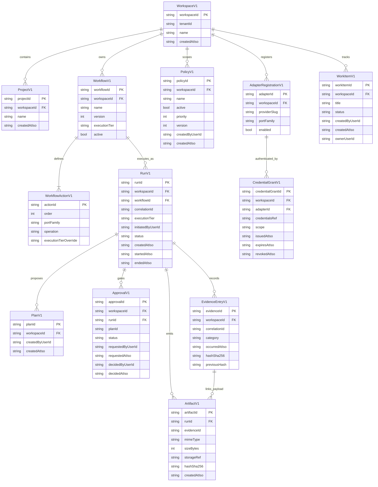

# Portarium Domain -- ERD (As Implemented)

> Runtime-aligned domain model snapshot based on `src/domain/*-v1.ts`.

## Aggregate and Entity Map

## Notes

- This ERD is intentionally aligned to currently implemented parser contracts (`parse*V1`) rather than aspirational future shapes.
- Cross-object references in canonical types use `ExternalObjectRef` and branded IDs.
- Run lifecycle transition rules are defined in `src/domain/services/run-status-transitions.ts`.
