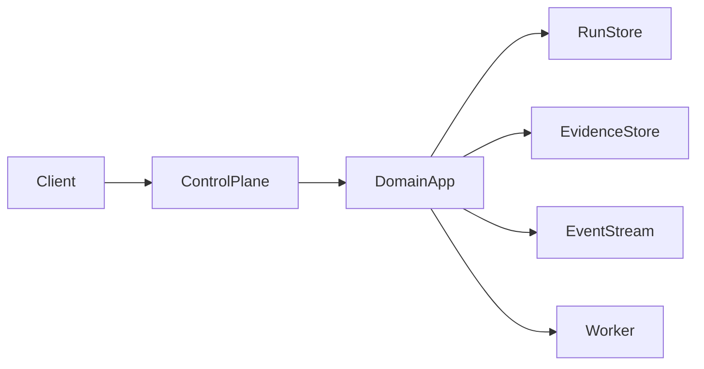

# Explanation: Architecture

Portarium is a layered, hexagonal system with strict dependency boundaries.

If you only read one technical page after the README, read this one.

## Layers

- `src/domain`: entities, value objects, invariants
- `src/application`: use-cases and orchestration
- `src/infrastructure`: adapters and external integrations
- `src/presentation`: HTTP handlers and runtime entrypoints

## Runtime split

- Control plane runtime exposes HTTP API and governance boundaries.
- Execution-plane runtime hosts worker behavior and optional Temporal worker loop.

## Current scaffold realities

- Control-plane handler supports selected `/v1` routes.
- Auth uses JWT/JWKS when configured; otherwise protected routes return `401`.
- Some stores are intentionally in-memory or stubbed for scaffold stage.

## Diagram

## References

- `docs/adr/0056-infrastructure-reference-architecture.md`
- `docs/adr/0065-external-execution-plane-strategy.md`
- `src/presentation/runtime/control-plane-handler.ts`
