# Master Execution DAG

Generated: 2026-02-20T03:37:55.945Z
Source: `.beads/issues.jsonl`

## Snapshot

- Open beads: 134
- Open dependency edges: 22
- Open beads currently blocked by open prerequisites: 18
- Open beads with at least one review artifact in `docs/review/`: 1
- Graph acyclic: yes

## Phase Summary

| Phase          | Open Beads | Blocked By Open | With Evidence |
| -------------- | ---------: | --------------: | ------------: |
| application    |          3 |               1 |             0 |
| domain         |          3 |               1 |             0 |
| governance     |          4 |               4 |             0 |
| infrastructure |         13 |               5 |             0 |
| integration    |          5 |               5 |             0 |
| presentation   |          1 |               0 |             0 |
| security       |          2 |               2 |             0 |
| unspecified    |        103 |               0 |             1 |

## Critical Path

Longest open dependency chain length: **4**

| Order | Bead      | Title                                                                                     |
| ----: | --------- | ----------------------------------------------------------------------------------------- |
|     1 | bead-0515 | Infra: gRPC edge gateway adapter implementing MissionPort — prototype                     |
|     2 | bead-0517 | Infra: ROS 2 Action bridge via edge gateway — Nav2 NavigateTo mission prototype           |
|     3 | bead-0519 | Infra: simulation CI harness for robotics integration — Gazebo or Webots regression suite |
|     4 | bead-0529 | Testing: pre-emption and stop-path latency benchmark for robot missions                   |

## Open Dependency Graph

```mermaid
flowchart TD
  subgraph application[application]
    B0320["bead-0320<br/>Add contract tests for application command/query surface (.spec…"]
    B0340["bead-0340<br/>Complete remaining application-layer use-cases beyond register-…"]
    B0433["bead-0433<br/>App: Agent Task action execution path in workflow runner - disp…"]
  end
  subgraph domain[domain]
    B0448["bead-0448<br/>Spec: Policy evaluation rule language — decide and document con…"]
    B0449["bead-0449<br/>Spec: Workflow action execution semantics — document sequential…"]
    B0451["bead-0451<br/>Spec: Saga compensation interface — define standard compensatio…"]
  end
  subgraph governance[governance]
    B0491["bead-0491<br/>Review: control plane HTTP handlers (bead-0415) — verify all ro…"]
    B0493["bead-0493<br/>Doc review: OpenAPI spec and backlog docs aligned after bead-04…"]
    B0494["bead-0494<br/>Doc review: application layer backlog docs aligned after P0 app…"]
    B0495["bead-0495<br/>Doc review: spec files (.specify/specs/) aligned with implement…"]
  end
  subgraph infrastructure[infrastructure]
    B0403["bead-0403<br/>Spike: evaluate Activepieces piece coverage for the 18 port ada…"]
    B0404["bead-0404<br/>Infra: Activepieces self-hosted deployment configuration (Docke…"]
    B0405["bead-0405<br/>Infra: Activepieces action executor adapter - invoke Activepiec…"]
    B0407["bead-0407<br/>Infra: Langflow isolated deployment - per-environment instances…"]
    B0408["bead-0408<br/>Infra: Langflow agent flow HTTP adapter - invoke Langflow flows…"]
    B0415["bead-0415<br/>Infra: implement control plane HTTP server handlers to match Op…"]
    B0435["bead-0435<br/>Infra: OpenClaw Gateway HTTP adapter implementing MachineInvoke…"]
    B0436["bead-0436<br/>Infra: OpenClaw /tools/invoke constrained-tool client - tool po…"]
    B0437["bead-0437<br/>Infra: Evidence logging hooks for agent step lifecycle - persis…"]
    B0515["bead-0515<br/>Infra: gRPC edge gateway adapter implementing MissionPort — pro…"]
    B0516["bead-0516<br/>Infra: MQTT gateway adapter for IoT-style actuator commands and…"]
    B0517["bead-0517<br/>Infra: ROS 2 Action bridge via edge gateway — Nav2 NavigateTo m…"]
    B0518["bead-0518<br/>Infra: OPC UA connector prototype using node-opcua for industri…"]
  end
  subgraph integration[integration]
    B0519["bead-0519<br/>Infra: simulation CI harness for robotics integration — Gazebo …"]
    B0528["bead-0528<br/>Testing: evidence-chain verification under adversarial retries …"]
    B0529["bead-0529<br/>Testing: pre-emption and stop-path latency benchmark for robot …"]
    B0530["bead-0530<br/>Testing: multi-robot dispatch and fleet coordination via Open-R…"]
    B0567["bead-0567<br/>Integration v1: ingest adapters for VDA 5050 and MassRobotics l…"]
  end
  subgraph presentation[presentation]
    B0587["bead-0587<br/>Cockpit assets phase 2: app icons + canonical icon pack + UI wi…"]
  end
  subgraph security[security]
    B0520["bead-0520<br/>Security: SROS2 and DDS-Security hardening for ROS 2 mission tr…"]
    B0521["bead-0521<br/>Security: mTLS workload identity for robot gateways using SPIFF…"]
  end
  subgraph unspecified[unspecified]
    B0162["bead-0162<br/>Phase gate: Domain complete — requires aggregate invariants, pa…"]
    B0163["bead-0163<br/>Phase gate: Application complete — requires DTOs, use-cases, or…"]
    B0164["bead-0164<br/>Phase gate: Infrastructure complete — requires persistence, out…"]
    B0165["bead-0165<br/>Phase gate: Presentation complete — requires OpenAPI route pari…"]
    B0166["bead-0166<br/>Phase gate: Integration complete — requires per-family readines…"]
    B0167["bead-0167<br/>Phase gate: Security complete — requires vulnerability, secret …"]
    B0168["bead-0168<br/>Phase gate: Release complete — requires ci:pr, quality gates, r…"]
    B0169["bead-0169<br/>Release freeze: block new families while release closure bead i…"]
    B0170["bead-0170<br/>Per-ADR closure: ADR-001 through ADR-0040 must each have implem…"]
    B0171["bead-0171<br/>Per-ADR closure: ADR-0041 through ADR-0043 must be promoted fro…"]
    B0172["bead-0172<br/>Per-ADR closure: ADR-0048 to ADR-0138 legacy gaps from research…"]
    B0174["bead-0174<br/>Review: verify no adapter work starts without canonical-to-prov…"]
    B0178["bead-0178<br/>Code review: validate architecture boundaries for every new sca…"]
    B0179["bead-0179<br/>CI gate: require architecture-guard, gate-baseline, and npm aud…"]
    B0180["bead-0180<br/>CI gate: require OpenAPI parser/golden fixture parity on every …"]
    B0184["bead-0184<br/>Review: tie each open implementation bead to at least one test …"]
    B0228["bead-0228<br/>Closeout review: ProcurementSpend port adapter integration tests"]
    B0229["bead-0229<br/>Closeout review: HrisHcm port adapter foundation"]
    B0230["bead-0230<br/>Closeout review: HrisHcm port adapter integration tests"]
    B0231["bead-0231<br/>Closeout review: Payroll port adapter foundation"]
    B0232["bead-0232<br/>Closeout review: Payroll port adapter integration tests"]
    B0233["bead-0233<br/>Closeout review: CrmSales port adapter foundation"]
    B0234["bead-0234<br/>Closeout review: CrmSales port adapter integration tests"]
    B0235["bead-0235<br/>Closeout review: CustomerSupport port adapter foundation"]
    B0236["bead-0236<br/>Closeout review: CustomerSupport port adapter integration tests"]
    B0237["bead-0237<br/>Closeout review: ItsmItOps port adapter foundation"]
    B0238["bead-0238<br/>Closeout review: ItsmItOps port adapter integration tests"]
    B0239["bead-0239<br/>Closeout review: IamDirectory port adapter foundation"]
    B0240["bead-0240<br/>Closeout review: IamDirectory port adapter integration tests"]
    B0241["bead-0241<br/>Closeout review: SecretsVaulting port adapter foundation"]
    B0242["bead-0242<br/>Closeout review: SecretsVaulting port adapter integration tests"]
    B0243["bead-0243<br/>Closeout review: MarketingAutomation port adapter foundation"]
    B0244["bead-0244<br/>Closeout review: MarketingAutomation port adapter integration t…"]
    B0245["bead-0245<br/>Closeout review: AdsPlatforms port adapter foundation"]
    B0246["bead-0246<br/>Closeout review: AdsPlatforms port adapter integration tests"]
    B0247["bead-0247<br/>Closeout review: CommsCollaboration port adapter foundation"]
    B0248["bead-0248<br/>Closeout review: CommsCollaboration port adapter integration te…"]
    B0249["bead-0249<br/>Closeout review: ProjectsWorkMgmt port adapter foundation"]
    B0250["bead-0250<br/>Closeout review: ProjectsWorkMgmt port adapter integration tests"]
    B0251["bead-0251<br/>Closeout review: DocumentsEsign port adapter foundation"]
    B0252["bead-0252<br/>Closeout review: DocumentsEsign port adapter integration tests"]
    B0253["bead-0253<br/>Closeout review: AnalyticsBi port adapter foundation"]
    B0254["bead-0254<br/>Closeout review: AnalyticsBi port adapter integration tests"]
    B0255["bead-0255<br/>Closeout review: MonitoringIncident port adapter foundation"]
    B0256["bead-0256<br/>Closeout review: MonitoringIncident port adapter integration te…"]
    B0257["bead-0257<br/>Closeout review: ComplianceGrc port adapter foundation"]
    B0258["bead-0258<br/>Closeout review: ComplianceGrc port adapter integration tests"]
    B0260["bead-0260<br/>Closeout review: Phase gate: Foundation complete — requires gat…"]
    B0261["bead-0261<br/>Closeout review: Phase gate: Domain complete — requires aggrega…"]
    B0262["bead-0262<br/>Closeout review: Phase gate: Application complete — requires DT…"]
    B0263["bead-0263<br/>Closeout review: Phase gate: Infrastructure complete — requires…"]
    B0264["bead-0264<br/>Closeout review: Phase gate: Presentation complete — requires O…"]
    B0298["bead-0298<br/>Implement concrete infrastructure execution baseline (Terraform…"]
    B0311["bead-0311<br/>Closeout review: Domain hardening release gate must confirm all…"]
    B0312["bead-0312<br/>Application-layer implementation roadmap: scope and acceptance …"]
    B0313["bead-0313<br/>Application-level observability: traces/logs/metrics correlatio…"]
    B0315["bead-0315<br/>Application query read-model projection strategy (denormalized …"]
    B0317["bead-0317<br/>Application-level rate limiting and anti-abuse guard (tenant/us…"]
    B0318["bead-0318<br/>Implement and wire policy/authorization matrix for all app comm…"]
    B0321["bead-0321<br/>Add end-to-end integration tests for application-layer idempote…"]
    B0322["bead-0322<br/>Provision and document Terraform remote state + locking for all…"]
    B0323["bead-0323<br/>Code review: application-layer completion: acceptance evidence,…"]
    B0324["bead-0324<br/>Add Terraform state validation matrix in CI (format/init/valida…"]
    B0325["bead-0325<br/>Build and validate AWS control-plane bootstrap script (EKS/VPC/…"]
    B0327["bead-0327<br/>Hardening pass: enforce egress allowlist, namespace isolation, …"]
    B0328["bead-0328<br/>AuthN/AuthZ production hardening (OIDC validation claims, tenan…"]
    B0329["bead-0329<br/>Implement CI/CD provenance and image signing for control-plane/…"]
    B0330["bead-0330<br/>Draft Azure and GCP Terraform baselines to match AWS control-pl…"]
    B0378["bead-0378<br/>App: API backward compatibility and versioning strategy (versio…"]
    B0379["bead-0379<br/>App: input validation framework at command/query boundary (sche…"]
    B0380["bead-0380<br/>CI: security gates (OpenAPI breaking-change diff checks, depend…"]
    B0381["bead-0381<br/>App: load and stress testing (rate-limit validation under synth…"]
    B0383["bead-0383<br/>App: event schema versioning governance (CloudEvents type versi…"]
    B0384["bead-0384<br/>App: HTTP precondition support for optimistic concurrency (ETag…"]
    B0387["bead-0387<br/>Infra: environment model and artefact promotion pipeline (dev/s…"]
    B0388["bead-0388<br/>Infra: Temporal workflow runtime deployment (Helm chart, persis…"]
    B0390["bead-0390<br/>Infra: OTel Collector deployment and observability backend wiri…"]
    B0392["bead-0392<br/>Infra: multi-tenant storage tier automation (schema-per-tenant …"]
    B0393["bead-0393<br/>Infra: SLO definitions, dashboards, and alerting (API latency/e…"]
    B0394["bead-0394<br/>Infra: progressive delivery pipeline (canary or blue-green depl…"]
    B0395["bead-0395<br/>Infra: CI OIDC federation for cloud access (GitHub Actions OIDC…"]
    B0396["bead-0396<br/>Infra: Kubernetes health probes and PodDisruptionBudgets for al…"]
    B0397["bead-0397<br/>Infra: DR drills and automated recovery validation (DB restore,…"]
    B0398["bead-0398<br/>Infra: FinOps tagging and cost governance (resource tagging, en…"]
    B0399["bead-0399<br/>Infra: workflow durability fault-injection testing (pod kill, D…"]
    B0406["bead-0406<br/>Infra: DomainEvent trigger routing to Activepieces webhook endp…"]
    B0410["bead-0410<br/>Infra: Activepieces custom piece TypeScript npm package pattern…"]
    B0411["bead-0411<br/>App: trigger-to-execution-plane routing - route TriggerKind to …"]
    B0412["bead-0412<br/>Spike: evaluate Kestra for CloudEvents-triggered ops and pipeli…"]
    B0413["bead-0413<br/>Spike: evaluate StackStorm for event-driven IT ops automation (…"]
    B0414["bead-0414<br/>Governance: licence compliance audit for adopted execution plat…"]
    B0420["bead-0420<br/>Domain: add consent and privacy policy canonical objects for ma…"]
    B0421["bead-0421<br/>Infra: Mautic reference adapter for MarketingAutomation port fa…"]
    B0422["bead-0422<br/>Infra: Odoo or ERPNext reference adapter for FinanceAccounting …"]
    B0423["bead-0423<br/>Infra: Zammad reference adapter for CustomerSupport port family…"]
    B0424["bead-0424<br/>Infra: GitHub reference adapter for software development operat…"]
    B0428["bead-0428<br/>Infra: OTel Collector production pipeline - add OTLP trace/metr…"]
    B0429["bead-0429<br/>Governance: domain coverage matrix - map Portarium port familie…"]
    B0434["bead-0434<br/>App: Machine/agent registration command handlers - RegisterMach…"]
    B0441["bead-0441<br/>Testing: Contract tests for machine/agent OpenAPI endpoints - s…"]
    B0442["bead-0442<br/>Testing: Integration tests for OpenClaw Gateway adapter with st…"]
    B0444["bead-0444<br/>Governance: OpenClaw tool blast-radius policy - map Gateway too…"]
    B0445["bead-0445<br/>Governance: OpenClaw multi-tenant isolation strategy - per-work…"]
  end
  B0340 --> B0320
  B0404 --> B0405
  B0407 --> B0408
  B0435 --> B0436
  B0435 --> B0437
  B0449 --> B0451
  B0415 --> B0491
  B0415 --> B0493
  B0340 --> B0494
  B0340 --> B0495
  B0515 --> B0517
  B0515 --> B0519
  B0517 --> B0519
  B0517 --> B0520
  B0515 --> B0521
  B0515 --> B0528
  B0516 --> B0528
  B0519 --> B0529
  B0515 --> B0530
  B0519 --> B0530
  B0515 --> B0567
  B0516 --> B0567
```

## Open Beads: Dependency And Evidence Detail

| Bead      | Phase          | Open Blockers        | Review Artifacts                                                       |
| --------- | -------------- | -------------------- | ---------------------------------------------------------------------- |
| bead-0162 | unspecified    | none                 | none                                                                   |
| bead-0163 | unspecified    | none                 | none                                                                   |
| bead-0164 | unspecified    | none                 | none                                                                   |
| bead-0165 | unspecified    | none                 | none                                                                   |
| bead-0166 | unspecified    | none                 | none                                                                   |
| bead-0167 | unspecified    | none                 | none                                                                   |
| bead-0168 | unspecified    | none                 | none                                                                   |
| bead-0169 | unspecified    | none                 | none                                                                   |
| bead-0170 | unspecified    | none                 | none                                                                   |
| bead-0171 | unspecified    | none                 | none                                                                   |
| bead-0172 | unspecified    | none                 | none                                                                   |
| bead-0174 | unspecified    | none                 | none                                                                   |
| bead-0178 | unspecified    | none                 | none                                                                   |
| bead-0179 | unspecified    | none                 | none                                                                   |
| bead-0180 | unspecified    | none                 | none                                                                   |
| bead-0184 | unspecified    | none                 | none                                                                   |
| bead-0228 | unspecified    | none                 | docs/review/bead-0228-procurement-spend-integration-closeout-review.md |
| bead-0229 | unspecified    | none                 | none                                                                   |
| bead-0230 | unspecified    | none                 | none                                                                   |
| bead-0231 | unspecified    | none                 | none                                                                   |
| bead-0232 | unspecified    | none                 | none                                                                   |
| bead-0233 | unspecified    | none                 | none                                                                   |
| bead-0234 | unspecified    | none                 | none                                                                   |
| bead-0235 | unspecified    | none                 | none                                                                   |
| bead-0236 | unspecified    | none                 | none                                                                   |
| bead-0237 | unspecified    | none                 | none                                                                   |
| bead-0238 | unspecified    | none                 | none                                                                   |
| bead-0239 | unspecified    | none                 | none                                                                   |
| bead-0240 | unspecified    | none                 | none                                                                   |
| bead-0241 | unspecified    | none                 | none                                                                   |
| bead-0242 | unspecified    | none                 | none                                                                   |
| bead-0243 | unspecified    | none                 | none                                                                   |
| bead-0244 | unspecified    | none                 | none                                                                   |
| bead-0245 | unspecified    | none                 | none                                                                   |
| bead-0246 | unspecified    | none                 | none                                                                   |
| bead-0247 | unspecified    | none                 | none                                                                   |
| bead-0248 | unspecified    | none                 | none                                                                   |
| bead-0249 | unspecified    | none                 | none                                                                   |
| bead-0250 | unspecified    | none                 | none                                                                   |
| bead-0251 | unspecified    | none                 | none                                                                   |
| bead-0252 | unspecified    | none                 | none                                                                   |
| bead-0253 | unspecified    | none                 | none                                                                   |
| bead-0254 | unspecified    | none                 | none                                                                   |
| bead-0255 | unspecified    | none                 | none                                                                   |
| bead-0256 | unspecified    | none                 | none                                                                   |
| bead-0257 | unspecified    | none                 | none                                                                   |
| bead-0258 | unspecified    | none                 | none                                                                   |
| bead-0260 | unspecified    | none                 | none                                                                   |
| bead-0261 | unspecified    | none                 | none                                                                   |
| bead-0262 | unspecified    | none                 | none                                                                   |
| bead-0263 | unspecified    | none                 | none                                                                   |
| bead-0264 | unspecified    | none                 | none                                                                   |
| bead-0298 | unspecified    | none                 | none                                                                   |
| bead-0311 | unspecified    | none                 | none                                                                   |
| bead-0312 | unspecified    | none                 | none                                                                   |
| bead-0313 | unspecified    | none                 | none                                                                   |
| bead-0315 | unspecified    | none                 | none                                                                   |
| bead-0317 | unspecified    | none                 | none                                                                   |
| bead-0318 | unspecified    | none                 | none                                                                   |
| bead-0320 | application    | bead-0340            | none                                                                   |
| bead-0321 | unspecified    | none                 | none                                                                   |
| bead-0322 | unspecified    | none                 | none                                                                   |
| bead-0323 | unspecified    | none                 | none                                                                   |
| bead-0324 | unspecified    | none                 | none                                                                   |
| bead-0325 | unspecified    | none                 | none                                                                   |
| bead-0327 | unspecified    | none                 | none                                                                   |
| bead-0328 | unspecified    | none                 | none                                                                   |
| bead-0329 | unspecified    | none                 | none                                                                   |
| bead-0330 | unspecified    | none                 | none                                                                   |
| bead-0340 | application    | none                 | none                                                                   |
| bead-0378 | unspecified    | none                 | none                                                                   |
| bead-0379 | unspecified    | none                 | none                                                                   |
| bead-0380 | unspecified    | none                 | none                                                                   |
| bead-0381 | unspecified    | none                 | none                                                                   |
| bead-0383 | unspecified    | none                 | none                                                                   |
| bead-0384 | unspecified    | none                 | none                                                                   |
| bead-0387 | unspecified    | none                 | none                                                                   |
| bead-0388 | unspecified    | none                 | none                                                                   |
| bead-0390 | unspecified    | none                 | none                                                                   |
| bead-0392 | unspecified    | none                 | none                                                                   |
| bead-0393 | unspecified    | none                 | none                                                                   |
| bead-0394 | unspecified    | none                 | none                                                                   |
| bead-0395 | unspecified    | none                 | none                                                                   |
| bead-0396 | unspecified    | none                 | none                                                                   |
| bead-0397 | unspecified    | none                 | none                                                                   |
| bead-0398 | unspecified    | none                 | none                                                                   |
| bead-0399 | unspecified    | none                 | none                                                                   |
| bead-0403 | infrastructure | none                 | none                                                                   |
| bead-0404 | infrastructure | none                 | none                                                                   |
| bead-0405 | infrastructure | bead-0404            | none                                                                   |
| bead-0406 | unspecified    | none                 | none                                                                   |
| bead-0407 | infrastructure | none                 | none                                                                   |
| bead-0408 | infrastructure | bead-0407            | none                                                                   |
| bead-0410 | unspecified    | none                 | none                                                                   |
| bead-0411 | unspecified    | none                 | none                                                                   |
| bead-0412 | unspecified    | none                 | none                                                                   |
| bead-0413 | unspecified    | none                 | none                                                                   |
| bead-0414 | unspecified    | none                 | none                                                                   |
| bead-0415 | infrastructure | none                 | none                                                                   |
| bead-0420 | unspecified    | none                 | none                                                                   |
| bead-0421 | unspecified    | none                 | none                                                                   |
| bead-0422 | unspecified    | none                 | none                                                                   |
| bead-0423 | unspecified    | none                 | none                                                                   |
| bead-0424 | unspecified    | none                 | none                                                                   |
| bead-0428 | unspecified    | none                 | none                                                                   |
| bead-0429 | unspecified    | none                 | none                                                                   |
| bead-0433 | application    | none                 | none                                                                   |
| bead-0434 | unspecified    | none                 | none                                                                   |
| bead-0435 | infrastructure | none                 | none                                                                   |
| bead-0436 | infrastructure | bead-0435            | none                                                                   |
| bead-0437 | infrastructure | bead-0435            | none                                                                   |
| bead-0441 | unspecified    | none                 | none                                                                   |
| bead-0442 | unspecified    | none                 | none                                                                   |
| bead-0444 | unspecified    | none                 | none                                                                   |
| bead-0445 | unspecified    | none                 | none                                                                   |
| bead-0448 | domain         | none                 | none                                                                   |
| bead-0449 | domain         | none                 | none                                                                   |
| bead-0451 | domain         | bead-0449            | none                                                                   |
| bead-0491 | governance     | bead-0415            | none                                                                   |
| bead-0493 | governance     | bead-0415            | none                                                                   |
| bead-0494 | governance     | bead-0340            | none                                                                   |
| bead-0495 | governance     | bead-0340            | none                                                                   |
| bead-0515 | infrastructure | none                 | none                                                                   |
| bead-0516 | infrastructure | none                 | none                                                                   |
| bead-0517 | infrastructure | bead-0515            | none                                                                   |
| bead-0518 | infrastructure | none                 | none                                                                   |
| bead-0519 | integration    | bead-0515, bead-0517 | none                                                                   |
| bead-0520 | security       | bead-0517            | none                                                                   |
| bead-0521 | security       | bead-0515            | none                                                                   |
| bead-0528 | integration    | bead-0515, bead-0516 | none                                                                   |
| bead-0529 | integration    | bead-0519            | none                                                                   |
| bead-0530 | integration    | bead-0515, bead-0519 | none                                                                   |
| bead-0567 | integration    | bead-0515, bead-0516 | none                                                                   |
| bead-0587 | presentation   | none                 | none                                                                   |

## Notes

- This artifact includes only open beads and only unresolved dependencies where both sides are still open.
- Review artifacts are detected by file prefix convention: `docs/review/bead-####*`.
