# Master Execution DAG

Generated: 2026-02-21T18:56:45.118Z
Source: `.beads/issues.jsonl`

## Snapshot

- Open beads: 135
- Open dependency edges: 187
- Open beads currently blocked by open prerequisites: 72
- Open beads with at least one review artifact in `docs/internal/review/`: 0
- Graph acyclic: yes

## Phase Summary

| Phase          | Open Beads | Blocked By Open | With Evidence |
| -------------- | ---------: | --------------: | ------------: |
| application    |          5 |               5 |             0 |
| cross-cutting  |          5 |               3 |             0 |
| devenv         |          1 |               0 |             0 |
| domain         |          4 |               3 |             0 |
| governance     |          9 |               5 |             0 |
| infrastructure |         16 |              13 |             0 |
| integration    |         18 |              13 |             0 |
| presentation   |         17 |              11 |             0 |
| release        |         12 |               9 |             0 |
| security       |         11 |               7 |             0 |
| unspecified    |         37 |               3 |             0 |

## Critical Path

Longest open dependency chain length: **11**

| Order | Bead      | Title                                                                             |
| ----: | --------- | --------------------------------------------------------------------------------- |
|     1 | bead-0764 | Derived Artifacts + Retrieval campaign: RAG/vector/graph integration plan         |
|     2 | bead-0766 | Spec + OpenAPI: workspace retrieval and graph query endpoints                     |
|     3 | bead-0768 | Domain/Application contracts: retrieval, graph projection, embedding, checkpoints |
|     4 | bead-0769 | Domain model: Derived Artifact invariants, provenance, and retention mapping      |
|     5 | bead-0770 | Application service: derived-artifact projector orchestration + idempotency       |
|     6 | bead-0773 | Infrastructure: JetStream projection worker for derived artifacts                 |
|     7 | bead-0774 | Infrastructure: Weaviate adapter for SemanticIndexPort (primary vector backend)   |
|     8 | bead-0778 | Presentation/API: retrieval and graph routes with workspace-scoped authz          |
|     9 | bead-0781 | Integration: end-to-end replay, idempotency, and provenance verification suite    |
|    10 | bead-0782 | Release readiness: retrieval performance, projection lag, and cost guardrails     |
|    11 | bead-0783 | Release gate: Derived Artifacts + Retrieval MVP closure                           |

## Open Dependency Graph

```mermaid
flowchart TD
  subgraph application[application]
    B0760["bead-0760<br/>Application V&V: command/query conformance matrix for workflow …"]
    B0770["bead-0770<br/>Application service: derived-artifact projector orchestration +…"]
    B0771["bead-0771<br/>Application service: retrieval query routing and provenance ass…"]
    B0789["bead-0789<br/>Application: machine/agent registry command-query orchestration"]
    B0790["bead-0790<br/>Application: OpenClaw management bridge use-cases for agent lif…"]
  end
  subgraph cross_cutting[cross-cutting]
    B0739["bead-0739<br/>Runnable-state MVP campaign: local real-data + integration-comp…"]
    B0740["bead-0740<br/>Adoption campaign: technical-adopter GTM and onboarding readine…"]
    B0758["bead-0758<br/>Workflow system V&V campaign: cross-layer verification from dom…"]
    B0764["bead-0764<br/>Derived Artifacts + Retrieval campaign: RAG/vector/graph integr…"]
    B0784["bead-0784<br/>OpenClaw full-integration campaign: create, connect, display, a…"]
  end
  subgraph devenv[devenv]
    B0733["bead-0733<br/>DX: one-command local runnable seed for workspace, policy, user…"]
  end
  subgraph domain[domain]
    B0759["bead-0759<br/>Domain V&V: workflow/approval/run state-machine invariant suite…"]
    B0768["bead-0768<br/>Domain/Application contracts: retrieval, graph projection, embe…"]
    B0769["bead-0769<br/>Domain model: Derived Artifact invariants, provenance, and rete…"]
    B0788["bead-0788<br/>Domain: machine-bound OpenClaw agent model alignment and invari…"]
  end
  subgraph governance[governance]
    B0748["bead-0748<br/>Governance: funding rails setup (GitHub Sponsors + Open Collect…"]
    B0750["bead-0750<br/>Licensing gate: third-party workflow UI/components compliance c…"]
    B0753["bead-0753<br/>Evaluate n8n Embed path vs native cockpit workflow editor"]
    B0763["bead-0763<br/>Governance V&V: workflow traceability matrix (spec -&gt; tests -&gt; …"]
    B0766["bead-0766<br/>Spec + OpenAPI: workspace retrieval and graph query endpoints"]
    B0767["bead-0767<br/>Licensing/compliance gate: vector+graph+embedding dependencies"]
    B0785["bead-0785<br/>ADR: Full OpenClaw integration architecture for Portarium contr…"]
    B0786["bead-0786<br/>Governance contract gate: align OpenClaw HTTP error semantics a…"]
    B0787["bead-0787<br/>Governance: machines/agents API versioning and migration policy…"]
  end
  subgraph infrastructure[infrastructure]
    B0515["bead-0515<br/>Infra: gRPC edge gateway adapter implementing MissionPort — pro…"]
    B0516["bead-0516<br/>Infra: MQTT gateway adapter for IoT-style actuator commands and…"]
    B0517["bead-0517<br/>Infra: ROS 2 Action bridge via edge gateway — Nav2 NavigateTo m…"]
    B0518["bead-0518<br/>Infra: OPC UA connector prototype using node-opcua for industri…"]
    B0761["bead-0761<br/>Infrastructure V&V: workflow durability, outbox ordering, and e…"]
    B0772["bead-0772<br/>Infrastructure: projection checkpoint and derived artifact regi…"]
    B0773["bead-0773<br/>Infrastructure: JetStream projection worker for derived artifac…"]
    B0774["bead-0774<br/>Infrastructure: Weaviate adapter for SemanticIndexPort (primary…"]
    B0775["bead-0775<br/>Infrastructure: Neo4j adapter for KnowledgeGraphPort (primary g…"]
    B0776["bead-0776<br/>Infrastructure spike: fallback vector backend parity (pgvector/…"]
    B0777["bead-0777<br/>Infrastructure spike: fallback graph backend parity (JanusGraph)"]
    B0791["bead-0791<br/>Infrastructure: persistent MachineRegistryStore and heartbeat t…"]
    B0792["bead-0792<br/>Infrastructure: harden OpenClaw HTTP invoker semantics and poli…"]
    B0793["bead-0793<br/>Infrastructure: OpenClaw operator WebSocket client for agent ma…"]
    B0794["bead-0794<br/>Infrastructure: OpenClaw agent presence and drift sync pipeline"]
    B0804["bead-0804<br/>Infrastructure spike: per-workspace OpenClaw sidecar bridge eva…"]
  end
  subgraph integration[integration]
    B0519["bead-0519<br/>Infra: simulation CI harness for robotics integration — Gazebo …"]
    B0528["bead-0528<br/>Testing: evidence-chain verification under adversarial retries …"]
    B0529["bead-0529<br/>Testing: pre-emption and stop-path latency benchmark for robot …"]
    B0530["bead-0530<br/>Testing: multi-robot dispatch and fleet coordination via Open-R…"]
    B0567["bead-0567<br/>Integration v1: ingest adapters for VDA 5050 and MassRobotics l…"]
    B0720["bead-0720<br/>Cockpit mobile packaging B: Capacitor iOS/Android wrapper with …"]
    B0722["bead-0722<br/>Cockpit mobile notifications: native push pipeline (device regi…"]
    B0730["bead-0730<br/>Integration showcase level-2: hello-connector scaffold and guid…"]
    B0735["bead-0735<br/>Integration: Odoo adapter transport compatibility (JSON-RPC tod…"]
    B0736["bead-0736<br/>Integration: local governed-run smoke (approval gate -&gt; adapter…"]
    B0741["bead-0741<br/>Integration DX: ergonomic SDK wrapper + portable evidence-chain…"]
    B0742["bead-0742<br/>Integration DX: AI-assisted scaffold prompt packs + validation …"]
    B0743["bead-0743<br/>Integration: define MIS v0.1 (minimal integration surface) and …"]
    B0752["bead-0752<br/>API contract alignment: cockpit-to-control-plane compatibility …"]
    B0756["bead-0756<br/>Execution durability decision: Temporal/LangGraph integration b…"]
    B0781["bead-0781<br/>Integration: end-to-end replay, idempotency, and provenance ver…"]
    B0801["bead-0801<br/>Integration: full OpenClaw create-connect-display-run end-to-en…"]
    B0805["bead-0805<br/>Integration spike: OpenClaw plugin callback strategy evaluation"]
  end
  subgraph presentation[presentation]
    B0595["bead-0595<br/>Cockpit: Users/RBAC management page (/config/users)"]
    B0705["bead-0705<br/>Publish integration ladder docs (Level 0-3) and demo walkthrough"]
    B0714["bead-0714<br/>Cockpit mobile delivery campaign: PWA-first + Capacitor iOS/And…"]
    B0717["bead-0717<br/>Cockpit mobile map mode: performance-budgeted Operations Map UX"]
    B0719["bead-0719<br/>Cockpit mobile packaging A: installable PWA (manifest, service …"]
    B0724["bead-0724<br/>Demo showcase campaign: scripted Cockpit governance demos + int…"]
    B0729["bead-0729<br/>Docs: run Cockpit demos locally + integration showcase ladder (…"]
    B0738["bead-0738<br/>Docs: first-run guide for local real-data integrations (Keycloa…"]
    B0744["bead-0744<br/>Docs: Hello Governed Workflow tutorial + role-based onboarding …"]
    B0751["bead-0751<br/>Cockpit IA baseline: work-item hub, approvals, evidence, correl…"]
    B0762["bead-0762<br/>Presentation V&V: workflow editor and operations cockpit E2E be…"]
    B0778["bead-0778<br/>Presentation/API: retrieval and graph routes with workspace-sco…"]
    B0779["bead-0779<br/>Presentation/Cockpit: semantic search + graph neighbourhood UX"]
    B0795["bead-0795<br/>Presentation/API: machines and agents registry endpoints for Op…"]
    B0796["bead-0796<br/>Presentation/Cockpit: real API wiring and MSW isolation for Ope…"]
    B0797["bead-0797<br/>Presentation/Cockpit: Machines screen for OpenClaw gateway regi…"]
    B0798["bead-0798<br/>Presentation/Cockpit: OpenClaw agent create/connect/display wit…"]
  end
  subgraph release[release]
    B0723["bead-0723<br/>Cockpit mobile release hardening: iOS/Android CI builds, smoke …"]
    B0727["bead-0727<br/>Demo media pipeline: render MP4 + GIF previews and publish gall…"]
    B0728["bead-0728<br/>CI automation for demo assets: validate scripts and regenerate …"]
    B0732["bead-0732<br/>Demo launch kit: outreach templates, publish checklist, and pos…"]
    B0737["bead-0737<br/>Release: CI runnable-state smoke pipeline for local stack"]
    B0745["bead-0745<br/>Release analytics: adoption funnel + community responsiveness m…"]
    B0747["bead-0747<br/>Adoption outreach: design-partner pipeline + first technical we…"]
    B0757["bead-0757<br/>Cockpit MVP plan with milestone estimates and decision gates"]
    B0782["bead-0782<br/>Release readiness: retrieval performance, projection lag, and c…"]
    B0783["bead-0783<br/>Release gate: Derived Artifacts + Retrieval MVP closure"]
    B0802["bead-0802<br/>Release: machines/agents API migration rollout and backward-com…"]
    B0803["bead-0803<br/>Release gate: OpenClaw full integration production readiness an…"]
  end
  subgraph security[security]
    B0520["bead-0520<br/>Security: SROS2 and DDS-Security hardening for ROS 2 mission tr…"]
    B0521["bead-0521<br/>Security: mTLS workload identity for robot gateways using SPIFF…"]
    B0721["bead-0721<br/>Cockpit mobile auth: OIDC PKCE login flow aligned to JWT claim …"]
    B0731["bead-0731<br/>Demo trust hardening: enforce redaction checks for scripted cap…"]
    B0734["bead-0734<br/>Security: pin OpenFGA model ID and enforce tuple PII guardrails"]
    B0746["bead-0746<br/>Security trust signals: OpenSSF Best Practices badge + SLSA map…"]
    B0754["bead-0754<br/>Credential boundary model for agentic workflows"]
    B0755["bead-0755<br/>Supply-chain guardrails for cockpit and connector dependencies"]
    B0780["bead-0780<br/>Security: derived-artifact redaction, tenant isolation, and sec…"]
    B0799["bead-0799<br/>Security: enforce per-workspace OpenClaw gateway isolation inva…"]
    B0800["bead-0800<br/>Security: OpenClaw gateway token handling and browser-exposure …"]
  end
  subgraph unspecified[unspecified]
    B0163["bead-0163<br/>Phase gate: Application complete — requires DTOs, use-cases, or…"]
    B0164["bead-0164<br/>Phase gate: Infrastructure complete — requires persistence, out…"]
    B0165["bead-0165<br/>Phase gate: Presentation complete — requires OpenAPI route pari…"]
    B0166["bead-0166<br/>Phase gate: Integration complete — requires per-family readines…"]
    B0167["bead-0167<br/>Phase gate: Security complete — requires vulnerability, secret …"]
    B0168["bead-0168<br/>Phase gate: Release complete — requires ci:pr, quality gates, r…"]
    B0169["bead-0169<br/>Release freeze: block new families while release closure bead i…"]
    B0298["bead-0298<br/>Implement concrete infrastructure execution baseline (Terraform…"]
    B0315["bead-0315<br/>Application query read-model projection strategy (denormalized …"]
    B0317["bead-0317<br/>Application-level rate limiting and anti-abuse guard (tenant/us…"]
    B0321["bead-0321<br/>Add end-to-end integration tests for application-layer idempote…"]
    B0322["bead-0322<br/>Provision and document Terraform remote state + locking for all…"]
    B0323["bead-0323<br/>Code review: application-layer completion: acceptance evidence,…"]
    B0324["bead-0324<br/>Add Terraform state validation matrix in CI (format/init/valida…"]
    B0325["bead-0325<br/>Build and validate AWS control-plane bootstrap script (EKS/VPC/…"]
    B0327["bead-0327<br/>Hardening pass: enforce egress allowlist, namespace isolation, …"]
    B0328["bead-0328<br/>AuthN/AuthZ production hardening (OIDC validation claims, tenan…"]
    B0329["bead-0329<br/>Implement CI/CD provenance and image signing for control-plane/…"]
    B0330["bead-0330<br/>Draft Azure and GCP Terraform baselines to match AWS control-pl…"]
    B0381["bead-0381<br/>App: load and stress testing (rate-limit validation under synth…"]
    B0383["bead-0383<br/>App: event schema versioning governance (CloudEvents type versi…"]
    B0387["bead-0387<br/>Infra: environment model and artefact promotion pipeline (dev/s…"]
    B0388["bead-0388<br/>Infra: Temporal workflow runtime deployment (Helm chart, persis…"]
    B0390["bead-0390<br/>Infra: OTel Collector deployment and observability backend wiri…"]
    B0392["bead-0392<br/>Infra: multi-tenant storage tier automation (schema-per-tenant …"]
    B0393["bead-0393<br/>Infra: SLO definitions, dashboards, and alerting (API latency/e…"]
    B0394["bead-0394<br/>Infra: progressive delivery pipeline (canary or blue-green depl…"]
    B0395["bead-0395<br/>Infra: CI OIDC federation for cloud access (GitHub Actions OIDC…"]
    B0396["bead-0396<br/>Infra: Kubernetes health probes and PodDisruptionBudgets for al…"]
    B0397["bead-0397<br/>Infra: DR drills and automated recovery validation (DB restore,…"]
    B0398["bead-0398<br/>Infra: FinOps tagging and cost governance (resource tagging, en…"]
    B0399["bead-0399<br/>Infra: workflow durability fault-injection testing (pod kill, D…"]
    B0421["bead-0421<br/>Infra: Mautic reference adapter for MarketingAutomation port fa…"]
    B0422["bead-0422<br/>Infra: Odoo or ERPNext reference adapter for FinanceAccounting …"]
    B0423["bead-0423<br/>Infra: Zammad reference adapter for CustomerSupport port family…"]
    B0424["bead-0424<br/>Infra: GitHub reference adapter for software development operat…"]
    B0428["bead-0428<br/>Infra: OTel Collector production pipeline - add OTLP trace/metr…"]
  end
  B0321 --> B0163
  B0390 --> B0164
  B0528 --> B0166
  B0530 --> B0166
  B0515 --> B0517
  B0515 --> B0519
  B0517 --> B0519
  B0517 --> B0520
  B0515 --> B0521
  B0515 --> B0528
  B0516 --> B0528
  B0519 --> B0529
  B0515 --> B0530
  B0519 --> B0530
  B0515 --> B0567
  B0516 --> B0567
  B0717 --> B0714
  B0719 --> B0714
  B0720 --> B0714
  B0721 --> B0714
  B0722 --> B0714
  B0723 --> B0714
  B0719 --> B0720
  B0328 --> B0721
  B0720 --> B0721
  B0721 --> B0722
  B0720 --> B0723
  B0721 --> B0723
  B0722 --> B0723
  B0705 --> B0724
  B0727 --> B0724
  B0728 --> B0724
  B0729 --> B0724
  B0730 --> B0724
  B0731 --> B0724
  B0732 --> B0724
  B0705 --> B0729
  B0727 --> B0729
  B0729 --> B0730
  B0727 --> B0732
  B0729 --> B0732
  B0422 --> B0735
  B0328 --> B0736
  B0733 --> B0736
  B0734 --> B0736
  B0735 --> B0736
  B0736 --> B0737
  B0733 --> B0738
  B0736 --> B0738
  B0321 --> B0739
  B0328 --> B0739
  B0422 --> B0739
  B0733 --> B0739
  B0734 --> B0739
  B0735 --> B0739
  B0736 --> B0739
  B0737 --> B0739
  B0738 --> B0739
  B0705 --> B0740
  B0741 --> B0740
  B0742 --> B0740
  B0743 --> B0740
  B0744 --> B0740
  B0745 --> B0740
  B0746 --> B0740
  B0747 --> B0740
  B0748 --> B0740
  B0705 --> B0744
  B0738 --> B0744
  B0732 --> B0745
  B0329 --> B0746
  B0732 --> B0747
  B0744 --> B0747
  B0321 --> B0758
  B0399 --> B0758
  B0759 --> B0758
  B0760 --> B0758
  B0761 --> B0758
  B0762 --> B0758
  B0763 --> B0758
  B0321 --> B0760
  B0399 --> B0761
  B0764 --> B0766
  B0764 --> B0767
  B0764 --> B0768
  B0766 --> B0768
  B0764 --> B0769
  B0768 --> B0769
  B0764 --> B0770
  B0768 --> B0770
  B0769 --> B0770
  B0764 --> B0771
  B0768 --> B0771
  B0770 --> B0771
  B0764 --> B0772
  B0768 --> B0772
  B0764 --> B0773
  B0770 --> B0773
  B0772 --> B0773
  B0764 --> B0774
  B0767 --> B0774
  B0768 --> B0774
  B0773 --> B0774
  B0764 --> B0775
  B0767 --> B0775
  B0768 --> B0775
  B0773 --> B0775
  B0764 --> B0776
  B0774 --> B0776
  B0764 --> B0777
  B0775 --> B0777
  B0764 --> B0778
  B0766 --> B0778
  B0771 --> B0778
  B0774 --> B0778
  B0775 --> B0778
  B0764 --> B0779
  B0778 --> B0779
  B0764 --> B0780
  B0769 --> B0780
  B0774 --> B0780
  B0775 --> B0780
  B0764 --> B0781
  B0773 --> B0781
  B0778 --> B0781
  B0780 --> B0781
  B0764 --> B0782
  B0781 --> B0782
  B0764 --> B0783
  B0776 --> B0783
  B0777 --> B0783
  B0779 --> B0783
  B0782 --> B0783
  B0784 --> B0785
  B0784 --> B0786
  B0785 --> B0786
  B0784 --> B0787
  B0785 --> B0787
  B0784 --> B0788
  B0787 --> B0788
  B0784 --> B0789
  B0788 --> B0789
  B0784 --> B0790
  B0786 --> B0790
  B0788 --> B0790
  B0784 --> B0791
  B0789 --> B0791
  B0784 --> B0792
  B0786 --> B0792
  B0784 --> B0793
  B0790 --> B0793
  B0784 --> B0794
  B0791 --> B0794
  B0793 --> B0794
  B0784 --> B0795
  B0787 --> B0795
  B0789 --> B0795
  B0791 --> B0795
  B0792 --> B0795
  B0784 --> B0796
  B0795 --> B0796
  B0784 --> B0797
  B0795 --> B0797
  B0796 --> B0797
  B0784 --> B0798
  B0794 --> B0798
  B0795 --> B0798
  B0796 --> B0798
  B0784 --> B0799
  B0795 --> B0799
  B0784 --> B0800
  B0793 --> B0800
  B0795 --> B0800
  B0784 --> B0801
  B0798 --> B0801
  B0799 --> B0801
  B0800 --> B0801
  B0784 --> B0802
  B0787 --> B0802
  B0795 --> B0802
  B0784 --> B0803
  B0801 --> B0803
  B0802 --> B0803
  B0784 --> B0804
  B0793 --> B0804
  B0784 --> B0805
  B0793 --> B0805
```

## Open Beads: Dependency And Evidence Detail

| Bead      | Phase          | Open Blockers                                                                                     | Review Artifacts |
| --------- | -------------- | ------------------------------------------------------------------------------------------------- | ---------------- |
| bead-0163 | unspecified    | bead-0321                                                                                         | none             |
| bead-0164 | unspecified    | bead-0390                                                                                         | none             |
| bead-0165 | unspecified    | none                                                                                              | none             |
| bead-0166 | unspecified    | bead-0528, bead-0530                                                                              | none             |
| bead-0167 | unspecified    | none                                                                                              | none             |
| bead-0168 | unspecified    | none                                                                                              | none             |
| bead-0169 | unspecified    | none                                                                                              | none             |
| bead-0298 | unspecified    | none                                                                                              | none             |
| bead-0315 | unspecified    | none                                                                                              | none             |
| bead-0317 | unspecified    | none                                                                                              | none             |
| bead-0321 | unspecified    | none                                                                                              | none             |
| bead-0322 | unspecified    | none                                                                                              | none             |
| bead-0323 | unspecified    | none                                                                                              | none             |
| bead-0324 | unspecified    | none                                                                                              | none             |
| bead-0325 | unspecified    | none                                                                                              | none             |
| bead-0327 | unspecified    | none                                                                                              | none             |
| bead-0328 | unspecified    | none                                                                                              | none             |
| bead-0329 | unspecified    | none                                                                                              | none             |
| bead-0330 | unspecified    | none                                                                                              | none             |
| bead-0381 | unspecified    | none                                                                                              | none             |
| bead-0383 | unspecified    | none                                                                                              | none             |
| bead-0387 | unspecified    | none                                                                                              | none             |
| bead-0388 | unspecified    | none                                                                                              | none             |
| bead-0390 | unspecified    | none                                                                                              | none             |
| bead-0392 | unspecified    | none                                                                                              | none             |
| bead-0393 | unspecified    | none                                                                                              | none             |
| bead-0394 | unspecified    | none                                                                                              | none             |
| bead-0395 | unspecified    | none                                                                                              | none             |
| bead-0396 | unspecified    | none                                                                                              | none             |
| bead-0397 | unspecified    | none                                                                                              | none             |
| bead-0398 | unspecified    | none                                                                                              | none             |
| bead-0399 | unspecified    | none                                                                                              | none             |
| bead-0421 | unspecified    | none                                                                                              | none             |
| bead-0422 | unspecified    | none                                                                                              | none             |
| bead-0423 | unspecified    | none                                                                                              | none             |
| bead-0424 | unspecified    | none                                                                                              | none             |
| bead-0428 | unspecified    | none                                                                                              | none             |
| bead-0515 | infrastructure | none                                                                                              | none             |
| bead-0516 | infrastructure | none                                                                                              | none             |
| bead-0517 | infrastructure | bead-0515                                                                                         | none             |
| bead-0518 | infrastructure | none                                                                                              | none             |
| bead-0519 | integration    | bead-0515, bead-0517                                                                              | none             |
| bead-0520 | security       | bead-0517                                                                                         | none             |
| bead-0521 | security       | bead-0515                                                                                         | none             |
| bead-0528 | integration    | bead-0515, bead-0516                                                                              | none             |
| bead-0529 | integration    | bead-0519                                                                                         | none             |
| bead-0530 | integration    | bead-0515, bead-0519                                                                              | none             |
| bead-0567 | integration    | bead-0515, bead-0516                                                                              | none             |
| bead-0595 | presentation   | none                                                                                              | none             |
| bead-0705 | presentation   | none                                                                                              | none             |
| bead-0714 | presentation   | bead-0717, bead-0719, bead-0720, bead-0721, bead-0722, bead-0723                                  | none             |
| bead-0717 | presentation   | none                                                                                              | none             |
| bead-0719 | presentation   | none                                                                                              | none             |
| bead-0720 | integration    | bead-0719                                                                                         | none             |
| bead-0721 | security       | bead-0328, bead-0720                                                                              | none             |
| bead-0722 | integration    | bead-0721                                                                                         | none             |
| bead-0723 | release        | bead-0720, bead-0721, bead-0722                                                                   | none             |
| bead-0724 | presentation   | bead-0705, bead-0727, bead-0728, bead-0729, bead-0730, bead-0731, bead-0732                       | none             |
| bead-0727 | release        | none                                                                                              | none             |
| bead-0728 | release        | none                                                                                              | none             |
| bead-0729 | presentation   | bead-0705, bead-0727                                                                              | none             |
| bead-0730 | integration    | bead-0729                                                                                         | none             |
| bead-0731 | security       | none                                                                                              | none             |
| bead-0732 | release        | bead-0727, bead-0729                                                                              | none             |
| bead-0733 | devenv         | none                                                                                              | none             |
| bead-0734 | security       | none                                                                                              | none             |
| bead-0735 | integration    | bead-0422                                                                                         | none             |
| bead-0736 | integration    | bead-0328, bead-0733, bead-0734, bead-0735                                                        | none             |
| bead-0737 | release        | bead-0736                                                                                         | none             |
| bead-0738 | presentation   | bead-0733, bead-0736                                                                              | none             |
| bead-0739 | cross-cutting  | bead-0321, bead-0328, bead-0422, bead-0733, bead-0734, bead-0735, bead-0736, bead-0737, bead-0738 | none             |
| bead-0740 | cross-cutting  | bead-0705, bead-0741, bead-0742, bead-0743, bead-0744, bead-0745, bead-0746, bead-0747, bead-0748 | none             |
| bead-0741 | integration    | none                                                                                              | none             |
| bead-0742 | integration    | none                                                                                              | none             |
| bead-0743 | integration    | none                                                                                              | none             |
| bead-0744 | presentation   | bead-0705, bead-0738                                                                              | none             |
| bead-0745 | release        | bead-0732                                                                                         | none             |
| bead-0746 | security       | bead-0329                                                                                         | none             |
| bead-0747 | release        | bead-0732, bead-0744                                                                              | none             |
| bead-0748 | governance     | none                                                                                              | none             |
| bead-0750 | governance     | none                                                                                              | none             |
| bead-0751 | presentation   | none                                                                                              | none             |
| bead-0752 | integration    | none                                                                                              | none             |
| bead-0753 | governance     | none                                                                                              | none             |
| bead-0754 | security       | none                                                                                              | none             |
| bead-0755 | security       | none                                                                                              | none             |
| bead-0756 | integration    | none                                                                                              | none             |
| bead-0757 | release        | none                                                                                              | none             |
| bead-0758 | cross-cutting  | bead-0321, bead-0399, bead-0759, bead-0760, bead-0761, bead-0762, bead-0763                       | none             |
| bead-0759 | domain         | none                                                                                              | none             |
| bead-0760 | application    | bead-0321                                                                                         | none             |
| bead-0761 | infrastructure | bead-0399                                                                                         | none             |
| bead-0762 | presentation   | none                                                                                              | none             |
| bead-0763 | governance     | none                                                                                              | none             |
| bead-0764 | cross-cutting  | none                                                                                              | none             |
| bead-0766 | governance     | bead-0764                                                                                         | none             |
| bead-0767 | governance     | bead-0764                                                                                         | none             |
| bead-0768 | domain         | bead-0764, bead-0766                                                                              | none             |
| bead-0769 | domain         | bead-0764, bead-0768                                                                              | none             |
| bead-0770 | application    | bead-0764, bead-0768, bead-0769                                                                   | none             |
| bead-0771 | application    | bead-0764, bead-0768, bead-0770                                                                   | none             |
| bead-0772 | infrastructure | bead-0764, bead-0768                                                                              | none             |
| bead-0773 | infrastructure | bead-0764, bead-0770, bead-0772                                                                   | none             |
| bead-0774 | infrastructure | bead-0764, bead-0767, bead-0768, bead-0773                                                        | none             |
| bead-0775 | infrastructure | bead-0764, bead-0767, bead-0768, bead-0773                                                        | none             |
| bead-0776 | infrastructure | bead-0764, bead-0774                                                                              | none             |
| bead-0777 | infrastructure | bead-0764, bead-0775                                                                              | none             |
| bead-0778 | presentation   | bead-0764, bead-0766, bead-0771, bead-0774, bead-0775                                             | none             |
| bead-0779 | presentation   | bead-0764, bead-0778                                                                              | none             |
| bead-0780 | security       | bead-0764, bead-0769, bead-0774, bead-0775                                                        | none             |
| bead-0781 | integration    | bead-0764, bead-0773, bead-0778, bead-0780                                                        | none             |
| bead-0782 | release        | bead-0764, bead-0781                                                                              | none             |
| bead-0783 | release        | bead-0764, bead-0776, bead-0777, bead-0779, bead-0782                                             | none             |
| bead-0784 | cross-cutting  | none                                                                                              | none             |
| bead-0785 | governance     | bead-0784                                                                                         | none             |
| bead-0786 | governance     | bead-0784, bead-0785                                                                              | none             |
| bead-0787 | governance     | bead-0784, bead-0785                                                                              | none             |
| bead-0788 | domain         | bead-0784, bead-0787                                                                              | none             |
| bead-0789 | application    | bead-0784, bead-0788                                                                              | none             |
| bead-0790 | application    | bead-0784, bead-0786, bead-0788                                                                   | none             |
| bead-0791 | infrastructure | bead-0784, bead-0789                                                                              | none             |
| bead-0792 | infrastructure | bead-0784, bead-0786                                                                              | none             |
| bead-0793 | infrastructure | bead-0784, bead-0790                                                                              | none             |
| bead-0794 | infrastructure | bead-0784, bead-0791, bead-0793                                                                   | none             |
| bead-0795 | presentation   | bead-0784, bead-0787, bead-0789, bead-0791, bead-0792                                             | none             |
| bead-0796 | presentation   | bead-0784, bead-0795                                                                              | none             |
| bead-0797 | presentation   | bead-0784, bead-0795, bead-0796                                                                   | none             |
| bead-0798 | presentation   | bead-0784, bead-0794, bead-0795, bead-0796                                                        | none             |
| bead-0799 | security       | bead-0784, bead-0795                                                                              | none             |
| bead-0800 | security       | bead-0784, bead-0793, bead-0795                                                                   | none             |
| bead-0801 | integration    | bead-0784, bead-0798, bead-0799, bead-0800                                                        | none             |
| bead-0802 | release        | bead-0784, bead-0787, bead-0795                                                                   | none             |
| bead-0803 | release        | bead-0784, bead-0801, bead-0802                                                                   | none             |
| bead-0804 | infrastructure | bead-0784, bead-0793                                                                              | none             |
| bead-0805 | integration    | bead-0784, bead-0793                                                                              | none             |

## Notes

- This artifact includes only open beads and only unresolved dependencies where both sides are still open.
- Review artifacts are detected by file prefix convention: `docs/internal/review/bead-####*`.
