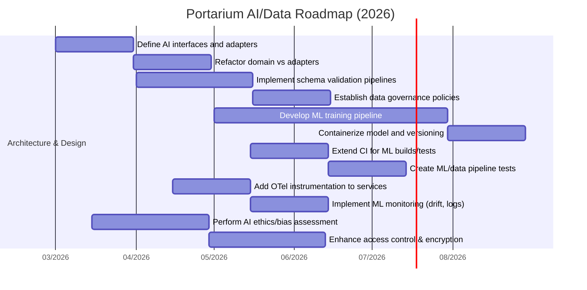

# Executive Summary

Portarium is an **event-driven control plane** for orchestrating operations (approvals, workflows, and evidence) across external systems. Its layered “ports-and-adapters” (hexagonal) architecture cleanly separates core domain logic from infrastructure, with asynchronous CloudEvents (NATS) and a Temporal-based worker service for execution. A modern UI (“Cockpit”) provides policy-informed approvals and an **AI-powered summary** feature is _planned_ (see the fixed `AISummary` schema【104†L13-L21】) to assist approvers.

Despite strong design foundations (domain-driven layering, test-driven UI, robust CI/CD【49†L48-L57】), **key gaps** exist in the AI/ML and data domains. The codebase contains _no implemented ML models or pipelines_ – the AI summary is currently a UI placeholder without a real model. There is limited support for data validation, model management, or monitoring of ML outputs. Responsible AI practices (bias assessment, explainability, consent management, data minimization) are largely unaddressed. Observability is focused on services (with OpenTelemetry planned) but not on model accuracy or data drift.

To reach production-level AI integration, we recommend **adding a formal ML/AI subsystem** and robust data pipelines. This includes: defining training and inference pipelines (e.g. fine-tuning or prompting of an LLM for summaries), versioning models, and instrumenting model outputs for drift detection【98†L66-L74】. Data flows from external systems should be governed by explicit schemas and validated at ingestion (using tools like Great Expectations)【100†L41-L50】【100†L66-L72】. Ethical guardrails – fairness checks, explainable rationales (the UI already surfaces “Why?” for risks), and consent/audit logs – must be built in (aligning with NIST’s trustworthiness pillars such as Explainability, Fairness and Privacy【70†L164-L172】). Testing must be extended beyond UI: include **data/schema unit tests** and **end-to-end ML pipeline tests**. CI/CD should incorporate these (e.g. pipeline integration tests, model packaging). Monitoring should cover both system health and ML performance: track service metrics and ML metrics (data drift, prediction drift, confidence trends【98†L66-L74】) with alerting.

Below we detail each dimension of analysis. We identify gaps (e.g. missing data contracts, no model lifecycle) and give actionable remedies (abstractions, tooling, processes) to bring Portarium to a “principal-level” standard for AI-driven systems. We conclude with a prioritized roadmap (tables + Gantt chart) of recommended improvements.

## 1. Project Scope & AI Components

**Scope.** Portarium is a control plane for “governable operations”: it interposes between users/agents and external systems (SaaS, databases, robotic tools) to enforce policies, approvals, and evidence logging【85†L12-L18】. Top-level features include _auto/assisted/human approval tiers_, enforceable policies (like Segregation-of-Duties, financial limits), and an immutable evidence chain.

**Existing AI Components.** The repository includes design docs for an “**AI Summary**” feature in the approval UI【104†L13-L21】. This schema (see sidebar) envisions using AI (likely a language model) to generate natural-language summaries of what an approval does, its risk level, compliance status, affected systems, etc. The UI wireframes even show tags for risk/confidence and “Why?” drilldowns【51†L66-L75】【52†L198-L207】. However, _no actual ML code is implemented_: the AI summary appears as static UI mockups, and no model-training or inference service exists. Apart from this, the only AI-related file is `AGENTS.md`/`CLAUDE.md` which describe internal dev rules and bots (code assistance), not deployed intelligence.

> **Current vs Recommended (AI Components):** The project currently has an AI _feature plan_ but no model or pipeline. We must introduce explicit AI modules: e.g. a microservice or library to invoke an LLM (OpenAI/GPT or open-source model) for summary generation. A clear **data contract** (the `AISummary` interface【104†L13-L21】) should back this. We recommend defining:
>
> - How the input (approval/work item details, policies, system state) is mapped into AI prompts.
> - Where AI inference runs (edge vs cloud, online vs batch).
> - How to handle confidence scoring and fallbacks.
>   In short, build out the missing “brain” behind the UI schema.

## 2. Data Sources, Schemas & Flow

**Data Sources.** Portarium integrates with various external systems (e.g. NetSuite, Google Drive, educational SIS) via adapters. The `vertical-packs/education-schools.md` shows example data models (OneRoster™, Ed-Fi) for users, roles, etc【30†L4-L13】. The event catalog (AsyncAPI spec) defines “Agents”, “Telemtery”, “Tools”, and domain objects (Approval, Run, Evidence).

**Data Schemas.** Many domain entities have Canonical Info Formats (CIFs) and Capability Matrices (see domain-`Atlas` beads) that map external schemas into Portarium’s internal models. JSON schemas or TypeScript interfaces enforce structure. However, enforcement seems manual: there is an OpenAPI spec for the control-plane API, but connectors’ schemas likely rely on code validation. There is no central **schema registry** or automated validation noted.

**Data Flow.** In brief, incoming requests (via REST or UI) create or update domain objects (approval/workitem/run) in the control plane. These emit CloudEvents (over NATS) handled by listeners or the Temporal worker. Execution requests dispatch to adapters (e.g. "create invoice in NetSuite"). Results (success/failure) append to the run’s evidence log. Audit data (action, timestamp, actor) form a tamper-evident chain. Real-time telemetry (adapter status, metrics) is broadcast via “Telemetry” events.

**Gaps & Risks.** - _Lack of end-to-end data validation:_ Currently, data can enter via many adapters; mistakes in mapping could propagate. Best practice is to validate input payloads against schemas as early as possible (using JSON Schema or tools like [Great Expectations](https://greatexpectations.io)).

- _Missing data contracts between services:_ The AsyncAPI events define structure, but there’s no enforced versioning beyond the spec file. Upstream changes (schema drift) could break consumers. A schema registry (e.g. RedHat ACM, or simpler versioned OpenAPI for events) is advisable.
- _Data volume/partitioning:_ For high throughput (e.g. thousands of events), ensure NATS clusters and Temporal workers are scaled (e.g. consumer groups). Design for partitioning by organization/tenant to avoid cross-tenant data leaks and hotspots.
- _Privacy-sensitive data:_ As the education docs hint, Portarium may handle PII/FERPA data. Portarium should **minimize data collection** and track consent. For example, a “consent” object is mentioned (type, expiry, guardian signature)【30†L4-L13】. Ingested personal data (student IDs, grades) must be pseudonymized if used in analytics or AI training (see GDPR/CNIL advice【102†L458-L467】【102†L500-L507】).

> **Current vs Recommended (Data):** The system now uses manual mapping of external data. We recommend introducing _data pipelines_ with validation steps: for each external feed (e.g. OneRoster roster import), validate against a declared schema, then transform to the domain model. Use a schema-validation framework so that any mismatch fails fast. Record lineage/metadata (timestamp, source) on all ingestions. Also, implement **data governance**: track data owners, retention policies, and consent flags. For instance, delete or anonymize student data when consent expires.

## 3. ML Models: Types, Training & Inference

**Current State.** There are _no trained models_ or ML artifacts in the code. The planned AISummary suggests a language model will be used, but no specifics are given. It likely requires an LLM or summarization model (e.g. GPT, Claude). No model training code or dataset is present.

**Recommended ML Pipeline.** To mature Portarium’s AI, we must explicitly define an ML workflow:

1. **Model Type:** Decide on an approach (e.g. fine-tuned transformer, retrieval-augmented generation, or a custom classifier for risk). For an approval summary, a large language model with domain-specific prompting might suffice.
2. **Training Data:** Collect historical approval and run data (with outcomes and human rationales) to fine-tune or prompt the model. Ensure this training data obeys privacy constraints.
3. **Versioning:** Use a model registry (like MLflow or a Git-based pointer) to track model versions and data versions. Each `AISummary` output should log the model version (UUID) and prompt used.
4. **Inference Service:** Package the model behind a service (could be a Dockerized microservice or a serverless function). This service takes an approval ID or payload and returns the `AISummary` object【104†L13-L21】. If using an external API (OpenAI), wrap calls to include rate-limiting, retries, and caching.
5. **Monitoring:** Log predictions and metadata for offline evaluation (see Section 6).

> **Current vs Recommended (ML Models):** Currently there is no ML infrastructure. We recommend establishing an ML workflow: create a model training pipeline (e.g. using Python/TF or a cloud ML service) and automated ingestion of curated training data. Implement a clear inference API (for example, a TS interface as in the `AISummary` schema【104†L13-L21】). Maintain _model logs_ and version tags. For retraining, schedule periodic jobs triggered by drift detection or new labeled data.

## 4. System Architecture & Abstractions

**Architecture & Layers.** Portarium follows a **hexagonal (ports-and-adapters)** pattern【73†L15-L23】. Domain code lives in `src/domain` (models, events, services) with zero direct external deps (per CLAUDE guidelines【58†L31-L39】). The application layer (`src/application`) defines use-case logic, invoking ports (interfaces) for persistence and execution. Infrastructure adapters (`src/infrastructure`) implement those ports (e.g. DB access, Event emitters, external API calls). The presentation/UI (`src/presentation`) and CLI are separate layers. This is consistent with AWS’s description of hexagonal architecture: _“loose coupling…testable independently with no dependencies on data stores or UIs”_【73†L15-L23】.

**Domain Abstractions.** Key domain abstractions are clear: **Workflow/Run**, **Approval**, **Plan**, **EvidenceEntry**, etc., with well-defined state machines. The evidence chain uses hash chaining for tamper-evidence (ref ADRs). Ports exist for operations like `IApprovalPort` or `IRunPort`. The architecture intentionally avoids an anemic model: business invariants (SoD checks, quotas) are enforced in domain services.

**Gaps/Missing Abstractions:** The core architecture is sound, but we note:

- **AI as a first-class service:** There is no abstraction or port for AI. E.g. it might be wise to define an `IAISummaryService` port so the domain logic can request summaries uniformly, making it easy to swap or mock the AI.
- **Connector Modularization:** Each external system adapter should be encapsulated. Ensure new adapters (e.g. for AI results storage) follow the same pattern to avoid entangling code.
- **Event-Driven Patterns:** The system uses a mix of choreography (events) and orchestration (Temporal). ADR-0070 even discusses “Hybrid choreography/orchestration” (unused here). As systems grow, we should formally catalog events (with semantic versioning). Missing event consumers or error-handling strategies should be added.

> **Current vs Recommended (Architecture):** The current layered design aligns with best practices【73†L15-L23】. We recommend continuing to isolate business logic in domain modules and use ports for any new components (e.g. an AI adapter). If concurrency or scale becomes an issue, consider breaking the control plane into microservices by subdomain (Approval, WorkItem, Evidence), each with its own bounded context. But avoid premature splitting unless needed: follow the “you aren’t gonna need it” rule. Ensure all asynchronous messages are idempotent and include correlation IDs, as per CloudEvents ADRs.

## 5. Scalability & Performance

**Data Scaling.** Portarium’s async/event-driven core (NATS JetStream) can scale horizontally. However, bottlenecks may appear in **stateful components** (the Temporal server, any databases). The project scaffold shows a CockroachDB and Elasticsearch in Docker Compose – these can scale vertically (CockroachDB is distributed by design). Checkpoints: plan for multi-node deployment of Temporal, JetStream, and ensure DB clustering is supported.

**Model/AI Scaling.** If an LLM is used for AI summaries, we must handle external API limits and latency. Real-time approvals likely require quick feedback. We should implement _caching of summaries_ (based on deterministic input hashes) and possibly a fallback (e.g. a simple rule-based summary) if the model fails. If using on-prem or self-hosted models, provision enough GPU/CPU resources and autoscaling.

**System Load.** The control plane itself should auto-scale: containerize services and use Kubernetes autoscaling on CPU/memory. For heavy workflows (e.g. ten thousand events per hour), ensure the NATS subscription can catch up (monitor consumer lag). Temporal task queue workers should be scaled by task-queue partition.

**Risks & Mitigations:**

- **Spike loads:** Large batches of runs could overwhelm databases. Mitigate by rate-limiting ingestion or batching evidence writes.
- **Infrastructure limits:** Cloud deployments should use managed services with quotas (e.g. AWS MSK or cloud NATS).
- **Latency:** UI should call control-plane asynchronously and not block on slow operations. Already health endpoints exist. Add metrics (e.g. request latency) and adjust timeouts.

> **Current vs Recommended (Scalability):** The event-driven design is scalable, but extra care is needed for the AI component: for example, batch AI summary generation in low-priority queues. Conduct load-testing: stress-test the approval workflow with thousands of events to find bottlenecks. If needed, introduce additional caching layers or sharding. Also, review “worker” design in Kubernetes (see `infra/kubernetes/`) to ensure enough replicas.

## 6. Testing & Validation

**Unit & Integration Tests.** Portarium has a strong UI testing strategy (Vitest + RTL, Playwright E2E, visual regression)【49†L18-L27】【49†L30-L39】. The CI gate enforces ≥80% coverage on presentation components【49†L48-L57】. However, there is little evidence of domain or data tests. We see _“smoke tests”_ for a “governed-run” scenario (in a specialized CI job) but no general domain test suite.

**Data/Schema Tests.** Currently, input/output schemas rely on manual enforcement. The community practice is to include **schema validation tests** (unit tests that the code accepts valid schema and rejects invalid data) and use data-contract testing (e.g. [Great Expectations](https://greatexpectations.io/) for each data pipeline). These catch changes in external data formats or corrupt inputs.

**Model Tests.** For ML, testing must cover:

- **Data validation:** ensure training/inference data meet expectations (no nulls where none expected, consistent feature ranges).
- **Unit tests for feature computation:** if custom features exist, test them on known inputs.
- **End-to-end tests:** e.g. “Given a work item with known parameters, does the AI summary have the expected structure or key phrases?” Possibly use a stubbed LLM.
- **Behavioral tests:** as Eugene Yan notes, ML pipelines require tests at multiple scopes【100†L41-L50】【100†L66-L72】 (unit, integration, data).

**Current Weaknesses:** In the AI context there are _no tests_ at all for any ML logic (since none exists). For data, there are no explicit data-driven tests or CI checks (the CI has static checks but not data quality checks). Best-practice violated: missing continuous validation of training-serving skew and drift detection.

> **Current vs Recommended (Testing):** Expand test coverage beyond the UI. In code/CI:
>
> - **Unit tests** for domain logic (e.g. policy evaluation, workflow state transitions).
> - **Integration tests** for the REST API (e.g. using mocked adapters) to cover end-to-end approval flows.
> - **Data schema tests:** write tests that deliberately feed malformed data to verify adapters and validation logic catch them.
> - **ML pipeline tests:** If an AI component is introduced, create **offline validation tests** on a frozen dataset【100†L41-L50】 (for example, check that known invoices generate appropriate risk levels).  
>   All these should be run on CI (see Table below).

## 7. CI/CD & Reproducibility

**Current CI/CD.** Portarium uses GitHub Actions extensively. The CI gate (on PR) runs linting, type-checking, spell-check, dependency analysis, tests, coverage, and even a nightly deep-check with mutation testing【49†L46-L57】【59†L10-L19】. Docker images and Kubernetes deployment (in `infra/`) are automated via workflows (`ci-images.yml`, `cd-k8s-deploy.yml`【59†L30-L39】). This is excellent for the codebase as-is.

**ML Pipeline CI/CD.** However, there is no ML pipeline in CI. Best practice in MLOps is to include model training and packaging in CI/CD. For example, trigger a workflow that retrains the model on updated data and saves the artifact when source data or code changes (like DataBricks or Kubeflow pipelines do). Model container images should be built and stored (Portarium already uses GHCR for the local stack).

**Reproducibility.** The Node.js environment and infra are containerized (docker-compose, k8s), helping reproducibility of the system. For ML, reproducibility means fixing random seeds, environment (Python/library versions), and snapshotting data. A conda environment or Dockerfile for training jobs is recommended.

> **Current vs Recommended (CI/CD):** The existing CI is robust for application code. We recommend extending it to the ML workflow: for example, add a “ml-train” job that runs only when the training code or data changes, and pushes the new model. Also, include data validation checks (possibly on a nightly schedule) to prevent broken data from entering production. To ensure full reproducibility, document and lock the ML environment (e.g. via `requirements.txt` or a Docker image) and version the training data (as part of the schema registry or using data versioning tools).

## 8. Observability, Monitoring & Alerting

**System Observability.** Portarium emits metrics and traces (via Prometheus/OTel) for service health. ADRs mention tracing and stats (e.g. ADR-033 recommends OTel context propagation). We infer some OTel readiness: the Temporal worker imports `@temporalio/worker`, but no explicit instrumentation is shown. The health endpoints (`/healthz`) exist.

**ML Observability.** This is largely absent. We need to monitor **model performance** alongside system health. According to best practices, set up a monitoring service to **ingest input and output samples** from the AI service【98†L219-L227】. Track metrics such as:

- **Prediction distribution drift:** e.g. if risk-level outputs suddenly skew high/low【98†L72-L81】.
- **Data distribution drift:** monitor key feature distributions in the input, as a leading indicator of concept drift【98†L66-L74】.
- **Key performance indicators:** e.g. compare how many approvals were auto-approved by AI vs manual override.
- **Latency/error rates:** track API response times for AI calls (if external, monitor 429 errors or timeouts).

Use an observability platform (existing Prometheus/Grafana) or ML-focused tool (Datadog ML monitoring, Evidently, etc.) to capture these. Alerts should fire if drift crosses a threshold【98†L130-L139】 or if the AI confidence plunges.

> **Current vs Recommended (Monitoring):** Today, Portarium likely monitors service-level metrics but _not ML metrics_. We recommend instrumenting the AI service to log every request: inputs, outputs, model version, and any confidence score. Then implement drift detection: e.g. weekly compute JS-divergence of new data vs training data【98†L72-L80】. Set up dashboards and alerts so data scientists/devs are notified of anomalies. On the infrastructure side, enable full OpenTelemetry tracing (as ADRs suggest) so that any slow call (especially to external AI APIs) is visible.

## 9. Security, Privacy & Ethical AI

**Security.** The repository’s `SECURITY.md` defines scope (e.g. prevention of RCE, injection, privilege escalation)【90†L30-L39】. This is a good start. Key actions:

- **Authentication/Authorization:** Portarium uses RBAC at the workspace level. Ensure JWT tokens or API keys are securely handled (rotate keys, limit scopes).
- **Injection Risks:** Particularly for AI, **prompt injection** is noted as in-scope【90†L30-L39】. If user-provided text goes into prompts, sanitize it or use prompt templates to avoid code execution. For example, never allow uncontrolled execution of code via AI.
- **Encryption:** Use TLS everywhere. Encrypt sensitive fields (e.g. evidence chain entries) at rest. The security scope explicitly mentions cryptographic integrity of evidence【90†L30-L39】. Implement signature verification for evidence logs.
- **Supply Chain:** They already use `npm audit` and `knip` to catch vulnerable or unused deps【59†L10-L19】. Continue these practices, and enable Dependabot/whiteSource.

**Privacy & Ethical AI.** This is largely undeveloped in Portarium: there is no mention of bias checks or user consent. Given the nature of the product:

- **Explainability:** The UI already includes “Why?” rationales for each AI judgment【51†L23-L31】【52†L205-L213】, which is good. Ensure these are actually populated (not just placeholder text). For any automated decision (e.g. risk=High), log the reasoning.
- **Bias/Fairness:** If the model is trained on historical data (e.g. past approvals), it may learn human biases. Institute periodic bias audits: test the model on synthetic cases (e.g. ensure approvals aren’t biased by user roles or demographics).
- **Data Minimization:** As CNIL advises, only collect the data needed for the AI’s purpose【102†L458-L467】. For instance, do not send private HR data to an external LLM. Use data anonymization/pseudonymization where possible.
- **Consent & Transparency:** If using personal data, record consent and ensure data subjects can view and request deletion of their data (PII retention policy). Possibly add a “Privacy Notice” in the UI.
- **Regulatory Compliance:** For domains like finance or education, there are specific rules. The UI example even notes SOX logs【52†L195-L203】. Similarly, in education, FERPA (US) or GDPR (EU) restrict student data use. Portarium should offer data retention policies and auditing for such regulations.

> **Current vs Recommended (Security/Ethics):** Security practices (CI audits, TLS, scoping) are solid, but AI-specific safeguards need emphasis. We recommend performing an **AI Risk Assessment**: catalog all ways the AI could cause harm (misinformation, biased outputs, privacy leaks). For each, define mitigation (e.g. human-in-the-loop for high-risk approvals). Formally adopt a Responsible AI framework (e.g. Microsoft’s six principles or the NIST guidelines【70†L164-L172】). Also, ensure all sensitive data is encrypted and access-logged. Finally, maintain documentation (e.g. an “Ethics ADR”) to capture these policies.

## 10. Code Quality, Modularity & Maintainability

**Current State.** The code follows Domain-Driven Design with strict layering (no circular deps), as per the internal style guide (the “CLAUDE” doc【58†L31-L39】). TypeScript enforces types, linting and formatting ensure style consistency. Package scripts (in `ci:pr`) enforce spell-check and dependency rules to keep code health high【59†L10-L19】.

**Concerns.** - **Technical Debt:** The README notes many paths are “scaffold-stage” (especially integration and persistence)【85†L74-L81】. This suggests unfinished adapters or hard-coded mocks. Ensure these scaffolds are marked with TODO/ADR and addressed soon to avoid rot.

- **Modularity:** As features (like AI) are added, avoid bloated modules. Use npm workspaces or separate repos if needed for large subcomponents (e.g. a “portarium-ai” package).
- **Documentation:** The project has extensive ADRs and docs, which is excellent. Continue documenting architecture changes (e.g. how the AI summary is generated) so new devs can follow. Every public interface (ports, domain events) should be documented in code and in design docs.

> **Current vs Recommended (Code Quality):** Portarium already enforces high code quality. We should maintain this by adding code review checklists specifically for AI/data code (e.g. does every new adapter have unit tests and error handling?). Consider using a static analysis tool (SonarQube) for code smells. Keep modularity high: for instance, if the AI summary grows complex, extract it into a dedicated service with its own interface. Continue using the existing governance (beads/ADRs) to track debt – e.g. create beads for “add unit tests for domain”, “refine adapter X implementation”, etc.

## 11. Dependencies & Third-Party Risks

**Current State.** The stack is Node.js (v22+), with npm packages. The project uses `knip` to detect unused deps, and runs `npm audit` nightly【59†L10-L19】. It also uses Docker images (published to GitHub Container Registry) for the local stack.

**Risks.** - **Vulnerabilities:** Regular vulnerabilities in popular Node packages necessitate frequent updates. Relying on nightly `npm audit` is good; ensure vulnerabilities are triaged and backported. Critical third-party libs (e.g. the Temporal SDK, or any AI library) should be pinned to known-good versions.

- **Licenses:** If incorporating any AI model or data library, verify license compatibility. e.g. GPT APIs are fine, but some ML models (like from Hugging Face) have non-commercial clauses.
- **Supply Chain (AI):** If using cloud AI (OpenAI, Anthropic), check for compliance/contractual restrictions (data residency, logging of prompts, etc.). For open models, monitor the source (some can be compromised with trojans).

> **Current vs Recommended (Dependencies):** Maintain the existing vulnerability scanning rigor. Additionally, adopt **SBOM generation** for container images (GitHub Actions can produce SBOMs) to track open-source components. For any new AI-related library, check its maintenance status and CVEs. For example, if using an LLM library (like `openai` or `langchain`), update at least monthly. Finally, consider an additional manual review for critical updates (e.g. major API changes in NATS, Temporal) due to the complexity of migrating.

## 12. Compliance & Regulatory

**Scope.** Portarium’s use cases (finance, education, healthcare, enterprise ops) likely intersect many regulations. For finance/ERP (as in the AI summary example mentioning SOX) the product must create immutable audit trails【52†L195-L203】. In education, compliance like GDPR (EU), FERPA (US), or COPPA (child online privacy) applies. If applied to healthcare, HIPAA would be relevant.

**Current Preparations.** The design already enforces an **evidence chain** (secure audit log) and role separation (RBAC/SoD). The UI even notes SOX (“invoice above $10k”)【52†L195-L203】. However, formal compliance (data subject rights, audit reports) is not implemented.

> **Current vs Recommended (Compliance):** Document compliance obligations clearly. For example, if deployed in EU education, implement GDPR consent and data deletion flows (aligning with CNIL’s “data minimisation”【102†L458-L467】). For finance, ensure the evidence log and approvals meet Sarbanes-Oxley audit requirements (evidence should be retained and immutable, which Portarium’s hash chain supports). We recommend building a **compliance checklist** (as ADRs or runbooks) that covers: data retention policies, user consent capture, breach notification process, and periodic audits. Any data breach or AI failure analysis should be captured in compliance logs.

---

## Recommendations & Remediation Roadmap

Below we prioritize identified gaps and suggested improvements. The table compares current vs. recommended design for key areas. Actionable steps are outlined in the roadmap (Gantt chart) with estimated effort/impact.

| **Aspect**                    | **Current**                                                                                                     | **Recommended**                                                                                                                                                    |
| ----------------------------- | --------------------------------------------------------------------------------------------------------------- | ------------------------------------------------------------------------------------------------------------------------------------------------------------------ |
| **AI Model Integration**      | Planned UI schema (`AISummary`), but **no model/service implemented**【104†L13-L21】. No ML pipeline.           | Define an AI service (port/adapter) with a clear interface【104†L13-L21】. Build a training pipeline or prompt-flow. Containerize model; version all artifacts.    |
| **Data Pipelines & Schemas**  | Manual adapter code, no automated schema validation. Some CIFs exist (Education pack)【30†L4-L13】.             | Introduce schema validation (e.g. JSON Schema, Great Expectations) on all inputs. Maintain a schema registry or versioned contracts for events and DB.             |
| **System Architecture**       | Hexagonal (ports & adapters) with domain-driven design【73†L15-L23】. Good layering, but AI logic absent.       | Continue strict layering. Add new ports/adapters for AI. Consider splitting services only if scale demands. Ensure idempotency and tracing on all flows.           |
| **Scalability**               | Event-driven, uses NATS+Temporal. Potential DB/worker bottlenecks if unscaled.                                  | Benchmark peak loads. Scale NATS/Temporal horizontally. Cache AI results; shard workloads by tenant. Implement autoscaling on Kubernetes.                          |
| **Testing**                   | Strong UI tests (80% coverage)【49†L48-L57】. No domain or ML tests.                                            | Add unit tests for core logic, integration tests for API flows. Create data validation tests and ML-specific tests (prediction consistency checks)【100†L41-L50】. |
| **CI/CD**                     | Comprehensive CI for code (lint, test, audit)【59†L10-L19】. No ML pipeline CI.                                 | Extend CI to include ML workflows: e.g. a “train” job that retrains models on data changes. Automate model Docker build and deployment.                            |
| **Observability/Monitoring**  | Service metrics (via Prometheus/OTel), but no ML metrics.                                                       | Instrument AI service: log inputs/outputs. Monitor data drift and prediction drift【98†L66-L74】. Setup alerts on anomalous model behavior or high latency.        |
| **Security**                  | Strong CI checks. Threat scope defined (incl. RCE, injection, “agentic prompt injection”)【90†L30-L39】.        | Perform security reviews of AI endpoints (sanitize prompts). Encrypt sensitive data at rest. Implement intrusion alerts.                                           |
| **Ethical AI (Bias/Privacy)** | No explicit bias/fairness processes. Data minimisation hinted in docs (consent in education pack)【30†L4-L13】. | Adopt fairness checks and audit logs for AI decisions. Anonymize personal data where possible. Obtain/record consents as advised by CNIL【102†L458-L467】.         |
| **Code Quality**              | Enforced style (lint, DDD). Many ADRs exist.                                                                    | Maintain modularity; continue using ADRs and Beads for design. Use static analysis (e.g. dependency-cruiser) to avoid new cycles. Keep documentation updated.      |
| **Dependencies**              | Vulnerability audits nightly【59†L10-L19】. Public APIs (e.g. NATS, Temporal) used.                             | Enable automated SBOM and Dependabot. Review licenses for AI libraries. Ensure third-party ML models/APIs comply with data policies.                               |
| **Regulatory Compliance**     | Audit trail built-in (evidence chain). Mention of SOX log【52†L195-L203】. No formal compliance controls.       | Implement data retention and deletion policies. Publish a compliance guide mapping features to regulations (GDPR, HIPAA, FERPA, SOX, etc.).                        |



### Code Snippet: AISummary Contract

For reference, the AI summary uses a strict schema. For example, the `AISummary` TypeScript interface is defined as【104†L13-L21】:

```typescript
interface AISummary {
  gateId: string; // Unique ID matching the approval gate
  actionSummary: string; // Plain-language description (1-2 sentences)
  risk: {
    level: 'low' | 'medium' | 'high';
    rationale: string;
    why?: string; // Optional detailed explanation
  };
  // ... additional fields (compliance checks, systems, reversibility, etc.) ...
}
```

This contract should be implemented and enforced by the AI service: every generated summary object must satisfy this schema【104†L13-L21】.

### References

- Portarium code & docs (architecture, AI design, CI strategy): e.g. AISummary schema【104†L13-L21】, CI/CD reference【59†L10-L19】【49†L48-L57】, evidence/SOX note【52†L195-L203】, security scope【90†L30-L39】.
- Architecture best practices: ports-and-adapters pattern【73†L15-L23】.
- Responsible AI principles (NIST trust pillars【70†L164-L172】; CNIL data minimisation【102†L458-L467】).
- ML pipeline testing and monitoring: recommendations on test scopes【100†L41-L50】 and drift detection【98†L66-L74】.
