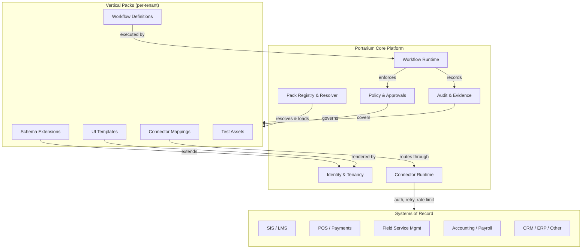
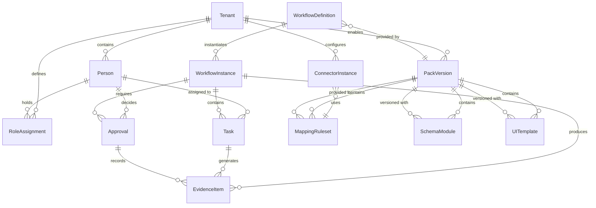
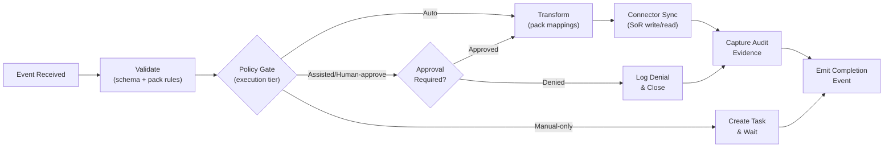

# Portarium Vertical Packs System

> **Portarium** is the product name. **VAOP** (Vertical Autonomous Operations Provider) is the internal architecture acronym. See ADR-036.

## Executive Summary

Portarium is and remains a **horizontal control plane**: it owns identity and tenancy, policy and approvals, the durable workflow runtime, tamper-evident audit/evidence, the connector execution runtime, and the pack registry/resolver. None of these responsibilities move into vertical code.

**Vertical packs** are versioned, declarative bundles that add domain-specific capabilities on top of the core. A pack contributes:

- **Domain data and entities** -- namespaced schema extensions (e.g., `edu.student_profile`, `hospo.menu_item`) that attach to core extension points without modifying core schemas.
- **Workflow definitions** -- declarative, event-driven workflow graphs composed of core steps (approval gates, evidence capture, connector invocations) and pack-specific steps (domain validations, entity transformations).
- **UI templates** -- schema-driven forms, pages, and layouts resolved at runtime by the core template renderer based on the tenant's enabled packs.
- **Connector mappings** -- field-level mapping rules and transformation definitions that bridge pack entities to Systems of Record (SoRs) through the core connector runtime.

Packs are **not arbitrary code**. They are configuration artefacts executed by the core runtime under the same policy, tenancy, audit, and security guarantees that govern all Portarium operations. This design follows the microkernel pattern described in ADR-044: a minimal, stable core with a defined extension contract and a registry that resolves packs per tenant.

Each pack is independently versioned using semantic versioning (ADR-045), independently tested with its own CI pipeline (ADR-051), and independently deployable on a per-tenant basis (ADR-055). Tenants pin pack versions in a lockfile and upgrade on their own schedule.

## Reference Pack

The ADR-0039 reference vertical pack is now materialized under:

- `vertical-packs/software-change-management/`

It provides a concrete software-change-management flow with explicit approval and evidence semantics while remaining fully declarative and governed by core pack contracts.

---

## Architecture Layering

The following diagram shows the separation between the Portarium core platform and the vertical pack layer, with packs connecting through to external Systems of Record.



### Core Responsibilities

| Component                | Responsibility                                                                              |
| ------------------------ | ------------------------------------------------------------------------------------------- |
| Identity & Tenancy       | Workspace isolation, RBAC, credential vaulting, session management                          |
| Policy & Approvals       | Execution tiers (Auto/Assisted/Human-approve/Manual-only), SoD constraints, approval queues |
| Workflow Runtime         | Durable execution (Temporal), retry/backoff, step orchestration, event routing              |
| Audit & Evidence         | Tamper-evident append-only log, evidence artefact storage, retention management             |
| Connector Runtime        | Auth flows, rate limiting, quota-aware execution, idempotency, secrets management           |
| Pack Registry & Resolver | Version resolution per tenant, compatibility enforcement, lifecycle gates, pack catalogue   |

### Pack Contributions

| Artefact             | Description                                                                    |
| -------------------- | ------------------------------------------------------------------------------ |
| Schema Extensions    | Namespaced entity types and fields extending core extension points             |
| Workflow Definitions | Declarative workflow graphs composed of core + pack steps                      |
| UI Templates         | Schema-driven forms and layouts with role-based visibility                     |
| Connector Mappings   | Field mappings, transformations, and identity resolution rules for domain SoRs |
| Test Assets          | Fixtures, contract tests, conformance suites distributed with the pack         |

---

## Entity-Relationship Model

The following diagram shows the core and pack-contributed entities and their relationships.



### Key Entity Definitions

| Entity             | Owner | Description                                            |
| ------------------ | ----- | ------------------------------------------------------ |
| Tenant             | Core  | Workspace isolation boundary                           |
| Person             | Core  | Identity record for any user, staff member, or contact |
| WorkflowDefinition | Pack  | Declarative workflow graph provided by a pack          |
| WorkflowInstance   | Core  | A single execution (Run) of a workflow definition      |
| Task               | Core  | A work item within a workflow instance                 |
| Approval           | Core  | An approval decision point within a workflow           |
| EvidenceItem       | Core  | An immutable audit record or artefact                  |
| ConnectorInstance  | Core  | A configured connection to an external SoR             |
| PackVersion        | Core  | A specific version of a pack enabled for a tenant      |
| SchemaModule       | Pack  | A namespaced set of schema extensions                  |
| UITemplate         | Pack  | A schema-driven form or page definition                |
| MappingRuleset     | Pack  | Field mappings and transformations for a connector     |
| RoleAssignment     | Core  | A person-to-role binding within a tenant               |

---

## Workflow Composition

Pack workflows compose core steps and pack steps into event-driven graphs. The following flowchart shows the standard composition pattern.



**Composition rules** (ADR-047):

1. Core emits domain-agnostic events (`record.created`, `approval.granted`, `connector.sync.requested`).
2. Packs subscribe to events and attach domain-specific validation and transformation steps.
3. Ordering is enforced by the workflow runtime; conflicts between pack handlers are governed.
4. Pack steps are declarative and executed by the core runtime -- no arbitrary code in packs.
5. Tenants can customise workflow templates within pack-defined boundaries.

---

## Pack Artefact Structure

A pack artefact is a signed, versioned bundle with the following layout (ADR-045):

```
edu-schools-pack/
  manifest.yaml            # Metadata, compatibility range, dependencies, provenance, checksums
  schemas/
    student_profile.json   # Namespaced schema extension (edu.student_profile)
    staff_profile.json     # Namespaced schema extension (edu.staff_profile)
    enrolment.json         # Namespaced schema extension (edu.enrolment)
    ...
  workflows/
    rostering_sync.yaml    # Declarative workflow definition
    enrolment_change.yaml  # Declarative workflow definition
    ...
  ui-templates/
    student_form.yaml      # Schema-driven UI template
    enrolment_panel.yaml   # Schema-driven UI template
    ...
  connector-mappings/
    oneroster_csv.yaml     # Field mappings for OneRoster CSV
    canvas_rest.yaml       # Field mappings for Canvas REST API
    ...
  tests/
    fixtures/              # Test event fixtures
    contracts/             # Connector contract tests
    conformance/           # Standards conformance tests (e.g., OneRoster)
```

The **manifest** contains:

- Pack ID and display name
- Semantic version
- Core compatibility range (e.g., `requiresCore: ">=1.2.0 <2.0.0"`)
- Pack dependencies (if any)
- Provenance metadata (builder, commit SHA, build timestamp, test results hash)
- Checksum list for all artefact files
- Digital signature

---

## Versioning Rules

Packs follow **Semantic Versioning** (SemVer) as defined in ADR-045.

| Increment         | Meaning                                                                                  | Example                                              |
| ----------------- | ---------------------------------------------------------------------------------------- | ---------------------------------------------------- |
| **Major** (X.0.0) | Breaking schema or workflow contract changes; removals, renames, incompatible transforms | `edu-schools 2.0.0` removes `edu.legacy_id` field    |
| **Minor** (x.Y.0) | Additive, backwards-compatible changes; new entities, fields, workflows, connectors      | `edu-schools 1.3.0` adds `edu.wellbeing_record`      |
| **Patch** (x.y.Z) | Bugfixes and non-breaking adjustments; mapping corrections, template fixes               | `edu-schools 1.2.1` fixes date format in roster sync |

### Compatibility Ranges

- Each pack declares `requiresCore: ">=X.Y <(X+1).0"` -- compatible within a core major series.
- Connector modules are versioned independently (e.g., `canvas.rest@2.x`) to allow connector updates without full pack upgrades.
- Pack-to-pack dependencies use the same SemVer range syntax.

### Tenant Lockfiles

Each tenant has a **pack lockfile** storing:

- Enabled pack IDs and exact pinned versions
- Connector module versions
- Enablement timestamp and actor
- Last compatibility check result

See [compatibility-matrix.md](compatibility-matrix.md) for detailed compatibility rules and upgrade paths.

---

## ADR Register

The vertical packs system is governed by the following Architecture Decision Records.

| ADR     | Topic                              | Decision Outcome                                                                                  |
| ------- | ---------------------------------- | ------------------------------------------------------------------------------------------------- |
| ADR-044 | Vertical Pack Layering Model       | Microkernel core + governed packs; core owns invariants, packs own domain extensions              |
| ADR-045 | Pack Format and Versioning         | Signed artefacts with SemVer; manifest, schemas, workflows, UI, mappings, tests                   |
| ADR-046 | Schema Extension Mechanism         | Namespaced extensions (`edu.*`, `hospo.*`) on core extension points; additive-only in minor       |
| ADR-047 | Workflow Composition               | Event-driven composable graphs; core steps + pack steps; declarative only                         |
| ADR-048 | UI Templating and Theming          | Schema-driven templates with role-based layouts; core renderer resolves pack templates            |
| ADR-049 | Data Storage and Tenancy Isolation | Shared default (Tier A) with schema-per-tenant (B) and DB-per-tenant (C) options                  |
| ADR-050 | Connector Mapping                  | Core runtime + pack mapping definitions; connector modules versioned independently                |
| ADR-051 | Testing and CI/CD                  | Packs as shippable units; schema compat checks, workflow simulation, contract tests               |
| ADR-052 | Support and Lifecycle Policy       | Core N/N-1 minors; pack LTS+Current trains; catalogue statuses with registry enforcement          |
| ADR-053 | Security, Privacy, Compliance      | Core compliance infrastructure + pack-declared compliance profiles; configurable per jurisdiction |
| ADR-054 | Observability and Telemetry        | Pack-aware OpenTelemetry; pack ID/version on spans; per-pack dashboards and regression detectors  |
| ADR-055 | Rollout and Migration              | Tenant-by-tenant rollout; patch=auto, minor=opt-in, major=migration plan+canary                   |

---

## Related Documentation

- [Education (Schools) Vertical Pack](education-schools.md) -- entities, standards, connectors, workflows, and regulatory constraints for the education domain
- [Hospitality & Trades Vertical Pack](hospitality-trades.md) -- entities, connectors, workflows, and regulatory constraints for hospitality and trades/field service domains
- [Compatibility Matrix](compatibility-matrix.md) -- version compatibility rules, upgrade paths, enablement/disablement processes, and support policy
