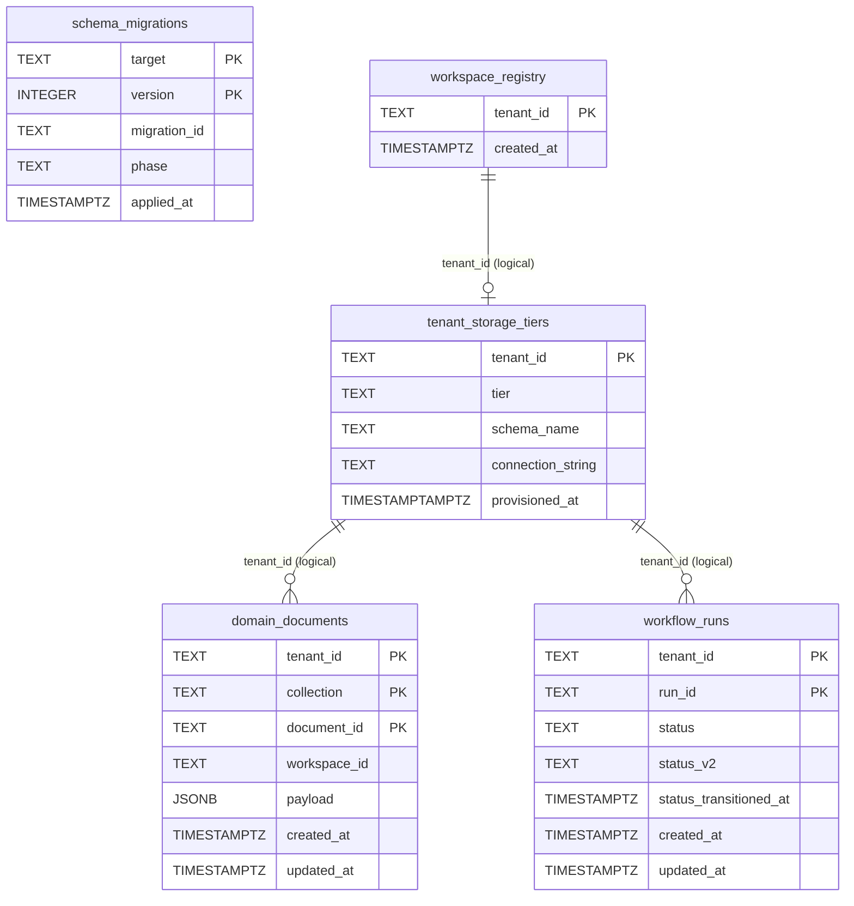
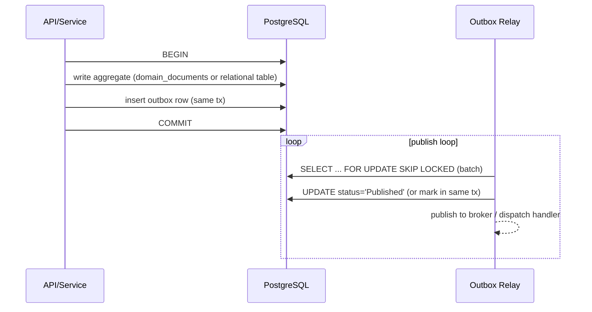

# Critical Evaluation of the Data & Information Systems Layer in Portarium

## Executive Summary

The data layer in **45ck/Portarium** is intentionally minimalist: a custom **PostgreSQL-backed JSON document store** (`domain_documents`) plus a small set of “system” tables (`schema_migrations`, `workspace_registry`, `tenant_storage_tiers`) and an early **projection table** (`workflow_runs`). fileciteturn77file1L1-L1

This architecture is coherent for a fast-moving domain model (write JSON, validate shape in code, evolve schemas via expand/contract), but current implementation details create **principal-level risks** in four areas:

- **Operational correctness risk (high):** the CI/CD pipelines **validate migrations but do not apply them** to any real database; deployment workflow explicitly “dry-runs” migrations only. This makes runtime drift and “works on dev only” failures likely. fileciteturn83file4L1-L1 fileciteturn84file10L1-L1
- **Scalability risk (high):** multiple store adapters load entire collections from `domain_documents` and filter/sort in memory. This will turn into DB hot spots, high memory pressure, and slow tail latency as data grows. fileciteturn73file0L1-L1 fileciteturn74file0L1-L1
- **Transactional integrity & messaging risk (high):** the outbox approach exists in two competing forms (JSON store vs a dedicated `outbox` table adapter), but there is no clear unit-of-work/transaction boundary abstraction to guarantee atomic “write state + enqueue event”. fileciteturn75file0L1-L1 fileciteturn76file0L1-L1 citeturn14search0turn14search1
- **Tenant isolation ambiguity (high):** the repository contains **two tenancy models**: (a) row-level `tenant_id` scoping inside shared tables, and (b) schema-per-tenant / DB-per-tenant automation with `search_path` implications. These need to be reconciled into one enforced model with testable guarantees. fileciteturn89file0L1-L1 fileciteturn85file1L1-L1 fileciteturn81file0L1-L1 citeturn13search0turn9search0

**Enabled connectors used:** GitHub. (As configured for this investigation.)

## Current Architecture and Baseline

The persistence surface is defined by a small `SqlClient` interface, implemented for PostgreSQL using `pg`’s connection pool. fileciteturn92file0L1-L1 fileciteturn70file0L1-L1

Repository evidence indicates:

- **Runtime:** Node.js (CI uses Node **24**) fileciteturn83file4L1-L1
- **Database engine:** PostgreSQL (local compose uses **postgres:16-alpine**) fileciteturn69file1L1-L1
- **Persistence style:** raw SQL + thin helpers (no ORM); a JSON document store (`domain_documents`) is the core backing store. fileciteturn72file0L1-L1 fileciteturn77file1L1-L1

Migrations are implemented as versioned TypeScript objects in a custom migration framework designed for expand/contract and compatibility classification. fileciteturn78file0L1-L1 fileciteturn77file1L1-L1

A multi-tenant storage tiering concept exists in **two overlapping ADRs**: an earlier Tier A/B/C framing and a newer “Shared (schema-per-tenant) vs Dedicated (DB-per-tenant)” automation ADR, plus Terraform automation for dedicated tenant databases. fileciteturn89file0L1-L1 fileciteturn85file1L1-L1 fileciteturn64file0L1-L1

## Schema Design and Relational Modelling

### Implemented tables and modelling posture

The “default migrations” define six migration versions that create five tables, with two indices beyond primary keys:

- `schema_migrations` (journal)
- `workspace_registry` (tenant registry baseline)
- `domain_documents` (JSONB document store)
- `workflow_runs` (projection table)
- `tenant_storage_tiers` (tier registry)

fileciteturn77file1L1-L1

The modelling posture is **deliberately denormalised**:

- Most domain entities are stored as JSONB `payload` in `domain_documents`. fileciteturn77file1L1-L1
- There are **no foreign keys** between tables (or from JSON documents to relational projections), so referential integrity is application-enforced only. fileciteturn77file1L1-L1
- Indexing is minimal: `(tenant_id, collection, workspace_id)` for `domain_documents`, and `(tenant_id, status)` for `workflow_runs`. fileciteturn77file1L1-L1

This design is acceptable **only if** you consciously commit to:

- “schema-on-read” with rigorous validation at boundaries,
- explicit projection tables for read-hot queries,
- disciplined index management (including JSON expression indexes / GIN indices where appropriate). citeturn10search2turn11search0turn11search1

### Current ER view

The absence of FKs is an intentional flexibility trade-off, but it materially increases:

- probability of orphaned/invalid references,
- difficulty of data migrations (especially across tenancy tiers),
- requirement for strong automated tests and repair tooling. fileciteturn77file1L1-L1

### Normalisation, constraints, and index posture

**Strengths**

- Composite primary key on `domain_documents (tenant_id, collection, document_id)` is a decent logical partitioning key and can support future partitioning by `tenant_id` or `collection`. fileciteturn77file1L1-L1
- `created_at`/`updated_at` exist, enabling incremental backfills and operational queries. fileciteturn77file1L1-L1

**Weaknesses**

- `domain_documents` mixes many entity types in one table; write amplification and index bloat will increase as collections expand. fileciteturn77file1L1-L1
- The only non-PK index on `domain_documents` is `(tenant_id, collection, workspace_id)`. Many access patterns in store adapters filter by fields inside `payload`, which will not be index-assisted unless expression/GIN indexes are added. fileciteturn73file0L1-L1 citeturn10search2turn11search0turn10search0
- `workflow_runs` is created and then expanded/contracted by later migrations, but there is little evidence of a production query store actually using it; this is “schema drift risk” (tables without consumers). fileciteturn77file1L1-L1

**Recommended modelling improvements**

- If `domain_documents` remains the write model, define **read models** (projection tables) for high-volume queries (runs, work-items, approvals, idempotency keys, outbox) and enforce constraints + indexes there. fileciteturn75file0L1-L1 citeturn10search2turn11search0turn11search1
- Add targeted Postgres indexes for JSONB access patterns:
  - **GIN jsonb_ops / jsonb_path_ops** where you use containment (`@>`) or jsonpath filtering. citeturn10search0turn10search2
  - **Expression indexes** on `(payload->>'field')` for equality/range constraints, possibly as **partial indexes** per `collection` to reduce size. citeturn11search0turn11search1

## SQL Quality, Persistence Abstractions, and Data Access Patterns

### Raw SQL vs ORM, and current abstraction boundaries

The system uses raw SQL through `SqlClient.query`, wrapped in “store adapter” classes (effectively repositories). This is reasonable for a TypeScript service when:

- SQL is centralised, parameterised, reviewed, and covered by integration tests,
- transaction boundaries are explicit and composable. fileciteturn92file0L1-L1 fileciteturn73file0L1-L1

At present, the abstraction is **too thin** for correctness at scale:

- The `SqlClient` interface does not model transactions (no `BEGIN/COMMIT` unit-of-work wrapper is visible at the interface level). fileciteturn92file0L1-L1
- Many store methods compensate by doing logic in memory, avoiding SQL complexity but pushing scalability risk into application memory/CPU and database read load. fileciteturn73file0L1-L1 fileciteturn74file0L1-L1

### Query patterns: N+1, projections, joins, and pagination

**N+1 example**
`PostgresWorkforceMemberStore.listWorkforceMembersByIds` executes `Promise.all(ids.map(...getById))`, i.e., **one query per ID**, which will degrade linearly with list size. fileciteturn74file0L1-L1

**Projection mismatch**
A query-builder exists to build list queries by filtering `domain_documents` in SQL, but multiple stores still fetch-and-filter. This indicates either incomplete adoption or missing capabilities (e.g., safe sorting/cursor support). fileciteturn71file0L1-L1 fileciteturn73file0L1-L1

**Pagination**
There is a helper for cursor pagination that filters by `id > cursor`, but several list methods do not implement DB-side keyset pagination and/or do not apply limits at the SQL level. fileciteturn91file0L1-L1 fileciteturn73file0L1-L1

**Security-sensitive SQL construction**
The query builder parameterises values, but it also splices field identifiers into SQL. Any identifier that can be influenced by external input must be strictly whitelisted; Postgres cannot parameterise identifiers. fileciteturn71file0L1-L1

### Connection pooling, batching, caching

`NodePostgresSqlClient` instantiates `pg.Pool` with only a connection string, implicitly relying on defaults (e.g. default pool size, idle timeout, connection timeout semantics). fileciteturn70file0L1-L1

This is operationally fragile because:

- `pg.Pool` defaults (including `max`, `idleTimeoutMillis`, `connectionTimeoutMillis`) need intentional sizing per workload; otherwise you risk long waits or connection storms under load. citeturn0search0turn0search3
- you currently have no central place to add DB query instrumentation (duration, row counts, error classification) without wrapping `SqlClient`. fileciteturn92file0L1-L1 fileciteturn90file0L1-L1

Caching is not evident at the SQL layer; for correctness-sensitive state (idempotency/outbox), correctness-first is fine, but for read-heavy endpoints you will eventually need either a projection table strategy or an external cache with explicit invalidation rules. fileciteturn75file0L1-L1

## Scalability, Integrity, and Security Risks

### Hotspots, table growth, and partition readiness

`domain_documents` concentrates all “document-like” entities into one hot table. As data grows, even with tenant scoping, you should expect:

- index bloat (especially with frequent updates, as `updated_at` changes),
- increased vacuum pressure,
- degraded cache locality if many unrelated collections share pages. fileciteturn77file1L1-L1

The composite PK is a good starting point for partitioning strategies (by tenant or by collection), but you should decide early:

- **row-level multi-tenancy** (single schema, tenant_id everywhere), potentially with RLS to avoid human/query mistakes, vs
- **schema-per-tenant** (tenant isolation via `search_path`), which shifts risk to connection/session hygiene. fileciteturn89file0L1-L1 fileciteturn85file1L1-L1 citeturn13search0turn9search0

### Locking and outbox/queue consumption

If you implement a relational outbox table (which you appear to be moving towards), multi-consumer processing should use a queue-safe pattern such as `SELECT … FOR UPDATE SKIP LOCKED` to avoid thundering herds and double-processing. PostgreSQL explicitly documents `SKIP LOCKED` as suitable for “queue-like tables”. citeturn8search1turn12search8

The current repo contains an outbox adapter that uses a dedicated `outbox` table, but:

- default migrations do not create that table,
- there’s no visible transaction boundary ensuring atomicity with state writes. fileciteturn76file0L1-L1 fileciteturn77file1L1-L1 citeturn14search0turn14search1

### Tenant isolation and `search_path` hazards

Using schema-per-tenant requires stringent `search_path` discipline. PostgreSQL warns that adding schemas to `search_path` effectively “trusts” users with `CREATE` on those schemas and can enable malicious behaviour, especially where unqualified object names are used. citeturn13search0

If PgBouncer is used, beware pool mode:

- default `server_reset_query` is `DISCARD ALL` (good hygiene), but it is not used in transaction pooling mode unless configured; relying on session state across requests is unsafe. citeturn9search0turn9search8

The repository’s migration drivers include a schema-scoped driver that sets `search_path` (per statement). That needs to be tied to a safe transaction/request boundary and must be validated under realistic connection pooling conditions. fileciteturn79file0L1-L1

### SQL injection and integrity

Most SQL statements use parameter placeholders, which is good. However:

- any dynamic identifier insertion (field names, schema names) must be _strictly_ validated/whitelisted because identifiers cannot be parameterised. fileciteturn71file0L1-L1
- tenant/schema provisioning uses dynamically constructed schema/database names in some places; even if current sanitisation is strong, you should treat this as a “must fuzz-test” surface because mistakes here can lead to cross-tenant impact. fileciteturn81file0L1-L1 fileciteturn80file0L1-L1

## Testing, Observability, and Operational Readiness

### Testing weaknesses

There is good intent around behavioural testing of store adapters, but the current “integration tests” use an `InMemorySqlClient` that simulates only a subset of SQL (JSON doc upsert/select tags). This will not catch:

- SQL syntax errors,
- index usage regressions,
- transaction/locking issues,
- Postgres-specific JSONB semantics,
- schema drift between migrations and code. fileciteturn72file2L1-L1 fileciteturn72file1L1-L1

Migrations are validated in CI, but the workflow does not spin up a PostgreSQL service and does not apply migrations to a real DB. fileciteturn83file4L1-L1

### Migration execution gap in CD

The platform deploy workflow runs **“Dry-run schema migrations”** (expand phase). It does not apply migrations, which is a major operational hole for any system beyond a prototype. fileciteturn84file10L1-L1

This undermines the otherwise strong expand/contract intent and will eventually produce broken deployments where application code expects new columns/indexes that do not exist.

### Observability

An OpenTelemetry setup file exists, but it currently reads as scaffolding rather than a full DB instrumentation pipeline (no evidence of pg auto-instrumentation wiring or query metrics at the `SqlClient` boundary). fileciteturn90file0L1-L1

Given performance risks from JSONB + collection scans, you will need:

- query duration metrics (including tags identifying which store/query),
- slow query logging (with query IDs/comments),
- migration run logs and “schema version” dashboards. fileciteturn72file0L1-L1

### Backups and DR posture

For **dedicated DB-per-tenant** tiering, the Terraform module provisions:

- RDS instance with backup retention,
- AWS Backup plan with retention and optional cross-region copy,
- credentials stored in Vault. fileciteturn64file0L1-L1

The newer storage tier ADR documents backup/restore expectations and cautions about `search_path` hygiene. fileciteturn85file1L1-L1

For **shared tiers**, the repo indicates reliance on shared RDS automated backups (conceptually), but the enforcement and verification mechanisms (restore drills, tenant-level restore procedures) must be backed by actual automated tests/runbooks, not just documentation. fileciteturn85file1L1-L1

## Recommendations, Target State, and Prioritised Roadmap

### Current vs recommended design posture

| Dimension                   | Current state                                                                                                                                         | Recommended target                                                                                                                                                                                                                       |
| --------------------------- | ----------------------------------------------------------------------------------------------------------------------------------------------------- | ---------------------------------------------------------------------------------------------------------------------------------------------------------------------------------------------------------------------------------------- |
| Tenancy model               | Mixed signals: row-level tenant_id tables + schema/DB tier automation docs and provisioners fileciteturn77file1L1-L1 fileciteturn85file1L1-L1 | Choose **one execution model** per tier and enforce it: either (A) single-schema + RLS, or (B) schema-per-tenant + `SET LOCAL search_path` inside per-request transactions, plus pool reset guarantees citeturn13search0turn9search0 |
| Persistence model           | JSON document store for most entities; few projection tables exist but underused fileciteturn77file1L1-L1                                         | Keep `domain_documents` for write model **only if** you introduce projection/read models for read-hot queries + indexes aligned with those queries citeturn10search2turn11search0                                                    |
| Transactions / unit-of-work | No explicit transaction API in `SqlClient`; outbox atomicity not guaranteed fileciteturn92file0L1-L1 fileciteturn76file0L1-L1                 | Add a `TransactionManager` / unit-of-work abstraction; require “state write + outbox write” to occur in one tx (Transactional Outbox pattern) citeturn14search0turn14search1turn8search1                                            |
| Querying                    | Frequent “load all then filter” and N+1 patterns fileciteturn73file0L1-L1 fileciteturn74file0L1-L1                                            | Move filtering/sorting/pagination into SQL; implement batched IN queries; add expression/partial/GIN indexes matching query predicates citeturn11search0turn11search1turn10search0                                                  |
| Migrations                  | Custom framework is strong on paper, but CI/CD does not apply migrations to real DB fileciteturn78file0L1-L1 fileciteturn84file10L1-L1        | A deploy-time migration job that applies expand/contract with journaling, plus “apply + verify” gates; dry-run remains as preflight fileciteturn79file0L1-L1                                                                         |
| Observability               | OTel scaffolding; no clear DB-level metrics or slow-query strategy fileciteturn90file0L1-L1                                                       | Instrument `SqlClient` for latency/error metrics, add query tags, enable slow query logs and dashboards                                                                                                                                  |

### Recommended target transaction flow

`SKIP LOCKED` is explicitly designed to avoid lock contention for queue-like workloads with multiple consumers. citeturn8search1turn12search8

Transactional outbox ensures atomic state change + message recording without 2PC. citeturn14search0turn14search1

### Prioritised findings and actions by risk and effort

| Finding                                         | Evidence (repo)                                                                                                                                                       |   Risk | Effort | Action                                                                                                                                                                      |
| ----------------------------------------------- | --------------------------------------------------------------------------------------------------------------------------------------------------------------------- | -----: | -----: | --------------------------------------------------------------------------------------------------------------------------------------------------------------------------- |
| Deploy pipeline does **not apply migrations**   | CI validates `migrate:ci`; CD does dry-run only fileciteturn83file4L1-L1 fileciteturn84file10L1-L1                                                            |   High | Medium | Add a real migration job (K8s Job / init container) that uses `PostgresMigrationJournalStore` + real SQL driver; gate deploy on apply+verify                                |
| Store adapters do “load all then filter/sort”   | Postgres store adapters and workforce adapters fileciteturn73file0L1-L1 fileciteturn74file0L1-L1                                                              |   High | Medium | Move list/filter/sort into SQL (keyset pagination), add needed indexes (expression/partial/GIN) citeturn11search0turn11search1turn10search2                            |
| N+1 reads in workforce member listing           | `listWorkforceMembersByIds` pattern fileciteturn74file0L1-L1                                                                                                      |   High |    Low | Implement batched fetch (`WHERE document_id = ANY($1)`), return map; benchmark                                                                                              |
| No explicit unit-of-work / transaction boundary | `SqlClient` has only `query` fileciteturn92file0L1-L1                                                                                                             |   High | Medium | Add `withTransaction(fn)` to client + a `TxSqlClient`; enforce in app use-cases for multi-write operations                                                                  |
| Outbox design is ambiguous/incomplete           | JSON outbox store vs dedicated outbox adapter; no migration for `outbox` table fileciteturn75file0L1-L1 fileciteturn76file0L1-L1 fileciteturn77file1L1-L1 |   High | Medium | Pick one: (A) dedicated `outbox` table with queue-safe polling (`SKIP LOCKED`) or (B) JSON outbox with projection; add migrations + tests citeturn14search0turn8search1 |
| Tenancy isolation model mismatch                | ADR-0049 vs ADR-0084 + provisioners fileciteturn89file0L1-L1 fileciteturn85file1L1-L1 fileciteturn81file0L1-L1                                            |   High |   High | Decide and codify: schema-per-tenant vs row-level; then add automated isolation tests + pool reset strategy citeturn13search0turn9search0                               |
| Pool config relies on defaults                  | NodePostgresSqlClient uses only connection string fileciteturn70file0L1-L1                                                                                        | Medium |    Low | Make pool sizing/timeouts explicit; surface via env; set connection timeouts intentionally citeturn0search0turn0search3                                                 |
| Tests do not hit real Postgres                  | InMemorySqlClient based integration tests fileciteturn72file2L1-L1                                                                                                | Medium | Medium | Add Postgres-backed integration tests (CI service container) for migrations, indexes, query plans, locking behaviour                                                        |

### Concrete refactor patterns to adopt

**Adopt a “principal-grade” database boundary:**

- Define `Db` module that owns:
  - pool lifecycle,
  - migration apply/verify,
  - transaction wrappers,
  - observability hooks (metrics + tracing),
  - tenancy context propagation (schema/tenant_id). fileciteturn92file0L1-L1 fileciteturn90file0L1-L1

**Harden expand/contract discipline**

- Your migration framework already encodes phases and compatibility. Enforce this by making CI/CD require:
  - expand migrations applied before releasing code that reads the new shape,
  - contract migrations only after a verification window.
    Thoughtworks explicitly recommends expand/contract (parallel change) patterns for safe evolution of published interfaces. fileciteturn78file0L1-L1 citeturn17search2turn16search3

**Index strategy for JSON store**

- For JSON-heavy filtering, use Postgres’ documented JSONB indexing methods:
  - GIN on JSONB (jsonb_ops/jsonb_path_ops depending on operators) citeturn10search0turn10search2
  - expression indexes for `(payload->>'field')` citeturn11search0
  - partial indexes to constrain by `collection` where feasible citeturn11search1

This turns your “document DB on Postgres” approach from “works at 10k rows” into something that can plausibly scale while you incrementally introduce typed projections.

---

## **Unspecified details (explicit):** production database topology (single RDS vs Aurora vs self-managed), actual pooling mode (PgBouncer presence/config), and runtime transaction isolation levels are not concretely specified in the inspected sources; recommendations above therefore assume standard PostgreSQL behaviour and must be verified against the actual deployment environment. fileciteturn69file1L1-L1 citeturn9search0turn13search0

## Data Layer Triage (bead-abk6 — assessed 2026-02-22)

Cross-referenced all 8 prioritised findings against the live codebase (commit 8bf12ff).

| Finding                                       | Status    | Evidence                                                                                                                                              | Bead                                                                 |
| --------------------------------------------- | --------- | ----------------------------------------------------------------------------------------------------------------------------------------------------- | -------------------------------------------------------------------- |
| Deploy pipeline does not apply migrations     | CONFIRMED | `package.json:112` `migrate:ci` = check + dry-run:expand only; no Postgres service container in CI; CD also dry-run only                              | bead-mig1 (P1, seeded)                                               |
| Store adapters do "load all then filter/sort" | CONFIRMED | `postgres-store-adapters.ts` + `postgres-workforce-store-adapters.ts` have in-memory filter/sort patterns                                             | bead-sql2 (P1, seeded); bead-nj7i (pagination, blocked by bead-8k55) |
| N+1 reads in workforce member listing         | CONFIRMED | `postgres-workforce-store-adapters.ts:106` uses `Promise.all` over `getById`                                                                          | bead-sql2 (P1, seeded)                                               |
| No unit-of-work / transaction boundary        | CONFIRMED | `sql-client.ts` exposes only `query()`; no `withTransaction`; outbox insert not atomic with state write                                               | bead-tx1 (P1, seeded)                                                |
| Outbox design is ambiguous/incomplete         | PARTIAL   | `postgres-eventing.ts` implements `PostgresOutboxStore` via `domain_documents` 'outbox' collection; no dedicated outbox table; no transaction pairing | bead-tx1 (P1) covers atomicity                                       |
| Tenancy isolation model mismatch              | OPEN      | ADR-0049 vs ADR-0084 not reconciled; architectural decision required                                                                                  | Deferred — P2 tenancy epic work                                      |
| Pool config relies on defaults                | CONFIRMED | `node-postgres-sql-client.ts:9` `new Pool({ connectionString })` only                                                                                 | bead-pool1 (P2, seeded)                                              |
| Tests do not hit real Postgres                | CONFIRMED | CI uses `InMemorySqlClient`; `migrate:ci` = dry-run; no Postgres service container                                                                    | bead-mig1 (P1); bead-ijlt (P1, blocked by bead-8k55)                 |

**New beads seeded:** bead-mig1 (migration apply in CD), bead-sql2 (N+1 + in-memory filter), bead-tx1 (unit-of-work), bead-pool1 (pool config).
