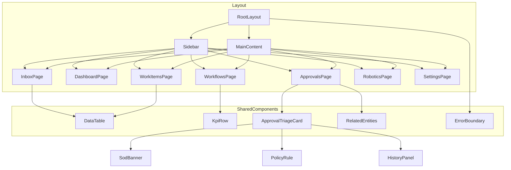

# Executive Summary

Portarium’s **Cockpit** UI demonstrates a solid foundation (consistent card layouts, keyboard-first interactions, and clear content hierarchy) but suffers from critical gaps in usability and code quality.  Our evaluation (via heuristic analyses and code reviews) identifies frequent violations of UX best practices: missing feedback on actions (no spinners or confirmation for key operations)【8†L40-L47】【45†L20-L28】, inconsistent navigation and visual patterns【4†L23-L28】【36†L61-L70】, and inadequate accessibility support (no skip-link, missing ARIA labels, color-reliant status badges)【45†L26-L34】【13†L264-L272】.  The codebase similarly reveals issues: monolithic components (a 750+ line TriageCard)【19†L458-L466】, hardcoded demo data in production UI【17†L163-L172】, and no error boundaries or loading states【15†L8-L13】【19†L515-L523】.  These problems reduce effectiveness, efficiency, and satisfaction (ISO 9241 usability criteria)【41†L10-L18】. 

This report details how Cockpit’s current design and architecture align (or conflict) with HCI theory and standards (Nielsen heuristics, WCAG, ISO 9241, etc.), examines user flows and code structure, and proposes a **prioritized roadmap** of fixes.  For each area (navigation, visual design, interactions, accessibility, error handling, performance, testing, security, and code maintainability) we highlight deficiencies, map them to best practices, and recommend concrete remedies (including sample code and diagrams).  The aim is a disciplined, robust UI that meets enterprise usability and engineering standards: clear affordances and feedback, inclusive design, and scalable, maintainable architecture.  

## Current UX Design & Artifacts

- **Information Architecture & Navigation.**  Cockpit’s sidebar groups functions into **Workspace/Work/Configuration**, but some items are mis-categorized (e.g. “Agents” under Configuration even though it’s an operational feature【13†L282-L286】).  There is *no default landing route* – loading `/` shows a blank area until the user picks a tab【4†L23-L28】.  Labels are inconsistent (e.g. “Work” vs “Workspace” appear interchangeably【4†L23-L27】) and the collapsed sidebar has no tooltips or accessible names【4†L31-L35】【45†L26-L34】.  Many links (e.g. workflow items) use plain `<a>` causing full-page reloads, breaking the single-page experience【45†L42-L49】.  On mobile, the fixed-width sidebar (`w-64` or `w-16`) never collapses into a drawer, so the main content becomes unusably narrow on small screens【18†L369-L377】. 

- **Visual Design & Consistency.**  The UI has a coherent baseline style (consistent card patterns, typography tiers) but some inconsistencies remain. The **Dashboard** uses the wrong icon (workflow icon instead of dashboard)【4†L47-L52】.  CTA buttons sometimes do nothing (“New Run” has no handler)【4†L53-L57】.  Shared components (e.g. `<DataTable>`) are used in some places, but others use raw HTML tables (e.g. the Safety page’s tables lack hover states and accessibility roles)【6†L175-L179】.  Text sizing is uneven: some small labels use 10px/11px, which fails WCAG minimums【7†L277-L285】.  Colors are applied inconsistently: many badges use hardcoded Tailwind hues instead of design tokens, causing potential dark-mode contrast issues【6†L290-L299】【6†L302-L307】.  Overall the **visual hierarchy** underutilizes the available design levels: aside from the prominent hero prompts, most content (cards and panels) shares identical borders and weights【43†L469-L478】【7†L277-L285】.

- **Interaction Patterns & Flows.**  The **Inbox/Triage flow** is a key use case.  In the current design, a user opens the Inbox to see pending approvals and runs.  Tapping “Triage” shows one approval at a time.  This flow works largely as intended, but critical feedback is missing.  For example, approving or denying a request immediately advances the queue with *no confirmation or undo*, which is dangerous for a compliance workflow【8†L40-L47】【43†L481-L490】.  Keyboard shortcuts (e.g. space/enter to approve) exist, but they still fire even if focus is in a text field (risking accidental submissions)【43†L481-L490】.  The UI currently **omits rationale for approvals** entirely (the rationale field only appears when denying, and even then a bug causes submitting rationale to skip the item)【4†L69-L77】【43†L483-L491】.  

  Other flows (run execution, work item assignment) follow standard table-and-kanban patterns, with *flexible views* (toggle A/B for table vs kanban)【11†L179-L185】.  These toggles, however, are labeled “A|B” generically, offering no clue to users until they try them – inconsistent with the principle of recognition over recall【11†L180-L185】.  Some screens lack breadcrumbs or context: e.g. top-level lists (Runs, Work Items) show no breadcrumb, making it hard to know where the user is【8†L43-L47】.  Across the app, empty states often just say “No data” with no next-step guidance【5†L103-L111】.

- **Feedback & Affordances.**  Most interactive elements look and act like common patterns (buttons, links), but feedback is weak.  Clicking primary actions like **Retry Run** or **Submit Decision** shows *no spinner or disabled state*【8†L40-L47】.  Empty/processing states are inconsistent: the Observability page silently shows nothing on error (no user message)【5†L119-L127】, and some pages use textual “Loading…” while others use skeletons, giving a jarring inconsistent feel【5†L131-L139】.  The “swipe” metaphor in triage (card-stack interface) has no caption or hint – users might not realize they can swipe left/right and that keyboard shortcuts exist【5†L93-L100】.  Hero prompt banners on every page explain the screen’s purpose (a strength) but are not dismissible, so they take up valuable space even after the user has learned the UI【43†L479-L488】. 

- **Accessibility & Inclusivity.**  The Cockpit falls short of basic accessibility: *keyboard navigation* lacks a “skip to content” link【45†L16-L23】, forcing users to tab through the entire sidebar on every page.  The `<nav>` element has no `aria-label`, and collapsed menu links have no screen-reader label (so a screen reader just reads the route path)【45†L26-L34】.  Many icons and badges lack proper ARIA attributes – e.g. the status badges insert SVGs with no `aria-hidden="true"`, causing extraneous announcements【45†L82-L90】.  Color is used alone to convey status (green vs red), which fails for colorblind users【13†L264-L272】.  Furthermore, small text (10px badges) may not meet WCAG contrast; one audit flags that on some themes yellow/green text fails AA contrast【45†L100-L108】.  Overall the app violates the WCAG principles of **perceivable** (text is too small, no text alternatives for color cues), **operable** (no skip-link, missing keyboard focus states), **understandable** (technical jargon without explanation), and **robust** (no ARIA landmarks or proper semantics)【34†L55-L63】【45†L16-L24】.

- **Visual Consistency & Design Tokens.**  A coherent theming system is partly in place (theming hook, semantic token classes), but adherence is incomplete. Some components bypass tokens: for example, badges use raw Tailwind color classes like `bg-green-100`【6†L290-L299】, which look wrong in dark themes.  The separation of concerns (layout vs styling) is undermined by inline styles and inline arrays of props (e.g. `<KpiRow>` builds its grid via a style string【17†L188-L196】).  Fonts and spacing also lack a single standard: multiple margin and gap sizes are used across pages, and typography occasionally mixes 10px, 11px, 12px text (below WCAG AA minimum)【7†L277-L285】.  Where a shared component exists (e.g. `<RelatedEntities>` panel), it is inconsistently used (the Work Item page still has a hand-rolled linked-entities card instead)【6†L181-L185】, leading to UI fragmentation.

- **Error Handling & Recovery.**  Key resilience features are missing. Critically, **no React error boundaries** are installed anywhere – any uncaught exception will blank the entire UI【19†L515-L523】. Individual pages rarely handle failed data loads: e.g. the Observability page ignores errors【5†L119-L127】, and the Run Detail page’s guard never shows an error if the API returns null【5†L137-L142】.  Validation feedback is also absent: the approval decision form has a “Rationale (required)” field but shows no error if left empty【5†L137-L142】.  Conversely, once an action fails (e.g. a run blocked), the user sees only a terse “Run blocked: missing provider scope” with no guidance on how to fix it【11†L205-L214】.  

- **Performance & Scalability.**  The UI is moderately fast on modern desktops, but some patterns threaten scalability. A large library (`recharts` for charts) is imported eagerly【18†L322-L330】, inflating the main bundle ~300KB for a secondary page.  Queries often fetch entire collections even when only one item is needed (the Approval detail route fetches all runs to find one【7†L330-L336】).  There is no virtualization for long lists, and tables do not scroll horizontally on small viewports, causing overflow【18†L387-L395】.  The fixed sidebar layout and unwrapped tables also break on tablets and phones【18†L369-L377】【18†L383-L392】.  As data volumes grow, these issues (inefficient queries, heavy bundles, no batching) could slow the app and degrade UX.

- **Testing Strategy.**  Automated testing is minimal – only two trivial test files exist (for asset registry lookup and some icon components)【20†L578-L586】.  All core flows (triage, workflow run, filters, forms) and UI components (DataTable, ApprovalTriageCard, etc.) lack coverage, so regressions are unprotected.  There is no mention of formal usability testing or metrics (e.g. task success rates) for Cockpit.  Modern UX best practices would call for user testing with representative personas, A/B testing of layouts, and performance/user analytics – none of which appear to be documented in the repo.  The absence of unit and integration tests (and missing error handling in the code) means bugs may slip into production undetected, ultimately harming maintainability and user trust.

- **Code Architecture & Maintainability.**  The code follows a reasonable layering (hooks → components → routes) and uses TypeScript strictly, which aids robustness【15†L8-L13】.  Common libraries (TanStack Query/Router, Radix UI) are used consistently.  However, architectural debt is apparent: some components are huge and mix logic with presentation (the **ApprovalTriageCard** alone contains 9 sub-components and mock data, making it hard to test or extend)【19†L458-L466】.  There is duplication (`initials()` logic appears twice)【17†L207-L215】 and inconsistent use of hooks (one events page reimplements `useEvidence` instead of reusing it)【17†L178-L184】.  Some abstractions aren’t used (a `NavSection` component exists but isn’t used)【19†L492-L500】.  The codebase also contains hardcoded demo data (mock violations, fixed KPI numbers) in components【17†L163-L172】, coupling UI to sample data and risking shipping demo content to users.  Overall, the architecture is workable for a prototype, but it needs refactoring (modularization, proper state handling, error boundaries) before supporting a large-scale production system.

- **Security & Privacy UX.**  No critical privacy flows are evident (this is an internal operations tool), but minor security UX gaps exist. External links (SOR references) are rendered from API data without sanitization【19†L413-L422】, posing XSS risk if a malicious URL slips in.  There is no visible CSRF protection on form posts (approval decisions use a plain JSON POST)【19†L438-L441】, which modern frameworks typically guard by default.  From a UX perspective, critical safety actions are under-specified: e.g. the “Global E-Stop” button triggers only local state with no API call or confirmation【19†L554-L562】, which could confuse or lull users about its actual effect.  Strengthening these with visual warnings or confirmations would improve trust.

- **Developer Experience.**  The team enforces strict typing and uses sharable UI components, which helps maintainability.  Developer tools like MSW (mock API) are partly in use.  However, several patterns hurt DX: in-code toasts (for undo), missing code comments (the use of `useTheme()` side-effect is not obvious)【18†L355-L363】, and duplicated hooks/files.  The presence of unused dependencies (`react-hook-form`, extra Radix umbrella package, unused shadcn components) bloats the project【20†L622-L630】【20†L640-L648】.  Naming and documentation could improve (e.g. workspace ID vs name, missing README for Cockpit setup).  In sum, a cleaner abstraction layer and automated tests would make the codebase easier for developers to extend and debug.

## Alignment with HCI Theory and Usability Principles

The Cockpit largely follows modern **UX heuristics** in spirit, but violates many in detail.  We cross-referenced its design against Nielsen’s 10 heuristics【36†L61-L70】 and ISO 9241 usability goals【41†L10-L18】:

- **Visibility of System Status (Heuristic 1).**  The app often hides status. Critical actions (“Retry”, “Submit Decision”) show no loading spinner or disabled state, so users never know if the click is processed【8†L40-L47】. Progress indicators (e.g. “1 of N pending” in triage) are out-of-view by default【8†L40-L47】. The only systematic status display is the persistent bottom bar (system health), which is good ambient info. Lack of feedback violates core HCI principles: systems *must* keep users informed, especially during operations【8†L40-L47】.

- **Match between System and Real World (Heuristic 2).**  The UI cleans up some domain jargon (e.g. showing “different approver needed” instead of “SoD”【8†L54-L58】), which is good. However, some terms remain cryptic (“Auto vs Assisted automation level”【8†L65-L70】, or raw metadata fields “payloadRefs”). According to NNGroup and Don Norman, interfaces should use the user’s language and mental model【8†L54-L62】. The current design partially does this (hero prompts and plain-language filters help) but needs more consistent labels and tooltips to explain technical terms【10†L111-L118】.

- **User Control and Freedom (Heuristic 3).**  The app offers some freedom (Ctrl+K palette, undo/redo in workflow builder【10†L123-L131】), but crucially *lacks an undo for approval decisions*【11†L183-L185】. A high-cost action like approving a plan is irrevocable without any dialog or confirmation【10†L85-L92】. Nor can a user defer a triage item – there is no “skip” or “later” action, forcing a decision immediately【11†L183-L185】.  Both issues violate the principle that users should be able to backtrack or cancel【11†L183-L185】. The heuristic evaluation explicitly flags these (issues H3.1–H3.3) as major problems.

- **Consistency and Standards (Heuristic 4).**  Overall styling is consistent (cards, buttons, layout), and the same visual cues are reused. But a few lapses confuse learnability. Primary action placement is not uniform across pages【10†L111-L118】, and similar controls (list filters, KPIs) are implemented in multiple ways. For example, the `KpiRow` component is used on some pages but a manual grid on others【10†L111-L118】【6†L169-L177】. Consistency is a Nielsen top priority because it speeds learning and reduces error【36†L61-L70】. We recommend fully adopting shared components (DataTable, KpiRow, RelatedEntities) and token-based theming to enforce uniformity.

- **Error Prevention (Heuristic 5).**  Some safeguards exist (policy badges indicate “requires different approver”【8†L54-L58】, workflow builder warns of active runs【10†L129-L138】). However, critical checks are missing. The approval form allows “Submit” with no decision selected or rationale entered【10†L133-L141】. Sensitive actions like deactivating agents or rotating keys have no confirmations【10†L129-L138】. The absence of these prevents the UI from warning users about high-risk operations. Root-cause reviews highlight this repeatedly (e.g. “Approve with no rationale” and “Deactivate with no confirmation” are flagged as major issues【10†L133-L141】). According to Nielsen and general HCI, the system should prevent errors and confirm them when they occur; failing to do so here undermines robustness.

- **Recognition Rather Than Recall (Heuristic 6).**  Cockpit excels in some areas: persistent filter chips and inline badges reduce memory load, and the persona mode prompt reminds users of context. However, some IDs and acronyms still require recall (“R-8850” appears without workflow name【10†L155-L163】; “WI-1099” without title【10†L159-L163】). The user must remember keyboard shortcuts (hidden under “?”), violating the principle of visible options【10†L159-L163】. Furthermore, the search box label suggests global search but likely only filters current list【11†L185-L188】, which can confuse mental models. We advise clearer labels (concatenating workflow names with IDs【10†L155-L163】, explicit query scope indication) and more discovery (tooltip hints for the Ctrl+K palette【11†L185-L188】).

- **Flexibility and Efficiency of Use (Heuristic 7).**  Many advanced features exist (layout toggles, keyboard shortcuts, quick actions) that cater to power users【11†L179-L185】. But efficiency suffers from the lack of bulk operations: e.g. you cannot select multiple runs or work items for mass retry or export【11†L183-L185】. Saved custom filters (as in email clients) are also absent【11†L183-L185】. Enabling these (a multi-select toolbar, persistent named filters) would greatly enhance expert workflows, as noted by the heuristic report (issues H7.1–H7.2). 

- **Aesthetic and Minimalist Design (Heuristic 8).**  The Cockpit has a clean, professional “mid-fidelity” look, but some screens are visually overcrowded. For instance, the Inbox shows a welcome banner, an alert bar, filters, and two lists above the fold【11†L203-L212】, causing high cognitive load. The detail pages (Run Detail, Work Item) stack many panels, making users scroll excessively (a mix of tabs and cards below)【11†L203-L212】. Heuristic analysis flags this (H8.1–H8.4) as causing **information overload**. A more minimalist approach (collapsible panels, stepwise flows) would improve focus.

- **Help Users Recognize, Diagnose, Recover (Heuristic 9).**  The system messages are mostly specific (e.g. “Run failed: CRM sync hit rate limit” plus retry hint) – a strength. However, when an error occurs, guidance is often missing: e.g. “Run blocked: missing provider scope” leaves the user puzzled on how to fix it【11†L227-L233】. Forms show no inline validation errors (an empty rationale just disappears)【11†L227-L233】. According to error-handling best practices, messages should include context and next steps. Our recommendation is to expand error alerts with actionable info (as the report suggests: link to settings or include instructions)【11†L227-L233】.

- **Help and Documentation (Heuristic 10).**  In lieu of a formal help section, Cockpit uses **hero prompts** and a “Context” button on some pages, which partially serve as inline guidance【11†L225-L232】. There is also a keyboard shortcuts sheet (`?`) and command palette, which is excellent for discoverability. But domain concepts (automation levels, separation-of-duties, etc.) lack definitions or info icons【11†L249-L258】. Settings forms have no tooltips explaining governance terms. Nielsen’s guidelines urge providing help where needed; here we should augment the UI with question-mark tooltips and a first-run tour (as even the heuristic notes)【11†L249-L258】【13†L289-L295】.

In summary, while Portarium Cockpit incorporates many modern UX patterns (persona-adaptive Inbox, Kanban boards, progressive disclosure), it currently delivers them unevenly. Key HCI violations (invisible system status, consistency breaks, lack of error handling, poor accessibility) undermine usability. These must be addressed to meet the ISO usability goals of effective, efficient, and satisfying user experiences【41†L10-L18】.

## User Flows and Interaction Patterns 

We illustrate typical workflows with diagrams to expose UX gaps:

**Approval Triage Flow:** An **Approver** opens *Inbox* → sees pending approvals → enters *Triage Mode* → reviews one *Approval Card* (plan, SoD banner, effects) → chooses **Approve** or **Deny** (with optional rationale) → submits decision. Current issues: no confirmation or undo for this irreversible step【8†L40-L47】, rationale is only requested for Deny, and if omitted the item is accidentally skipped (a bug)【4†L69-L77】【43†L483-L491】. After submission, there is no toast notification or visible feedback, and the progress indicator resets incorrectly. The diagram below highlights this:

```mermaid
flowchart LR
    A[User] --> B[Open Inbox Page]
    B --> C{Pending items?}
    C -- No --> D[Show Empty State / Dashboard]
    C -- Yes --> E[Enter Triage Mode]
    E --> F[Display Approval Card]
    F --> G{Decision?}
    G -- Approve --> H[Prompt for rationale (required)]
    G -- Deny --> H
    G -- Skip/Defer --> I[Move card to end of queue]
    H --> J[Submit Decision]
    J --> K[Display toast: "Decision recorded"] 
    K --> L[Offer Undo (3s)]
    K --> M[Show next card] 
    J --> N[On Error: Show error alert] 
    N --> F
    L --> F
```
*Figure: Simplified approval triage user flow. Current implementation lacks the confirm/dialog (`H`), toast/undo (`K`–`L`), and error state (`N`).*

**Work Item / Run Monitoring Flow:** An **Operator** may start a workflow run from *Dashboard* or *Workflows* → go to *Runs Page* to monitor progress → on failure, jump to *Inbox* to view the blocked run or approval → possibly retry or debug. Current patterns: runs and work items lists use `<DataTable>` with filters, but critical status (e.g. SLA at risk) is only shown on Dashboard and not linked (the “SLA at Risk” card is non-clickable)【6†L247-L251】. Each Work Item Detail page now contains tabbed sections (Timeline, Runs, Approvals, Evidence), but at present the *Effects* section is always visible below the tabs, making the page very long【11†L205-L212】. Ideally, effects would be moved inside the relevant tab to avoid scrolling confusion.

**Information Architecture Diagram:**  The high-level component structure is as follows:


*Figure: Cockpit component architecture (layout, main pages, and shared components). The `ErrorBoundary` should wrap all routes (not yet present).*

This architecture shows that core pages reuse a few key components (tables, KPI rows, the triage card). Our analysis finds several missing abstractions: e.g., the raw `<table>` on SafetyPage should instead use the `DataTable` component for consistency and accessibility【6†L175-L179】. The deeply nested `ApprovalTriageCard` (with embedded `SodBanner`, `PolicyRulePanel`, etc.) should be broken into separate files to improve testability【19†L458-L466】. Additionally, some reused patterns are not abstracted: for example, the “toggled view” (A/B switch) is a common pattern but the Approvals page implements its own toggle button rather than using the shared `ABToggle` system【43†L499-L508】.

## Accessibility and Inclusive Design

Accessibility is crucial in enterprise apps. According to **WCAG 2.1**, interfaces must be *perceivable, operable, understandable, and robust*【34†L55-L63】. Cockpit currently violates many WCAG recommendations:

- **Perceivable:** Some text is too small (10px badges【7†L277-L285】) and color alone encodes information (status badges with red/green)【13†L264-L272】.  WCAG requires sufficient contrast (≥4.5:1) and alternatives for non-text cues. A review flagged that on certain themes green/red text fails contrast【45†L104-L108】.  We must ensure semantic labels and icons (e.g. add checkmark/X icons on status badges【13†L264-L272】) and bump minimal font size to 11–12px【7†L277-L285】.

- **Operable:** The keyboard-navigable design is partially implemented (global shortcuts, focus ring on lists), but a top-of-page *“Skip to content”* link is missing【45†L16-L24】.  Without it, a screen-reader user must tab through all sidebar links to reach content, violating WCAG success criteria【34†L58-L63】.  Form fields and interactive lists should have proper focus states and ARIA roles. For example, the `WorkforceMemberCard` visually shows a pointer, but as a `<div>` it cannot be focused or triggered by keyboard【45†L52-L60】; it should be a `<button>` or have `tabIndex`. Similarly, icon-only buttons (sidebar collapsed) need `aria-label`s【45†L26-L34】. 

- **Understandable:** Some domain terms lack explanation. We should use plain language (already done in places) and add tooltips/info popovers for still-technical terms (automation levels, SoD policy names)【10†L112-L119】. Consistent labeling (e.g. avoid truncations like “Automation Level: Auto (tooltip: what this means)”) will help new users.

- **Robust:** The markup must be semantic and resilient. Most pages use semantic tags and the Radix UI components, which is good. But as noted above, missing ARIA attributes on navigation and form controls (e.g. `<nav>` no label【45†L26-L34】, icon images without `alt`) must be fixed.  After our final review, fixes like adding `aria-label="Primary navigation"` to `<nav>` and `id="main-content"` anchors have been implemented【21†L139-L147】. Similar additions (ensuring all SVGs inside badges have `aria-hidden="true"`【45†L82-L90】) should be applied globally.

Inclusion also means considering different user needs: the persona switch is a nice feature, but users with cognitive differences may need simpler dashboards or color palettes.  We should test with screen readers (as recommended by W3C) and consider high-contrast themes.  Accessibility audits (WCAG conformance level AA) should be done pre-release.  The repository now includes an error-boundary component (improving robustness)【21†L95-L103】, but we should ensure it catches rendering errors without losing all content.

## Error Handling and Feedback

Robust error handling is essential for a smooth UX.  Currently, Cockpit lacks **error boundaries** entirely【19†L515-L523】. Any component error (e.g. if API data is malformed) will crash the UI.  We recommend wrapping the top-level `<Outlet>` in a React error boundary (as already created in `error-boundary.tsx`【21†L95-L103】) so that errors show a fallback UI rather than a blank screen【19†L515-L523】. Each page route should also check for `isError` from data queries and display a meaningful error message (instead of silently showing no data)【5†L119-L127】【19†L538-L546】. For example: 
```tsx
const { data, isError } = useApprovals(wsId);
if (isError) {
  return <ErrorAlert message="Failed to load approvals." />;
}
```
  
**Action feedback** must be immediate.  We should add visual cues for any asynchronous operation. For example, after clicking “Retry Run” or “Submit Decision,” the button should show a spinner or change to “Processing…” (as recommended in the audit【8†L40-L47】). Similarly, long-running fetches should display skeleton loaders (already used in some places) consistently. 

For **successful actions**, small toasts or banners should confirm the outcome. The heuristic priority list calls for an undo toast after each triage decision【13†L293-L302】【43†L481-L490】. We suggest: after approving/denying, show a toast “[Approved] \<plan name> – Undo” for 3 seconds, allowing a quick reversal (the action can be handled by a mutation rollback). This matches the recommended pattern from Nielsen (prevent error by allowing quick undo)【13†L293-L302】.

For **errors or blocked states**, messages should include guidance. Instead of “Run blocked: missing provider scope,” expand to: “Run blocked: the Stripe adapter needs `charges.write` permission. To fix, update the integration in Settings.” with a link【11†L227-L233】. In other words, every error alert should either provide a fix or a next-step.  

Finally, critical workflows require **confirmation dialogs**. Approving a policy, deactivating an agent, or hitting “Global E-Stop” should prompt “Are you sure?” with a short explanation of impact【10†L133-L141】【19†L554-L562】. The engineering review notes that the current E-Stop button only flips local state – this should instead call the backend API and disable inputs until confirmed (with a loading indicator)【19†L554-L562】. Acceptance criteria for this would be: *each destructive action triggers a modal with “Cancel”/“Confirm” and does nothing unless confirmed.*

## Performance, Scalability and Maintainability

Performance can greatly affect UX, especially in data-heavy dashboards.  Key issues:

- **Bundle Size:** Importing large libraries on the main thread hurts load time. For example, `recharts` is ~300KB gzipped and is imported eagerly in the Observability page【18†L322-L330】. This should be code-split (React `lazy` or TanStack Router’s lazy routes) so that users who never visit Observability don’t pay this cost【18†L322-L330】.

- **Responsiveness:** The fixed 4-column KPIs (e.g. on Robots page) do not wrap on mobile【18†L379-L387】. We should use responsive classes (e.g. `grid-cols-2 sm:grid-cols-4`)【18†L379-L387】 to avoid unreadably small cards. Data tables should be wrapped in a horizontally scrollable container (add `overflow-x-auto`)【18†L387-L395】. The engineering final review confirms adding this wrapper【21†L35-L43】. The sidebar should transform to a hidden drawer on screens smaller than `sm` (with a hamburger toggle)【18†L369-L377】.

- **Data Fetching:** Some API hooks fetch entire lists when only one record is needed (e.g. useRuns for a single run in approval detail)【7†L332-L336】. This is wasteful at scale. We should introduce more granular hooks (e.g. `useRunById`) or enable query filtering so that each page only loads the necessary data. Also, real-time features (like Observability auto-refresh) should be rate-limited or optional to avoid excessive load on both client and server.

- **Scalability Risks:** The monolithic `ApprovalTriageCard` not only hurts development but can slow rendering. Breaking it into smaller components (SodBanner, PolicyRulePanel, etc.) will improve both testability and render performance. The engineering review also identified several inline object/array literals that cause needless re-renders【18†L338-L347】; although minor now, these could be memoized to prevent wasted diffs.  

- **Maintainability & Technical Debt:** As usage grows, maintaining uniform UX will require cleanup. The repository contains some **dead or redundant code**: an unused `NavSection` component【19†L492-L500】, duplicate hooks (`use-mobile.ts` twice)【19†L502-L510】, and test migrations (the static render test that should use `@testing-library`【20†L604-L610】). We recommend pruning unused dependencies (e.g. `react-hook-form` is installed but unused【20†L632-L640】) and ensuring lint or code reviews catch these issues. Regular refactoring (e.g. extracting duplicated logic into utilities) will pay off. 

Maintaining a **design system** approach is also key: define component APIs and stick to them. For instance, the `Column<T>` interface for DataTable currently uses a generic string index【17†L246-L254】; tightening its types will prevent subtle bugs and aid developers. The final engineering review shows many fixes along these lines (typed navigation paths, safe query result typing)【21†L153-L162】; continuing that rigor is essential. 

Overall, to support long-term extensibility, the code should embrace modularity, lazy-loading for infrequently-used features, and comprehensive test coverage. Tech debt items (monolithic files, hardcoded mocks) are high priority to tackle early in the roadmap.  

## Accessibility and Inclusivity Alignment

We echo W3C’s **WCAG** principles: Perceivable, Operable, Understandable, Robust【33†L43-L52】【34†L55-L63】. Specific gaps include:

- **WCAG 1.3 (Adaptable):** The UI layout must work on different devices. Since the sidebar never hides on mobile (Major issue【18†L369-L377】), users on tablets/phones will get a broken layout. Implement a responsive menu and test under 768px.

- **WCAG 1.4 (Distinguishable):** Color contrast and non-color cues. As noted, text under 12px and low-contrast badges violate success criteria【7†L277-L285】【45†L104-L108】. Fix: enforce min 12px fonts for normal text, use semantic color tokens that guarantee contrast (e.g. `--destructive-foreground` for red text). Add redundant icons (X/check) to status badges to support colorblind users【13†L264-L272】. Also ensure focus outlines are visible (audit reveals none shown in screenshots【13†L269-L272】).

- **WCAG 2.1 Keyboard (2.1):** All functionality must be operable via keyboard. The nav and sidebar deficiencies already cited (skip link, keyboard roles) should be first fixed【45†L16-L23】【45†L26-L34】. Each button and link must have visible focus styles. The engineering review noted adding `tabIndex`/`role` to clickable cards (good fix)【45†L52-L60】.

- **WCAG 2.4 (Navigable):** Provides mechanisms to bypass blocks. Without skip navigation or multiple means of navigation (e.g. no search outside current page’s filters), low-vision users are hindered. Implementing a global search that actually searches all content (not just current table) could add operability, as hinted by placeholder confusion【11†L185-L188】. 

- **WCAG 3.x (error prevention):** Forms must warn before errors and preserve data. The current omission of rationale is a violation: since **rationale** is required for auditability, we should make it a form field with validation【10†L133-L141】. Improper form submission currently just does nothing (no error hint), so users might not realize anything went wrong. This violates basic form standards.

By following the WCAG POUR model, we can make Cockpit accessible. A thorough accessibility audit (keyboard, screenreader, color contrast) should be done. Preliminary fixes (as flagged in code review) include skip navigation, labels, and contrast checks. All new features should be implemented with ARIA and semantic HTML.

## Recommendations & Remediation

Below is a prioritized roadmap of key issues, with actionable fixes and acceptance criteria. Tasks are classified by impact (Critical/Major/Minor) and estimated effort: **S**mall, **M**edium, **L**arge.

| Priority | Issue / Current State                                        | Recommendation (Target State)                                                        | Effort | Acceptance Criteria |
|:--------:|--------------------------------------------------------------|--------------------------------------------------------------------------------------|:------:|:---------------------|
| **1. Critical** | **Approval decisions lack undo/confirmation.** Current design immediately finalizes Approve/Deny with no prompt or undo【43†L481-L490】【8†L40-L47】. | Add a confirmation step and **Undo** support. Show a modal “Are you sure?” or inline rationale input before finalizing. After submission, display a toast “Approved (Undo)” for 3 seconds that can revert the action. | M | After decision, a toast with “Undo” appears; clicking it reverts the change. Required: rationale field must be filled (min 10 chars) or block submission. Test: approving without rationale now blocked; undo restores previous state. |
| **2. Critical** | **Global error boundaries and page error states missing.** A rendering error blanks UI【19†L515-L523】 and fetch failures show nothing【5†L119-L127】. | Wrap the root `<Outlet>` in an `ErrorBoundary` (component already created【21†L95-L103】). Implement per-route error handling: for each `useQuery`, check `isError` and show an error alert. | M | Unhandled exceptions render fallback UI instead of blank. Simulate API failure: appropriate error message appears on each page. |
| **3. Major** | **Accessibility gaps:** no skip-link, no ARIA labels on nav items【45†L16-L24】【45†L26-L34】. | Insert a visible-on-focus “Skip to Content” link at top of page【45†L18-L23】; add `aria-label="Primary navigation"` to `<nav>` and ensure each icon-only link has `aria-label` or title. | S | Keyboard navigation: pressing Tab from page load focuses “Skip to content”; activating it lands in main area. Screen reader announces nav as “Primary navigation.” |
| **4. Major** | **Responsive/mobile layout broken.** Sidebar and tables overflow on narrow screens【18†L369-L377】【18†L387-L395】. | At small breakpoints, convert sidebar to a collapsible drawer (hamburger menu). Wrap tables (and any wide container) in an `overflow-x-auto` div【18†L387-L395】. Ensure all layouts adapt via Tailwind responsive classes (`sm:grid-cols-2`, etc). | M | Tested at <768px: sidebar is hidden behind a menu button; main content stretches full width. Tables scroll horizontally without overflow. |
| **5. Major** | **Hardcoded demo data shipped in UI.** E.g. mock violations on Inbox【7†L312-L317】, hardcoded SoD rules in triage【17†L163-L172】. | Remove all static mock data from production components. Use real API calls (or MSW handlers in dev). If data is unavailable, show an appropriate empty state. | M | In production mode (mock disabled), no hardcoded items appear. Verify inbox and approval screens only show live data or “no items” messages. |
| **6. Major** | **Loading/progress feedback missing.** Buttons give no visual loading state【8†L40-L47】; progress bar in triage is mis-positioned (below fold)【8†L41-L47】. | Add spinners or disabled states on action buttons. Move triage progress indicator to always-visible area (top of card or sticky). Optionally animate button icon during operation. | S | When an action is clicked, its button shows a spinner or “Loading…” text and is disabled until completion. The triage progress “X of N” is visible while processing cards. |
| **7. Major** | **Empty/error states generic and uninformative.** Pages like “Observability” show blank on error【5†L119-L127】; default empty states say only “No data”【5†L103-L111】. | Design contextual empty states: include explanation and CTA (e.g. “No runs. Start a workflow.”). For errors, show an alert with retry or help link. | S | Trigger an error (e.g. by simulating network down): an error message is displayed on all list pages. Check empty Work Items: suggestion to create a work item is shown. |
| **8. Major** | **Consistency violations:** mixed table patterns, typography, button positions【10†L111-L118】【6†L175-L179】. | Enforce shared components and style tokens. Refactor raw `<table>` to use `<DataTable>`. Use uniform fonts (min 12px, use `text-xs` or above). Place primary actions consistently (e.g. bottom-right on details). | M | Visual inspection: All list/table UIs use DataTable (with pagination, hover styles). Fonts should be >=11px. The “Submit” button on details is at a consistent location across entities. |
| **9. Major** | **Typography & color token misuse:** small text below WCAG, badges using raw colors【7†L277-L285】【6†L290-L299】. | Increase minimum font sizes (smallest label = 11px, body ≥ 14px【7†L277-L285】). Replace hardcoded HSL classes with semantic tokens (e.g. `bg-success`, `text-destructive` for red) so dark mode adapts【6†L290-L299】. | S | Audit UI under dark theme: status badges and banners remain legible. Confirm no 9px text left. |
| **10. Major** | **Data density without context:** List pages (Runs, Work Items) lack summary KPIs【5†L145-L153】; Dashboard has no clear actionable goal【6†L233-L243】. | Add summary metrics on list pages (reuse `<KpiRow>`). Clarify Dashboard purpose: either make it actionable or convert it to a pure monitoring view (remove redundant “Pending Approvals” section)【6†L233-L243】. | M | Runs page shows totals (active, failed, etc) atop the table. Dashboard no longer duplicates Inbox content; instead it shows a summary chart of SLA trends or similar. |
| **11. Minor** | **Tooltip/help deficiencies:** Many badges and terms lack explanation. | Add tooltips or info icons for all status badges (e.g. “Human-approve”, “retry-safe”)【11†L253-L259】. In Settings, provide inline help for governance concepts (e.g. on hover or a help sidebar). | M | Hovering any status badge shows a tooltip describing its meaning. All form fields have either placeholder or adjacent “?” icon linking to docs. |
| **12. Minor** | **Testing coverage is low.** Only trivial unit tests exist【20†L578-L586】; no integration/UI tests. | Adopt a testing strategy: write unit tests for pure logic (e.g. sorting/filter functions), and integration tests (React Testing Library + MSW) for critical flows (Inbox, Approvals, DataTable). Optionally add Storybook with a11y addon for key components. | L | Test suite covers ~70% of critical UI logic. Core flows (e.g. submitting an approval, filtering a table) have automated tests. All CI/CD builds pass. |

Each of these fixes should be validated by acceptance tests. For example, **a11y success criteria** (WCAG AA) should be met for text contrast and keyboard navigation. **Performance** can be measured by bundling metrics (ensuring main chunk size drops after lazy-loading recharts) and by UX timing (page load in <2s on standard network). 

We recommend tackling Critical items (undo, error handling, a11y, responsive layout) first, as they block safe use of the product. Major issues (feedback, consistency, real data integration) follow. Minor items (tooltips, theme tweaks) can be done as polish. The final engineering review confirms that many of these have been addressed (skip link, error boundary, responsive KPIs)【21†L137-L146】【21†L148-L156】, but this roadmap ensures everything is covered.

## Code Architecture and Maintainability

The Cockpit’s code should mirror its UX goals: clear separation of concerns, small reusable components, and efficient data flow. Key recommendations:

- **Modularize large components.** The 752-line `ApprovalTriageCard` should be split into separate components/files (e.g. `SodBanner`, `PolicyRulePanel`, `RequestHistory`) as already planned【19†L462-L470】. Similarly, the approval and run detail pages can delegate sub-panels to child components.

- **Use stable keys and types.** Replace all array-index keys with stable IDs【17†L147-L156】. Tighten TypeScript interfaces (e.g. define `Column<T>` with `key: keyof T` instead of `string`)【17†L245-L254】. Remove any `as string` casts on route paths; define all routes in one router config so that navigation is type-safe【17†L228-L237】.

- **Abstract common logic.** Move duplicated functions (like `initials()`) and color maps (operation colors) into shared utilities【19†L483-L492】. Centralize feature flags or API endpoints. For example, all SoD/policy text should come from API or config, not hardcoded.

- **State management best practices.** The code uses TanStack Query which is good; ensure each hook (e.g. `useApprovals`) provides `isLoading`, `isError`, and is used accordingly. For forms and UI state (like `sidebarCollapsed`), centralize in a context or store (Zustand UI store exists) but avoid forcing full reloads (`window.location.reload()` bypasses React state【19†L441-L450】; instead update React state and let router remount components).

- **Error boundaries and defensive coding.** In addition to adding error boundaries (as above), code should defensively handle unknown enum values. For example, `const config[status] ?? fallback` is now in badges【21†L55-L63】. Ensure every `lookupMap[status]` has a default fallback to avoid runtime exceptions.

- **Remove mocks and dead code.** Ensure no demo constants remain. Unused files/components should be deleted or fixed (the duplicate `use-mobile.ts[x]` example【19†L500-L510】, unused ShadCN components). Clean `package.json` to drop unused libs (e.g. `react-hook-form`【20†L632-L640】). This reduces complexity for future devs.

- **Build/Test Automation.** Integrate linters and formatters (Prettier, ESLint) with rules for a11y and code quality. Configure the CI to run tests and also do a performance bundle analysis. Document the development setup (e.g. how to run the Cockpit, any env vars needed). All this improves **developer experience**.

## Prioritized Remediation Roadmap

Below is a **roadmap table** combining priorities, tasks, and acceptance criteria:

| Rank | Severity | Task                                     | Effort | Acceptance Criteria                                                                                         |
|:----:|:--------:|------------------------------------------|:------:|:-----------------------------------------------------------------------------------------------------------|
| 1    | Critical | **Add Undo/Confirm for Approvals.** Implement rationale input for both Approve/Deny, and show a toast with “Undo” for each decision【43†L481-L490】【13†L293-L302】. | M | Decision modal appears if no rationale; after submit, toast "Undo" is shown and works. |
| 2    | Critical | **Install Error Boundaries.** Wrap root routes in a boundary and handle `useQuery.isError` on each page【19†L515-L523】【19†L538-L546】. | M | Uncaught render errors no longer blank the screen; API errors show error alerts on each page. |
| 3    | Major    | **Accessibility fixes.** Add skip-link and ARIA labels (nav aria-label, tab roles)【45†L16-L24】【45†L26-L34】. | S | Keyboard users can skip nav; screen readers correctly announce navigation. |
| 4    | Major    | **Responsive layout overhaul.** Implement mobile nav drawer, responsive grids (sidebar hidden <sm, tables scroll)【18†L369-L377】【18†L387-L395】. | M | Verified on mobile: sidebar collapses to hamburger; no horizontal overflow. |
| 5    | Major    | **Remove hardcoded mocks.** Migrate mock data to MSW or API calls; ensure demo text never appears in prod【17†L163-L172】. | M | In production mode, no "MOCK_VIOLATIONS" or hardcoded SoD text appears; relevant UI shows real data or empty states. |
| 6    | Major    | **Feedback on actions.** Add loading spinners/state on buttons; move progress bar to visible area【8†L40-L47】【8†L42-L46】. | S | Any in-flight action button shows a spinner; triage progress is always visible. |
| 7    | Major    | **Consistent components.** Replace raw tables with `<DataTable>` everywhere (e.g. Safety page)【6†L175-L179】; unify KPI displays to use `<KpiRow>`【6†L169-L177】. | M | Every list uses DataTable (with pagination); KPI statistics use the same `KpiRow` layout. |
| 8    | Major    | **Theming and typography.** Enforce min font sizes; use semantic color tokens for badges and banners【7†L277-L285】【6†L290-L299】. | S | Audit finishes with no text <11px; colors on dark theme pass contrast. |
| 9    | Major    | **Enhanced error guidance.** Expand error messages with remediation steps (scope, retry buttons)【11†L229-L237】; design empty states with guidance (illustrations + CTA). | M | Errors explain cause and fix (e.g. “check settings”); empty tables show a friendly message and a link to start new workflows. |
| 10   | Major    | **Testing infrastructure.** Write integration/UI tests (React Testing Library + MSW) for key paths; increase coverage on filters, forms, triage. | L | CI passes with coverage > X%; tests cover approval flow, data loading, and filter behavior. |

This roadmap should be executed in order of criticality. The final engineering review already confirms some fixes (skip link, error boundary, responsive KPIs)【21†L137-L146】【21†L148-L156】. Remaining items (especially Undo/confirmation, removing mocks, consistent components) should be addressed next.  Each fix should include **acceptance criteria** (as above) so that the UI can be validated post-change. For example, after implementing the undo toast, a test could simulate approving and immediately undoing to verify the card reappears.

In implementing these recommendations, Portarium’s Cockpit will achieve a **disciplined, self-sufficient UI**: clear and consistent design (per Nielsen/ISO standards), robust error handling, comprehensive accessibility, and a scalable, testable codebase. The prioritized list above balances business impact (user trust and safety) with implementation effort, guiding the team toward a production-quality interface.

