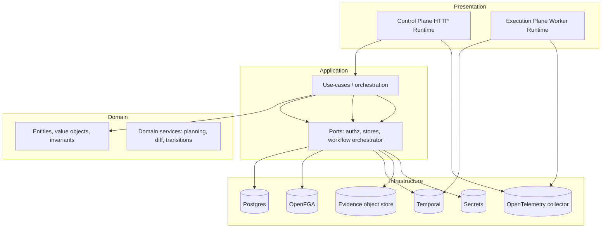
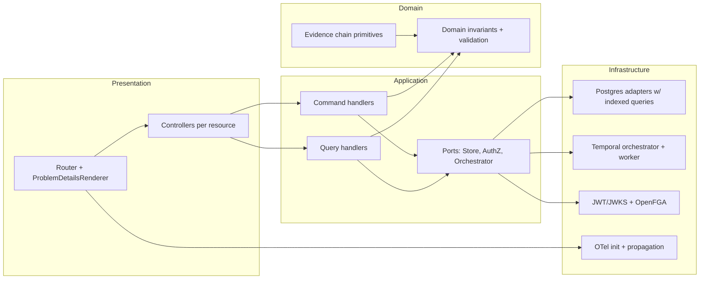

# Critical Evaluation of Core CS Foundations in the Portarium Project

## Executive summary

Portarium is structured as a layered, hexagonal/ports-and-adapters system with an explicit split between a **control plane runtime** (HTTP API + governance boundary) and an **execution-plane runtime** (worker behaviour and optional Temporal worker loop). This intent is clear in the repository documentation. fileciteturn9file0L1-L1 fileciteturn9file2L1-L1

The strongest foundations already present are: a strict TypeScript configuration (e.g., `strict`, `noUncheckedIndexedAccess`, `exactOptionalPropertyTypes`), a well-defined layering model, and serious quality tooling (coverage thresholds, mutation testing, CI gates). These choices are consistent with principal-level engineering habits (tight types, explicit boundaries, quality gates). However, a number of “scaffold realities” (in-memory stores, stubbed persistence, fixture-based endpoints) create **scalability, concurrency, OS interaction, and security/ethics risk** if they are not systematically retired behind stable abstractions. fileciteturn9file0L1-L1

The most urgent technical risks to address (in priority order) are:

- **API correctness + safety at the HTTP boundary**: request body handling needs explicit **resource limits**, timeouts, and consistent Problem Details responses, or the control plane is exposed to avoidable DoS/resource-consumption failures and inconsistent client behaviour. Node’s HTTP request object is a stream; safe servers must enforce limits and handle abort/close semantics deliberately. citeturn14search1 citeturn13search1
- **Pagination/filtering pushed down to data stores**: the current “load all then filter/sort in memory” pattern is workable for scaffolds but is a hard blocker for multi-tenant scale and cost control. OWASP’s API security guidance explicitly calls out “unrestricted resource consumption” as a major risk category for APIs. citeturn13search1
- **Worker lifecycle correctness**: the Temporal TypeScript SDK’s intended lifecycle is “`await worker.run()` then close the connection after the worker stops”; shutdown sequencing must respect the SDK model to avoid stuck drains or dropped completions. citeturn12view0
- **Security + ethics edge-hardening**: development bypasses (e.g., dev token auth) must remain strongly isolated to local profiles, and privacy protections must be made systematic across evidence, telemetry, and traces. The ACM Code of Ethics emphasises avoiding harm and respecting privacy, and W3C Trace Context includes privacy/security considerations that apply directly to trace propagation. citeturn11view2 citeturn11view1

Portarium is already pointed in the right direction architecturally; the core work now is _turning the architecture from “documented intent” into “enforced reality”_ via: stable ports, production-grade adapters, deterministic pagination/search semantics, and test coverage focused on boundary conditions and failure modes.

## Repository overview and topic mapping

The repository’s own architecture explanation defines the intended dependency boundaries and runtime split (control plane vs execution plane). fileciteturn9file0L1-L1  
Runtime entrypoints and environment variables are documented explicitly. fileciteturn9file2L1-L1  
Local development guidance also documents a dev-token bypass and warns it must never be used in staging/production. fileciteturn9file3L1-L1

The infrastructure baseline is unusually comprehensive for a scaffold: Postgres, Temporal, MinIO, Vault, and OpenTelemetry collector + Grafana/Tempo are provisioned in the repo’s local compose stack. fileciteturn71file18L1-L1 fileciteturn71file0L1-L1

### Mapping of CS foundations to major repo modules

| CS foundation area                   | Where it shows up most strongly in this repo                                                                                           | What to evaluate first                                                            |
| ------------------------------------ | -------------------------------------------------------------------------------------------------------------------------------------- | --------------------------------------------------------------------------------- |
| Programming fundamentals + OOP       | Layering (`src/domain`, `src/application`, `src/infrastructure`, `src/presentation`), ports/adapters model fileciteturn9file0L1-L1 | Boundary enforcement, dependency direction, abstraction quality, error modelling  |
| Data structures + algorithms         | Evidence chain integrity, rate limiting, pagination/cursor semantics, workflow planning/diffing                                        | Complexity, correctness under edge cases, scale behaviour, determinism            |
| Operating systems fundamentals       | HTTP server lifecycle, process signals, resource limits, container/runtime profiles, worker shutdown                                   | Backpressure, memory bounds, graceful shutdown, timeouts, network I/O correctness |
| Computing fundamentals (incl ethics) | Problem Details error model, trace context propagation, authn/authz, privacy minimisation, evidence retention                          | Data minimisation, auditability, security posture, ethics guardrails              |

### Current architecture as implied by docs



This matches the repo’s described layered model and runtime split. fileciteturn9file0L1-L1

## Programming fundamentals and OOP

### What is already strong

The project demonstrates several “senior-to-principal” fundamentals:

TypeScript strictness is explicitly configured (NodeNext modules, strict flags, no unchecked indexed access, etc.), which materially improves maintainability and reduces runtime ambiguity. This is a real architectural choice: it forces explicit handling of absence, narrows implicit any/unknown, and prevents a large class of boundary bugs.

The ports-and-adapters framing is consistently described in docs, and the layer taxonomy is explicit: domain/application/infrastructure/presentation. fileciteturn9file0L1-L1 fileciteturn9file1L1-L1

The risk is not the _existence_ of these fundamentals, but whether they are _enforced in code_, especially at integration boundaries.

### Gaps and best-practice violations that will cost you later

The following issues are the kinds of problems that typically “feel fine” in scaffolds but become expensive once features and contributors scale.

#### Boundary enforcement is documented, but not yet mechanically enforced

At principal level, “hexagonal architecture” must be enforced by tooling, not just described:

- Dependency direction should be checked continuously (e.g., domain must not import infrastructure/presentation).
- “Ports” should be stable and contract-tested.
- Adapters should be swappable behind ports with minimal ripple.

If any domain modules import runtime-specific helpers (HTTP, env parsing) you will end up with “domain logic that can’t be reused”, and your tests will become integration-heavy.

**Actionable recommendation**: add/strengthen a dependency rule system (e.g., dependency-cruiser is already in `devDependencies`) as a _hard_ CI gate, with explicit layer rules and forbidden edges. (This aligns with the repo’s “strict boundaries” claim.) fileciteturn9file0L1-L1

#### Error modelling: inconsistent between “spec intent” and inevitable runtime reality

The HTTP API intends to use Problem Details (`application/problem+json`) for errors. RFC 7807 defines the shape and intent of this format. citeturn11view3  
At scale, you need _one_ canonical error mapping layer:

- domain/application errors → stable problem types
- infrastructure errors → safe, redacted problem details
- correlation IDs always present
- never emit stack traces to clients by default

**Actionable recommendation**: introduce a central `ProblemDetailsFactory` (application layer) and a presentation-layer adapter that renders it consistently.

#### CLI vs runtime interface drift

The CLI defaults and endpoint paths must match the runtime contract, or the CLI becomes a source of operational confusion.

A concrete example in this repo: the local compose stack maps **Grafana to localhost:3100**, which is explicitly documented as the visualisation endpoint. fileciteturn71file18L1-L1 fileciteturn71file0L1-L1  
If the CLI is also defaulting its “base URL” to 3100, that is a correctness bug: it is pointing at observability, not the API.

**Actionable recommendation**: treat API base URLs and path prefixes as _generated from the OpenAPI contract_, not manually duplicated. This eliminates drift.

### Current vs recommended state (Programming + OOP)

| Dimension        | Current state (as observed from repo intent + scaffolding)             | Recommended state (principal-grade)                                                                       |
| ---------------- | ---------------------------------------------------------------------- | --------------------------------------------------------------------------------------------------------- |
| Layer boundaries | Documented clearly fileciteturn9file0L1-L1                         | Enforced by automated dependency rules + CI gates; no “escape hatches”                                    |
| Abstractions     | Ports/adapters model described fileciteturn9file1L1-L1             | Ports are small, stable, versioned; adapters are contract-tested; capability matrices are machine-checked |
| Errors           | Intends RFC 7807 usage citeturn11view3                              | One canonical error mapping pipeline; deterministic error types; client-safe redaction                    |
| API/CLI coupling | Risk of drift vs runtime and local infra fileciteturn71file18L1-L1 | CLI generated from spec (OpenAPI), not handwritten paths/defaults                                         |

### Key refactoring example: route table + typed handlers

Instead of embedding route matching/regex logic into one monolithic handler module, introduce a small, explicit routing table with typed request contexts.

```ts
// presentation/http/router.ts
type HttpMethod = 'GET' | 'POST' | 'PATCH' | 'PUT' | 'DELETE';

type Route<Ctx> = {
  method: HttpMethod;
  pathTemplate: string; // e.g. "/v1/workspaces/:workspaceId/runs/:runId"
  handler: (ctx: Ctx) => Promise<Response>;
};

export class Router<Ctx> {
  private readonly routes: Route<Ctx>[] = [];

  register(route: Route<Ctx>): void {
    this.routes.push(route);
  }

  async dispatch(req: IncomingMessage, ctx: Ctx): Promise<Response> {
    // 1) match method
    // 2) match path template
    // 3) extract params into ctx
    // 4) call handler
    // 5) fallback 404 ProblemDetails
    throw new Error('not implemented');
  }
}
```

This creates a clean seam for unit testing route matching, param extraction, and error mapping without spinning up the whole HTTP server.

## Data structures and algorithms

### Algorithms and data structures that matter most here

Portarium’s domain implies four algorithmically “hot” surfaces:

- **Listing APIs** (workspaces, runs, evidence, workforce, location history): need predictable latency, pagination semantics, and bounded memory.
- **Evidence integrity**: hashing, canonicalisation, chaining, and verification must be correct and testable.
- **Workflow planning/diffing**: planning from workflow actions and computing diffs should remain linear-ish and predictable.
- **Rate limiting / resource protection**: must be distributed if you run multiple replicas.

OWASP’s API Top 10 includes “Unrestricted Resource Consumption” (API4:2023), which is exactly what unbounded list/filter/sort and unbounded body parsing enable. citeturn13search1

### Architectural gaps and scalability risks

#### Cursor pagination semantics must be deterministic and _source-of-truth_

When you paginate by cursor, you must define (and implement) at least:

- ordering key(s) (e.g., `(created_at, id)` or just `id`)
- cursor encoding/decoding
- stable ordering across pages, even as new records arrive
- DB index support for the ordering + filters

If any endpoint constructs `nextCursor` from `limit` or array offsets, you will break pagination as soon as the underlying dataset changes. This is not a “minor” issue: it affects correctness, caching, and client retries.

**Actionable recommendation**: define and reuse a single `CursorCodec` abstraction:

- `encode({ lastSeenId, lastSeenTimestamp }) -> string`
- `decode(cursor: string) -> { lastSeenId, lastSeenTimestamp }`
- plus endpoint-specific `ORDER BY` rules

#### In-memory filtering/sorting is an explicit “scale ceiling”

Any list operation implemented as:

1. load all records
2. filter and sort in JS
3. slice for pagination

…is O(n log n) CPU with O(n) memory, and n is “tenant size”. That becomes a cost and latency cliff.

**Actionable recommendation**: push filtering/sorting/pagination into the storage adapter (SQL or search index), and keep the application layer purely declarative (“what to filter/order by”).

### Evidence chain integrity: align fixture behaviour with cryptographic reality

The evidence chain concept is a strength: it is exactly the sort of auditability primitive a governed control plane should have. At principal level, you must ensure:

- canonicalisation is deterministic
- hash computation uses a single implementation
- signature hooks are versioned and testable
- privacy minimisation rules are enforced consistently

Where fixtures generate “fake hashes” (e.g., random bytes) you risk training downstream code to accept non-verifiable evidence.

W3C Trace Context’s privacy considerations are a good parallel: metadata systems that correlate actions across distributed flows must treat correlation identifiers as potentially sensitive, and the spec discusses privacy risks and mitigations. citeturn11view1  
Similarly, RFC 9068 discusses privacy considerations for JWT access tokens, including leakage via claims and correlation via subject identifiers. citeturn4search0

### Current vs recommended state (Data structures + algorithms)

| Dimension          | Current risk pattern                                                | Recommended pattern                                                         |
| ------------------ | ------------------------------------------------------------------- | --------------------------------------------------------------------------- |
| Pagination         | Cursor semantics at risk of being endpoint-local and inconsistent   | Single cursor codec + canonical ordering rules + DB-backed pagination       |
| List endpoints     | In-memory filter/sort creates O(n) memory + O(n log n) CPU pressure | Storage-level filtering (indexes) + bounded page sizes (hard max)           |
| Evidence integrity | Strong idea, but fixtures can undermine invariants                  | One evidence library; fixtures must use real hashing; property-based tests  |
| Rate limiting      | May exist but must be distributed to matter                         | Token bucket/leaky bucket with shared state (Redis/Postgres advisory locks) |

### Key refactoring example: SQL-backed cursor pagination

Pseudocode for an adapter method that _never_ loads all rows:

```sql
-- Example for stable ID ordering
SELECT payload
FROM workspaces
WHERE tenant_id = $1
  AND ($2::text IS NULL OR workspace_id > $2)
ORDER BY workspace_id ASC
LIMIT $3;
```

```ts
// infrastructure/postgres/workspace-store.ts
async listWorkspaces(tenantId: string, cursor: string | null, limit: number) {
  const rows = await sql.query(/* above SQL */, [tenantId, cursor, limit + 1]);
  const items = rows.slice(0, limit);
  const nextCursor = rows.length > limit ? items[items.length - 1]!.workspaceId : null;
  return { items, nextCursor };
}
```

This enforces bounded memory and makes pagination deterministic.

## Operating systems fundamentals

### Control plane: HTTP streaming, backpressure, and process lifecycle

Node’s HTTP request object (`http.IncomingMessage`) is a Readable stream. If you parse request bodies by accumulating chunks without a maximum size, you can be trivially forced into large memory allocations. Node’s docs describe the streaming events and abort behaviour (`data`, `end`, `aborted`, `close`). citeturn14search1 citeturn14search3

At principal level, the HTTP boundary needs four explicit OS-adjacent behaviours:

- **Body size limits** (hard max per route category)
- **Timeouts** (read timeout, handler timeout, upstream call timeout)
- **Abort + close handling** (don’t continue work after client disconnect)
- **Backpressure** (don’t write indefinitely to slow clients)

OWASP API4:2023 (“Unrestricted Resource Consumption”) directly maps to unbounded body parsing and unbounded list endpoints. citeturn13search1

### Worker lifecycle and signals

Node processes change behaviour when you install signal handlers: if you install a `SIGTERM`/`SIGINT` handler, Node will no longer exit automatically; you must explicitly orchestrate shutdown. Node’s documentation describes this default behaviour and how installing listeners removes the default exit. citeturn15search0

For Temporal workers, the TypeScript SDK documentation shows the canonical pattern:

- create connection
- create worker
- `await worker.run()`
- close connection in `finally` after the worker stops citeturn12view0

This is not style—it is lifecycle correctness. If Portarium closes the connection too early (or shuts down in the wrong order), you risk workflows/tasks being abandoned in subtle ways (timeouts, dropped completions, prolonged draining).

### Network I/O: authn/authz calls must have timeouts

Any outbound authorisation (e.g., OpenFGA checks) or JWKS fetching must use:

- timeouts / abort signals
- bounded retries
- circuit breakers for dependency outages
- careful logging redaction

OpenFGA explicitly recommends pinning an authorisation model ID (immutable models; pass `authorization_model_id`, especially in production). citeturn5search1  
If you omit this, an infrastructure update can change authorisation semantics underneath live traffic.

### Current vs recommended state (OS fundamentals)

| OS concern          | Current exposure                                            | Recommended mitigation                                                       |
| ------------------- | ----------------------------------------------------------- | ---------------------------------------------------------------------------- |
| HTTP request bodies | Risk of unbounded accumulation; inconsistent abort handling | Streaming parse with max bytes; route-specific limits; 413 responses         |
| Process signals     | Signal listeners change exit behaviour citeturn15search0 | One shutdown controller: stop accepting traffic, drain, then exit            |
| Worker shutdown     | Must follow Temporal run/close lifecycle citeturn12view0 | Connection closed only after `worker.run()` resolves; explicit drain windows |
| External calls      | Risk of hanging calls without timeouts                      | `AbortController`-based timeouts, retries, bulkheads                         |

### Key refactoring example: bounded JSON body parsing

```ts
async function readJsonBody(req: IncomingMessage, maxBytes: number): Promise<unknown> {
  let size = 0;
  const chunks: Buffer[] = [];

  return await new Promise((resolve, reject) => {
    req.on('aborted', () => reject(new Error('client_aborted')));
    req.on('error', reject);

    req.on('data', (chunk: Buffer) => {
      size += chunk.length;
      if (size > maxBytes) {
        req.destroy(); // stop reading
        reject(new Error('payload_too_large'));
        return;
      }
      chunks.push(chunk);
    });

    req.on('end', () => {
      try {
        resolve(JSON.parse(Buffer.concat(chunks).toString('utf8')));
      } catch (e) {
        reject(new Error('invalid_json'));
      }
    });
  });
}
```

This aligns with Node’s stream semantics and protects memory. citeturn14search1

## Computing fundamentals and ethics context

### Security model: align with standards, not ad-hoc behaviour

Several standards are directly relevant to Portarium’s primitives:

- **Problem Details**: RFC 7807 defines the machine-readable error format for HTTP APIs; Portarium intends to use this shape. citeturn11view3
- **JWT access tokens**: RFC 9068 defines a specific JWT profile for OAuth2 access tokens (including `typ` and claim validation expectations). citeturn4search0
- **Bearer token errors**: RFC 6750 defines `invalid_token`, `insufficient_scope`, and when to include error information in responses. citeturn7search3

Principal-level guidance: treat these RFCs as **testable contracts**:

- unit tests: token validation edge cases (issuer mismatch, audience mismatch, exp clock skew, missing typ)
- integration: JWKS key rotation behaviour
- contract tests: Problem Details responses for every error class

### Ethics: privacy, minimisation, and audit design

Portarium’s repo intent already points toward governed operations and auditability: evidence stores, OpenTelemetry redaction pipelines, and retention policies in infra.

Ethically, the system is in a high-risk category because it can:

- coordinate workplace actions (workforce/human tasks)
- record potentially sensitive telemetry (location)
- store evidence and traces that can correlate individuals

The ACM Code of Ethics requires avoiding harm, respecting privacy, and being honest about system capabilities and limitations. citeturn11view2  
W3C Trace Context explicitly discusses privacy risks of correlation identifiers and metadata propagation across services. citeturn11view1

**Actionable recommendations (ethics-integrated engineering)**:

- Add an “Ethics & Safety” documentation section that states:
  - what personal data may exist (location events, user IDs, workforce assignments)
  - purposes and prohibited uses
  - retention and deletion expectations
  - incident response expectations for data exposure
- Treat “purpose limitation” as a first-class input to telemetry queries (not optional).
- Extend redaction rules beyond traces into logs and evidence payload pointers.

### Security/ethics concerns surfaced by local dev bypasses

Local development guidance documents a dev-token bypass and explicitly warns never to set it in staging/production. fileciteturn9file3L1-L1  
At principal level, warnings are not enough: you need technical enforcement:

- refuse to start with dev-token enabled unless `PORTARIUM_ENVIRONMENT=local`
- fail startup if dev-token variables are set in Kubernetes environments
- emit a structured “security posture” metric/event when auth mode is non-production

### OpenFGA authorisation model pinning

OpenFGA’s docs emphasise that authorisation models are immutable and recommend explicitly passing/pinning `authorization_model_id`, especially in production. citeturn5search1  
This matters operationally: a model update is effectively a schema migration for authorisation semantics.

## Prioritised remediation roadmap

This roadmap focuses on reaching “principal-grade” reliability and maintainability **without assuming any particular deployment SLAs**.

### Roadmap table

| Priority | Theme                  |                                                                                               Action | Effort | Risk if delayed | Why it matters                                                                                                      |
| -------- | ---------------------- | ---------------------------------------------------------------------------------------------------: | :----: | :-------------: | ------------------------------------------------------------------------------------------------------------------- |
| P0       | HTTP safety            |                      Add request body size limits + timeouts + abort handling for all JSON endpoints |   M    |      High       | Prevents memory/CPU DoS; aligns with Node stream semantics citeturn14search1                                     |
| P0       | Pagination correctness |   Define a single cursor spec + implement DB-backed pagination; remove “offset-as-cursor” behaviours |   L    |      High       | Prevents correctness failures and uncontrolled resource consumption citeturn13search1                            |
| P0       | Worker lifecycle       |                 Align Temporal shutdown sequencing to “run then close connection”; add drain metrics |   S    |      High       | Prevents stuck drains and dropped tasks; matches Temporal SDK docs citeturn12view0                               |
| P1       | Auth standards         |                  Make JWT validation + bearer error responses conformant to RFC 9068/6750; add tests |   M    |     Medium      | Prevents subtle auth bypasses and inconsistent client semantics citeturn4search0 citeturn7search3             |
| P1       | Ethics hardening       | Enforce non-production dev-token usage technically; add ethics/purpose docs + telemetry policy tests |   S    |     Medium      | Prevents accidental unsafe deployments; supports privacy obligations fileciteturn9file3L1-L1 citeturn11view2 |
| P1       | Observability          |           Ensure trace context propagation is correct and privacy-aware; standardise correlation IDs |   M    |     Medium      | Distributed systems debugging + privacy risk mitigation citeturn11view1                                          |
| P2       | OpenFGA robustness     |                                   Pin `authorization_model_id`, add timeouts/retries/circuit breaker |   M    |     Medium      | Avoids auth semantic drift and dependency hangs citeturn5search1                                                 |
| P2       | Quality strategy       |                    Add integration tests (Postgres/Temporal/MinIO) and perf tests for list endpoints |   L    |     Medium      | Proves behaviour under realistic failure modes                                                                      |

### Recommended module relationships after remediation



### CI/CD and observability upgrades (target end-state)

The repo already has serious CI intent (PR workflow, coverage upload, mutation testing). fileciteturn71file18L1-L1  
To reach principal-grade operational confidence, extend the pipeline to enforce:

- **Contract tests**: OpenAPI examples validated against handlers; schema drift detected early.
- **Integration tests**: ephemeral Postgres + Temporal + MinIO (compose-based or container-based) in CI.
- **Security gates**: ensure production deps are scanned; keep the existing “high/critical only fail” rule but add scheduled full reports.
- **Observability tests**: trace context propagation and redaction checks (unit tests validating no sensitive keys leak), aligned with Trace Context privacy considerations. citeturn11view1
- **Release discipline**: ensure dev-token auth cannot ship enabled; enforce environment checks in code and CI. fileciteturn9file3L1-L1

### Documentation upgrades (ethics included)

Minimum principal-level docs set:

- **Architecture invariants**: what must never be violated (dependency direction, ports, cursor semantics).
- **API correctness rules**: pagination contract, max request sizes, error shapes (RFC 7807). citeturn11view3
- **Security model**: token profile expectations (RFC 9068) and bearer error behaviour (RFC 6750). citeturn4search0 citeturn7search3
- **Privacy & ethics**: purpose limitation for location/telemetry, retention, redaction, and “avoid harm” principles grounded in ACM. citeturn11view2
- **Operational runbooks**: graceful shutdown behaviour (Node signals + Temporal worker lifecycle). citeturn15search0 citeturn12view0
