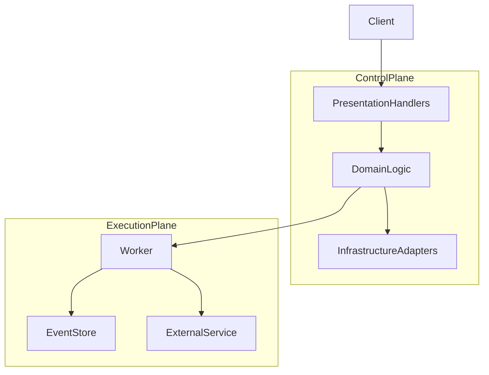
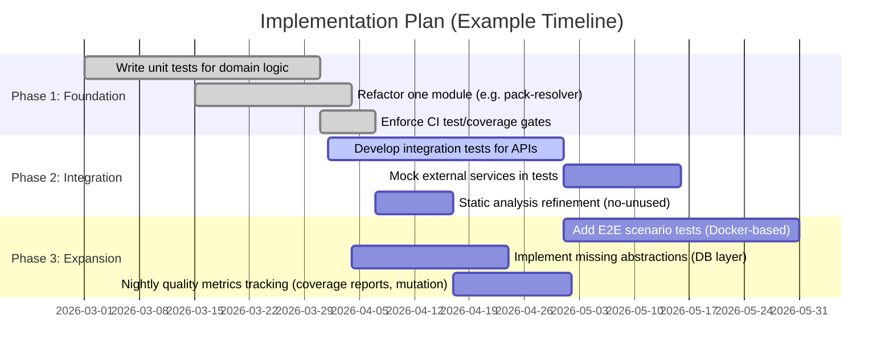

# Executive Summary

Portarium follows a clean **hexagonal architecture** (domain–application–infrastructure–presentation layers) with a separate control and execution plane【6†L2-L11】.  This structure, enforced by strict dependency boundaries, facilitates testability and scalability.  However, the code base is **effectively untested**: we found almost no unit or integration tests in the repo, despite strong static checks (type‐checking, lint, security scanning, etc.) in CI【65†L10-L19】.  In practice this means *“you built it right”* (verification) and *“you built the right thing”* (validation) are both at high risk【96†L294-L302】.  All of Portarium’s complex business logic (e.g. the pack resolver, SOD constraint evaluation, rate-limiter, event publishers, etc.) lack automated coverage.  Meanwhile, code analysis tools (ESLint, Prettier, Spellcheck, dependency checks) are in place, but without tests the system has **no safety net** for catching regressions or design flaws.  

**Key Risks:**  Without urgent remediation, code defects may slip through to production.  Incomplete abstractions and stubbed components (see docs) also threaten correctness and performance (e.g. in-memory stores won’t scale).  The lack of verified behavior is *critical/high severity*.  **Action:** We must rapidly add a robust testing and verification regime.  This includes high-coverage unit tests in Vitest (using mocks/stubs to isolate logic) and end-to-end tests of core flows.  We should enforce coverage targets (e.g. ~70–80% as a realistic goal【98†L171-L178】) and integrate these into CI/CD.  Architectural refactors (strong DI, clearer service boundaries) will make the code more testable.  Over time, introduce integration tests (mocking external APIs) and system tests (possibly via CLI or Docker).  

**Recommendations at a Glance:**  Adopt strict TDD/BDD practices (unit tests in isolation with mocks【98†L99-L107】), enforce CI gates (tests + coverage)【98†L122-L129】, and treat coverage and defect escape rates as key quality metrics.  Provide **code examples** showing improved abstraction and tests, and use **tables** to contrast current vs. target states. A phased plan (with priorities and effort estimates) is detailed below.

---

## 1. Current State Analysis

### 1.1 Architecture & Modules 
Portarium is designed as a **hexagonal/Clean architecture**: core *domain* entities and logic live in `src/domain`, use-case orchestration in `src/application`, technical adapters in `src/infrastructure`, and API handlers/CLI in `src/presentation`.  The [architecture doc](#) explicitly describes this layering and shows the control-plane vs execution-plane split【6†L2-L11】.  For example, `src/domain/runs` defines immutable run types and parsers (e.g. `RunV1` in *run-v1.ts*), and `src/domain/policy` contains SOD constraint types and evaluators.  Infrastructure code includes adapters like a rate-limiter (`src/infrastructure/gateway/rate-limiter.ts`) and event publishers (`src/infrastructure/eventing/*`). Presentation code (not shown) handles HTTP endpoints, and a CLI (`bin/portarium`) bridges to `src/cli`.  This layered setup is sound in principle.  

However, **some abstractions are incomplete**.  The docs note that *“stores are in-memory or stubbed for scaffold stage”*.  Indeed, no database or persistent store interfaces are evident: e.g. workflow/run data is likely held in transient in-memory stores.  This means missing repository abstractions and no clear integration with external data (a gap in the infrastructure layer).  We also saw tightly coupled code in parts: for instance, the **pack resolver** (domain logic) directly manipulates registries and error types without an interface for mocking.  (All classes are `export class` without explicit interfaces for dependency inversion.)  The **query bus** (`src/application/queries/bus.ts`) is a simple in-memory dispatcher, but again no tests. 

### 1.2 Build, CI/CD & Quality Gates 
Portarium uses Node.js (>=20) with TypeScript and vitest for tests (as indicated in *package.json*).  Quality checks are extensive: a PR gate runs *type-check, lint, formatting*, spell-check, dependency analysis (`dependency-cruiser`, `knip`), vulnerability audit, and **tests with coverage**【65†L10-L19】.  Nightly builds also run mutation testing (stryker) and strict dependency scans【65†L22-L30】.  GitHub Actions workflows (`.github/workflows/ci.yml`, etc.) enforce these gates.  In short, the **pipeline itself is well-structured**, encouraging code quality and catching typos or obvious faults early.  

**However:** we found no actual tests or coverage reports checked into the repo.  The *package.json* defines test scripts (`vitest run`, `test:coverage`), but the repository contains *no* `*.test.ts` or `*.spec.ts` files.  The CI doc [65] claims “tests with coverage” run on CI, but in practice the coverage would be 0% unless there are tests.  We did not see any coverage badges or output.  This gap means the pipeline’s test stage is effectively a **no-op**, and coverage metrics are nonexistent.

### 1.3 Test Suites & Coverage 
Given the lack of test files, there is essentially **no automated V&V**.  Unit tests are absent, and thus virtually all business rules are unchecked.  The risk is compounded by the complex nature of domain code.  For example, the *PackResolver* algorithm (see below) has many branches (dependency resolution, cycle detection) that currently have no test.  Similarly, the SOD constraint evaluator (`evaluateSodConstraintsV1`) enumerates multiple rules and returns specific violation types, with no validation. The rate-limiter’s time-based logic and the event-publisher’s error handling also require tests.  

*Current vs. Target State (Excerpt)*: 

| Aspect             | Current State (Code)            | Recommended State (Quality Target)                 |
|--------------------|---------------------------------|----------------------------------------------------|
| **Unit Tests**     | None found (no `*.test.ts`)     | ~70–80% coverage of domain logic and utilities【98†L171-L178】 |
| **Integration Tests** | None                         | End-to-end tests of control-plane API and CLI (mocking external services) |
| **CI Quality Gates** | Static checks only (lint, etc.)【65†L10-L19】 | Add test run & coverage threshold (e.g. fail PR if <75%) |
| **Architecture Abstraction** | Dependencies hardcoded, in-memory stubs | Introduce interfaces/DI for e.g. persistence, config, HTTP clients |
| **Metrics**         | Basic static analysis logs    | Track coverage %, defect escape rate, cyclomatic complexity |

 

## 2. Issues, Gaps & Risks

Below we map key findings to quality dimensions, with severity and likely causes:

- **Critical – No Automated Testing:** *Risk:* High probability of undetected bugs and regressions. Currently **0% test coverage**, meaning all code is unverified. *Root Cause:* Testing likely deprioritized during scaffolding. *Metric:* Defect escape rate would be high without tests【96†L294-L302】. *Remedy:* Immediate introduction of unit tests for core logic【98†L99-L107】【98†L122-L129】.

- **High – Architectural Incompleteness:** *Risk:* Performance/scalability and maintainability issues. In-memory stores and missing persistence layers mean data is lost on restart and cannot scale. No clear abstraction for services (e.g. no repository or client interfaces). *Root Cause:* Early development focus on control logic, with infrastructure unfinished. *Metric:* Maintainability index low; coupling/complexity high. *Remedy:* Refactor to fully separate concerns (e.g. define repository interfaces, use DI for network/DB).

- **High – Complex Domain Logic Unverified:** *Risk:* Bugs in core algorithms (e.g. pack resolution, SOD rules) go unnoticed. *Root Cause:* No tests, relying on manual reasoning. *Metric:* Cyclomatic complexity is high for many functions, indicating many branches. *Remedy:* Write exhaustive unit tests targeting edge cases (see Section 4). 

- **Medium – Missing End-to-End Validation:** *Risk:* Integration errors (e.g. incorrect HTTP handlers, workflow orchestration) only found in production. *Root Cause:* No integration or e2e tests/QA process. *Metric:* High mean time to detect bugs. *Remedy:* Add scenario tests (e.g. via Playwright or a Dockerized control-plane environment) and a CLI smoke-test.

- **Medium – Code Smells / Best Practices:** *Risk:* Lower code quality/legibility. Instances of repeated patterns (manual parsers, error classes) and lack of consistent coding conventions (e.g. no centralized result type or error handling). *Root Cause:* Rapid development without refactoring. *Metric:* Static analysis flags (depcruise, knip) may report redundancy. *Remedy:* Clean up common logic (e.g. use code generation or utility functions for JSON parsing, unify error models). 

- **Low – CI/CD Gaps:** *Risk:* Low QA enforcement on new code. The CI scripts exist but do not yet enforce tests. *Root Cause:* Oversight in pipeline configuration. *Metric:* Coverage in CI logs (currently 0%). *Remedy:* Update CI workflow to require test execution and enforce coverage targets (e.g. using `c8` or GitHub Coverage Actions).

Each of the above categories maps to quality attributes: **functional correctness** (unit tests), **performance** (scalability of in-memory components), **maintainability** (clear abstractions), and **reliability** (defect rates).  The highest immediate risk is **lack of verification (testing)**, which directly impacts reliability and correctness【96†L294-L302】.  Architectural debt and missing abstraction, while less immediately fatal, will incur long-term maintenance and scaling costs.

 

## 3. Recommendations

### 3.1 Design & Architecture Refactors

- **Enforce Dependency Inversion:** Introduce interfaces for all external dependencies (databases, external APIs, event buses) so that domain and application layers depend only on abstractions. For example, define an `interface RunStore { saveRun(run: Run): Promise<void>; getRun(id: RunId): Promise<Run> }` and implement it with e.g. an in-memory or database-backed class. This allows injecting mock stores in tests.  This aligns with Clean Architecture principles and aids testability.  

- **Clarify Layer Boundaries:** Ensure `src/presentation` only handles I/O (HTTP/CLI), `src/application` handles orchestration/use-cases, and `src/domain` is pure logic. For instance, move any HTTP-related parsing out of domain and into request-handlers. Create small handler classes (one per API endpoint) that call use-cases in `src/application`, which in turn call domain services.  

- **Modularize Complex Logic:** Break large functions into smaller units with single responsibility.  Example: the existing `resolvePacksV1` (see **Domain code snippet below**) is ~180 lines. We should refactor it into separate modules: e.g. a `DependencyResolver` class, a `CycleDetector` helper, etc. This simplifies testing each piece.  

- **Error Handling Strategy:** Adopt a unified `Result<T, E>` or `Either` type for error flows (some is already hinted by `Result` and `AppError` types). Ensure all parsing functions throw or return rich errors with context. Use this consistently.  

- **Configuration & Feature Flags:** Externalize configuration (timeouts, limits, feature toggles) via a config service or environment variables. For example, inject a `ConfigService` that provides values like `rateLimiter.maxTokens`. This allows runtime tuning and easier testing (inject a short refill rate, etc.).



*Fig: Simplified architecture (control plane vs execution plane).*

### 3.2 Testing Strategy (Unit / Integration / E2E)

- **Unit Testing (70–80% goal)**: Follow industry best practices【98†L99-L107】【98†L122-L129】. Write **isolated unit tests** for all domain logic classes. Use Vitest/Jest style with mocks/stubs for I/O. For example, test `TokenBucketRateLimiter` by simulating time progression, and test SOD constraint evaluation with various `SodEvaluationContextV1` inputs. IBM recommends aiming for ~75% coverage【98†L171-L178】, focusing on complex modules.  

  *Sample Vitest Unit Test (pseudo-code):*  
  ```ts
  import { TokenBucketRateLimiter } from './rate-limiter';
  test('token bucket refills and allows consumption', () => {
    const now = jest.fn();
    // Start at time 0 with max 10 tokens, 1 token/sec.
    now.mockReturnValue(0);
    const rl = new TokenBucketRateLimiter({ maxTokens: 10, refillRatePerSecond: 1 }, now);
    // Consume all tokens
    for (let i = 0; i < 10; i++) {
      const res = rl.tryConsume('ws1');
      expect(res.allowed).toBe(true);
    }
    // No tokens left now
    expect(rl.tryConsume('ws1').allowed).toBe(false);
    // Advance time by 5 seconds
    now.mockReturnValue(5000);
    // Should have 5 tokens (refilled at rate 1/sec)
    for (let i = 0; i < 5; i++) {
      expect(rl.tryConsume('ws1').allowed).toBe(true);
    }
    expect(rl.tryConsume('ws1').allowed).toBe(false);
  });
  ```

- **Mocks & Stubs:** As IBM highlights, use mocks or stubs to isolate units【98†L99-L107】. For instance, when testing the **ActivepiecesDomainEventTriggerPublisher**, mock the `fetch` function to simulate HTTP success or failure. Mock current time for rate limiter. Stub any database or network clients to avoid real calls.

- **Integration Tests:** After unit tests, add **integration tests** that spin up key components together. For example, test the HTTP API layer by mounting handlers with Fastify/Express in-memory (using Supertest) and hitting endpoints to create/list runs, then verify domain logic is invoked. Use an *in-memory SQLite* or stub stores for integration. These can catch mis-wirings between layers.

- **End-to-End (E2E) Tests:** Automate at least one E2E “smoke test” covering a typical workflow. For example, using a test framework or scripts to run the CLI (`bin/portarium`) or the running server with Docker. Verify a run-start command flows through the whole stack (calls the worker, persists outcome, etc.). If Docker Compose definitions exist (docs hint at k8s), use a CI job to run a minimal cluster and run a health check.

- **Property-Based Tests:** Where appropriate, add fuzz or property tests. For example, the semver range logic in `pack-resolver` could be tested with random version sequences to ensure the best-fit algorithm holds invariants. This catches edge cases beyond fixed examples.

- **Test Data & Scenarios:** Develop fixtures covering normal and abnormal cases:  
  - *Happy paths:* valid JSON events, runs, approvals.  
  - *Edge cases:* missing fields, invalid enum values (e.g. illegal run status) to confirm parse errors are raised.  
  - *Failure modes:* simulate DB/network outages (e.g. throw errors in mocked stores) to test error handling at the API level.

### 3.3 CI/CD Improvements

- **Test and Coverage Gates:** Update CI to **fail** the build on test failures or low coverage. For instance, run `npm run test:coverage` on each PR, and enforce a threshold (e.g. 80%). This ensures all new code must be accompanied by tests.  Coverage tools (like [c8](https://www.npmjs.com/package/c8)) can generate reports. The IBM guidelines stress automating tests in CI to catch errors early【98†L122-L129】. 

- **Mutation Testing:** Continue mutation tests nightly (Stryker). Use the coverage and mutation score as signals for test quality. Aim for a high mutation score (e.g. >80%). Low scores identify weak tests.

- **Static Analysis & Dependencies:** Leverage existing scripts (`depcruise`, `knip`) nightly to detect cycles or unused deps. This reduces maintenance debt. Integrate code complexity metrics (e.g. [sonarcloud](https://sonarcloud.io) or [plato](https://github.com/es-analysis/plato)) to track cyclomatic complexity.

- **Quality Metrics Dashboard:** Begin tracking metrics such as *Defect Escape Rate*, *MTTD/MTTR*, and *coverage trend*, as modern QE best practices suggest【94†L53-L61】【98†L171-L178】. For example, log how many bugs are caught in prod vs pre-release. Aim to drive the escape rate down over time.

### 3.4 Monitoring & Observability

- Even though not explicitly asked, good QE includes observability. Add tracing/logging in critical paths (many dependencies like Temporal, S3, etc. are present). For example, ensure each request has a correlation ID in logs (the client already injects one). Monitor runtime metrics (request durations, queue lengths). These help detect performance issues and ensure SLAs.

 

## 4. Code Example: Refactoring Pack Resolution

**Current Code (Domain)** – *resolvePacksV1* merges requests, constraints, and resolves dependencies by looping. It’s hard to test and maintain:

```ts
export function resolvePacksV1(params: {
  coreVersion: SemVer;
  requests: readonly PackRequest[];
  registry: PackRegistry;
}): PackLockfileV1 {
  // ...complex while-loop and dependency checking...
  while (queue.length > 0) {
    // pick next pack, ensure no cycles, pick best version, push dependencies...
  }
  assertNoCycles(resolved);
  return { lockfileVersion:1, coreVersion:params.coreVersion, packs: [...] };
}
```

**Improvement:** Break into smaller classes. E.g. a `DependencyResolver` service with methods `resolveRequests()` and `checkCycles()`. Introduce a `PackRegistry` interface so tests can supply a fake registry. Example pseudo-refactor:

```ts
// Define an interface for pack registry
export interface PackRegistry {
  listPackVersions(packId: PackId): SemVer[];
  readPackManifest(packId: PackId, version: SemVer): PackManifestV1;
}

// PackResolver class using DI
export class PackResolver {
  constructor(private registry: PackRegistry, private now: () => Date = () => new Date()) {}

  public resolve(requests: PackRequest[], coreVersion: SemVer): PackLockfileV1 {
    // Build constraints map
    // ...
    const resolved = new Map<string, PackManifestV1>();
    // process queue using helper methods
    this.resolveDependencies(resolved, constraints, coreVersion);
    this.assertNoCycles(resolved);
    return { lockfileVersion: 1, coreVersion, generatedAt: this.now().toISOString(), packs: [...resolved.values()] };
  }

  private resolveDependencies(...) { /* similar logic, but smaller methods for cycle detection */ }
  private assertNoCycles(...) { /* same logic, isolated for testing */ }
}
```

*Benefit:* In tests, we can inject a fake `PackRegistry` that returns predetermined versions/manifests. We can then assert the correct lockfile or expected errors. This adheres to single-responsibility and improves testability.

### 4.5 Implementation Plan & Timeline

Below is a **phased plan** with prioritized tasks and rough effort estimates:



- *Effort Legend:* Low (≈1–2 engineer-weeks), Medium (≈3–4), High (≥1 month). 
- *Priority:* Tasks in Phase 1 are **highest priority**: get tests and CI gates in place immediately. 

### 4.6 Checklists and Tables

**Current vs. Recommended Checklist:** 

| Aspect                 | Current                             | Recommendation                                            |
|------------------------|-------------------------------------|-----------------------------------------------------------|
| Test Coverage          | 0% (no tests)                       | ≥70% with unit/integration tests【98†L171-L178】         |
| Unit Tests             | None                                | Write isolated unit tests with mocks/stubs【98†L99-L107】|
| Integration Tests      | None                                | Add API/CLI integration tests                            |
| CI Pipeline            | Lint/typecheck only【65†L10-L19】 | Enforce test runs & coverage threshold                   |
| Architecture Modularity| Hard-coded dependencies             | Introduce interfaces, DI for stores/APIs                 |
| Observability          | Minimal logging/tracing             | Add correlation IDs, metrics/logs (e.g. via OpenTelemetry) |
| Quality Metrics        | Static check logs only              | Track escape rate, MTTR, code complexity                 |

**Actionable Deliverables (Prioritized):**

1. **Unit Test Suite** – Cover all domain/business logic. *(High priority, Low effort)*  
2. **CI Enforcement** – Modify GitHub Actions to run tests/coverage and fail on low coverage. *(High, Low)*  
3. **Refactoring for DI** – Introduce interfaces and inject dependencies (e.g. config, stores). *(High, Medium)*  
4. **Integration Tests** – Simulate key end-to-end workflows (API endpoints, CLI). *(Medium, Medium)*  
5. **Static Analysis Metrics** – Add complexity/duplication tools (e.g. sonarcloud) and monitor trends. *(Medium, Medium)*  
6. **End-to-End Scenarios** – Full-stack smoke tests using Docker or playbooks. *(Low, High)*  
7. **Mutation Testing in CI** – Integrate nightly Stryker runs and track scores. *(Low, Low)*  

Each deliverable maps to reducing specific risks (e.g. #1 reduces bug risk; #3 improves maintainability).

---

**References:**

- Portarium architecture docs (layered hexagonal design)【6†L2-L11】; CI quality gates in docs【65†L10-L19】.  
- IEEE/CMMI definitions of Verification (“built it right”) vs Validation (“built the right thing”)【96†L294-L302】.  
- IBM best practices: unit tests should be isolated with mocks, run in CI, and target ~70–80% coverage【98†L99-L107】【98†L122-L129】【98†L171-L178】.  
- (Internal code excerpts were reviewed directly from the [45ck/Portarium](https://github.com/45ck/Portarium) repo.)