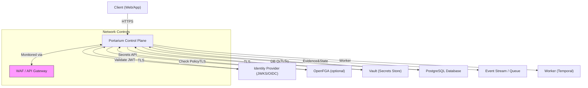

# Executive Summary

The Portarium control plane adopts a layered, hexagonal architecture with clear separation of domain logic from infrastructure and presentation. Authentication is provided via a development-mode static bearer token or JWTs (via a JWKS URI)【5†L26-L34】【11†L18-L26】. Authorization is role-based (workspace-scoped roles) by default, with an optional OpenFGA integration for policy-based checks【52†L74-L82】【17†L17-L25】. Secrets can be fetched from HashiCorp Vault (via the `VaultCredentialStore`), and API rate limiting is currently implemented in-memory per workspace【20†L79-L87】【36†L12-L20】. Cryptographic operations are minimal: SHA-256 hashing (for evidence) and cryptographically random generation for Vault credentials. Overall, the code follows many secure coding practices (e.g. parameterized SQL queries【107†L21-L30】, structured error responses). 

However, we identify several gaps and risks:

- **Authentication/Authorization:** The dev-token mode uses a fixed shared secret (insecure for production)【5†L26-L34】. JWT handling must ensure strict validation (alg, issuer, audience). The RBAC action matrix is static and may not cover new actions, risking “blind spots”【112†L33-L39】. 
- **Secrets Management:** Vault integration exists but is optional; any static secrets (DB credentials, vault tokens, OpenFGA tokens) in environment variables could be exposed. Secrets rotation and lifecycle management is not yet addressed. 
- **Cryptography:** No data encryption at rest or in transit is implemented at the application level. The evidence-hasher uses SHA-256 but the “hash” is random, not tied to content, so its security utility is unclear【49†L15-L23】【107†L21-L30】. Global `crypto.getRandomValues` is used in Node (relying on Node 22’s Web Crypto), but a unified crypto strategy should be verified. 
- **Network Controls & Rate Limiting:** Only basic workspace-level rate limits (in-memory) are enforced【55†L299-L308】【36†L12-L20】. No API gateway or WAF is present at the application layer; TLS enforcement is assumed but should be mandatory. Multi-tenant isolation beyond workspace IDs (e.g. network policies, VPC segmentation) is undefined. 
- **Secure Coding & Quality:** Input validation is done at handler layer (e.g. workload body parsing and ETag checks), but some parsing is ad-hoc (e.g. `decodeURIComponent` on URL segments). The code lacks structured logging or security event monitoring. Dependency scanning, static analysis, and security tests are not evident. 
- **Scalability & Persistence:** Many components (workforce, evidence, rate-limit counters) use in-memory or stubbed stores, suitable only for development. A production deployment must replace these with distributed stores (e.g. Redis for rate limits, a real database for state) to avoid loss of data or state on restart. 

In summary, Portarium has solid foundations, but to reach “principal-level” security maturity, we recommend a rigorous redesign of authentication/authorization, full integration of secrets management, robust audit/logging, and hardened defaults (TLS, no dev-mode in prod). The following report details these findings and provides actionable recommendations, design comparisons, and a prioritized remediation roadmap. 

# Authentication and Authorization

**Current Design:** Portarium’s control-plane supports two modes of authentication. In development, a static bearer token is accepted (see `DevTokenAuthentication`)【5†L26-L34】. In production, it expects JWT Bearer tokens, validated against a JWKS endpoint or local JWKS set (via `JoseJwtAuthentication`)【5†L26-L34】【11†L18-L26】. The JWT must include a `workspaceId`, `sub` (user ID), and `roles[]` claims, which are parsed into the application context【52†L74-L82】【49†L15-L23】. Each request’s `Authorization` header is validated (`authenticateBearerToken`), and the workspace ID in the JWT is enforced to match the request path (guarding tenant isolation)【47†L232-L240】. 

Authorization is enforced in layers. Basic RBAC (WorkspaceRbacAuthorization) uses a hardcoded action-to-role map: e.g. only `admin` can register a workspace, admins/operators can start runs, approvers can submit approvals, etc【112†L17-L25】. Additionally, if OpenFGA is configured, requests are further checked via the external policy engine (`OpenFgaAuthorization`)【16†L0-L9】. Handler code also checks user roles for each operation (e.g. only users with `'admin'` or `'operator'` roles can assign human tasks【64†L79-L87】). 

**Observations & Gaps:** 
- The **Dev Token mode** is insecure for production: it uses a fixed secret (`PORTARIUM_DEV_TOKEN`) and automatically grants the `admin` role without proof【5†L26-L34】. This should be strictly disabled in production deployments. 
- **JWT Validation:** The code explicitly checks `typ` and optionally `alg` headers (via `tokenType` and trusted issuers)【6†L8-L16】, but best practice demands explicitly enforcing the expected signing algorithm to prevent “none” or downgrade attacks【123†L302-L311】. The OpenID Connect claim checks (issuer, audience) are optional; these should be strictly configured to bind tokens to Portarium’s audience/issuer. 
- **Token Revocation:** JWTs are stateless and cannot be revoked without additional infrastructure. Currently, stolen tokens remain valid until expiry. An *explicit revocation strategy* or use of short-lived tokens with refresh (and possibly a denylist) is recommended. 
- **Scope of Claims:** The JWT is assumed to contain tenant/workspace context. OWASP guidelines suggest considering *token binding* or additional context (e.g. session cookies or device fingerprint) to prevent replay attacks【123†L331-L340】. For example, a fingerprint in a secure cookie could tie the token to the client. 
- **Authorization Logic:** The RBAC action matrix in `application/iam/workspace-rbac.ts` is static. If a new application action (APP_ACTIONS) is added without a corresponding entry, authorization may fail open or crash. We should validate that **every** defined action has an explicit rule, and ideally configure these rules (or use OpenFGA) rather than hardcode. Also, the least-privilege principle suggests narrowing roles where possible (e.g. separate *read* vs *write* roles for each resource). 
- **OpenFGA Integration:** If enabled, OpenFGA is an excellent policy backend. But the current code warns if a model ID is pinned or uses default models, and issues are logged (e.g. missing token or model)【17†L17-L25】. Production should configure a fixed model and handle OpenFGA failures gracefully. Also ensure OpenFGA API tokens are securely stored (see Secrets section).

**Recommendations:** 
1. **Enforce TLS:** All client-server traffic must use HTTPS (NIST requirement)【117†L58-L66】, preventing token interception (the code reads JWTs from the `Authorization` header, which should only traverse secure channels).
2. **Harden JWT Handling:** Configure the `JoseJwtAuthentication` to explicitly require a specific JWS algorithm (e.g. RS256)【123†L302-L311】, and validate standard claims (`exp`, `iss`, `aud`). Consider using OAuth2 / OIDC libraries with built-in validation. Remove any acceptance of `alg: none`. 
3. **Protect the Dev Token:** Mark dev mode as strictly for local development. In CI and production, fail-fast if `PORTARIUM_DEV_TOKEN` is set. Ideally, remove this path entirely outside of local. 
4. **Implement Token Management:** Issue JWTs with short expiration and consider a refresh flow. If immediate revocation is needed (logout or compromise), implement a denylist or token introspection endpoint. Alternatively, use opaque session tokens with server-side storage (at cost of statelessness). 
5. **Enhance Claims:** Include a nonce or fingerprint in tokens to bind them to a client context (see OWASP “Token Sidejacking”)【123†L331-L340】. This could involve setting a secure, HTTP-only cookie with a random value whose hash is included in the JWT. Validate this on each request. 
6. **Role Mapping Auditing:** Review `ACTION_MATRIX`【112†L17-L25】 against the OpenAPI spec (`docs/spec/...`) to ensure no gaps. Use tooling or tests to detect any actions without an allowed role. If using OpenFGA, migrate RBAC rules into the model for consistency. 

# Cryptography and Secrets Management

**Current Usage:** Cryptography is minimal. The `node-crypto` module is used for hashing and randomness: evidence records include a `hashSha256` generated via `randomBytes(32)`【64†L139-L142】 (rather than hashing content). Secrets are managed via HashiCorp Vault: the `VaultCredentialStore` can read and write credentials (using Vault’s KV v2 API)【20†L79-L87】. For example, credentials for system accounts can be rotated on-demand. Randomness for new credentials is obtained from the Web Crypto API (`crypto.getRandomValues`)【20†L79-L87】. Database access relies on NodePostgres with parameterized queries (avoiding SQL injection)【107†L21-L30】.

**Observations & Gaps:** 
- **No Encryption at Rest:** There is no application-layer encryption for sensitive data. The Postgres JSON document store writes payloads in plaintext JSONB. Cloud/Vault may encrypt disks, but application data (workspace/run/evidence state) is unencrypted. 
- **Evidence Hash:** Currently, `hashSha256` in `EvidenceRecord` is just random data, not a cryptographic hash of content【64†L139-L142】. If intended as an integrity marker, it fails to provide any integrity (it’s not derived from evidence fields). This should be replaced with a true cryptographic hash (or HMAC) of the evidence payload to ensure tamper-evidence. 
- **Randomness Source:** The code mixes `node:crypto` (`randomBytes`) and Web Crypto (`crypto.getRandomValues`). Ensure Node.js version (>=22) supports `crypto.getRandomValues()` without security gaps. All randomness (token nonces, secrets) should use a cryptographically secure source (Node’s `crypto.randomBytes` or Web Crypto are both acceptable). Consider centralizing randomness in one place. 
- **Vault Usage:** `VaultCredentialStore` requires a Vault token (configurable via `PORTARIUM_VAULT_TOKEN`)【20†L79-L87】. In current code, credentials are read/written but never logged to prevent leaks. However, environment variables for Vault (token, URL) are static secrets that need protection (see below). 
- **Key Management:** The platform’s crypto keys (e.g. JWT private key or Vault token) are not rotated by the application. There is no key lifecycle management or use of hardware modules. For example, storing a long-lived Vault root token in env would violate least privilege. 
- **Secret Injection:** OWASP warns against hardcoding secrets or exposing them in source/config management【121†L1-L9】. Currently, secrets are read from env at startup. While Vault integration helps, there’s no dynamic provisioning of secrets into the runtime. For CI/CD or container lifecycle, using a sidecar or secret-volume (Kubernetes Secrets, AWS Secrets Manager, etc.) is safer than plain env vars.

**Recommendations:** 
1. **Use End-to-End TLS:** As above, always use HTTPS/TLS for all API calls (including to Vault/OpenFGA)【117†L58-L66】. This ensures credentials in transit are protected. 
2. **Encrypted Storage:** For sensitive data at rest (e.g. evidence, approvals), consider enabling database encryption (e.g. Postgres `pgcrypto` or storage-level encryption). If using cloud DB, enable disk encryption. For critical secrets (like Vault root tokens), use a stronger secret store (e.g. cloud KMS/HSM) rather than env. 
3. **Improve Evidence Integrity:** Replace the placeholder random `hashSha256` with a true SHA-256 (or HMAC-SHA256) over the evidence content (or an ETag)【47†L217-L224】. This provides tamper detection as designed. Store only the hash, not full secret keys. 
4. **Secrets Distribution:** Adopt a dynamic secrets approach where possible (Vault can generate short-lived DB credentials). Avoid embedding static secrets in code/config. For environment secrets that must be provided, use an orchestrator (Kubernetes Secrets, AWS KMS, etc.) and inject them at runtime. Rotate all long-lived secrets regularly. 
5. **Access Control for Secrets:** Vault and other secret stores should enforce RBAC: only the Portarium service account (and specific operators) can retrieve the needed credentials, following least privilege【120†L319-L328】【120†L360-L368】. 
6. **Audit and Logging:** All accesses to Vault, OpenFGA, and DB should be logged. Vault and Postgres support audit logs (Vault’s Audit Devices, Postgres audit extension). Also log when secrets are rotated or updated (avoiding logging the secret values themselves). 

# Network Controls and Infrastructure

**Current Setup:** The control-plane HTTP server listens on port 8080 by default (configurable via `PORTARIUM_HTTP_PORT`)【110†L10-L19】. Health probes (`/healthz`, `/ready`) are exposed on all runtimes【110†L26-L34】. There is no in-app enforcement of TLS or CORS; the assumption is that deployment (e.g. Docker, Kubernetes) will terminate TLS and handle CORS. There is no built-in web application firewall or gateway logic. Rate limiting is applied per-tenant (workspace) in `applyWorkspaceRateLimit`【55†L299-L308】, using a `RateLimitStore`. By default, an in-memory store (`InMemoryRateLimitStore`) records usage windows【36†L12-L20】. 

**Observations & Gaps:** 
- **TLS Enforcement:** The code does not self-host certificates. It assumes all external traffic to `ControlPlane` is already TLS. Deployment must enforce HTTPS (NIST requires TLS 1.2+)【117†L58-L66】. 
- **API Gateway / Firewall:** No built-in WAF or intrusion detection. Malicious traffic (e.g. brute-force JWTs or malformed requests) could reach handlers. We recommend placing Portarium behind a cloud/API gateway or WAF (AWS API Gateway, Azure API Management, etc.) to block known bad patterns and enforce IP filtering if needed. 
- **Rate Limiting:** The in-memory rate limiter is not suitable for multiple instances or production scale. There is no per-IP or per-API endpoint throttling. A heavy-attacker could overwhelm a single instance. 
- **Multi-Tenancy Isolation:** Workspaces serve as logical tenants, but network isolation is unclear. All tenants share the same process and in-memory store (for dev). In production, separate Kubernetes namespaces or VPC isolation (e.g. one Portarium cluster per security boundary) should be considered to avoid cross-tenant data leaks. 
- **Ingress Controls:** The health endpoints expose a generic “ok” status【110†L34-L40】. Ensure these do not reveal sensitive info (they currently do not). Consider restricting management endpoints (like `/healthz`) to internal networks only. 
- **Logging and Alerting:** There is no mechanism for detecting or alerting anomalous network events (e.g. spikes in traffic, invalid authentication attempts). This should be added at the infrastructure level (cloud metrics, SIEM). 

**Recommendations:** 
1. **Mandatory TLS:** Require HTTPS for all ingress. If using Docker or Kubernetes, enable TLS termination at the ingress (nginx/Envoy with certificates) and do not allow plaintext port exposure. NIST emphasizes this【117†L58-L66】. 
2. **API Gateway / WAF:** Deploy Portarium behind an API Gateway or WAF to filter malicious traffic. For example, rate-limit at the gateway, block known-malformed JWTs, enforce size limits, and optionally handle CORS. 
3. **Distributed Rate Limiting:** Replace `InMemoryRateLimitStore` with a distributed cache (e.g. Redis or Memcached) so that horizontal scaling shares rate-limit counters. Enforce limits per workspace, per user, and possibly per action (using `RateLimitScope` to implement tenant/user/action quotas)【88†L19-L27】. 
4. **Network Segmentation:** In cloud, place the control plane in a private subnet with security groups limiting access to known client IPs or VPN. Treat OpenFGA and Vault endpoints similarly (allow only from Portarium host). 
5. **Monitoring:** Configure Prometheus/Grafana metrics (request count, error count, latency) and alerts on abnormal conditions. Log all `401/403/429` responses and high-latency or error spikes. Ensure audit trails exist for all admin operations (e.g. workspace registration). 

# Secure Coding Practices and Testing

**Current Practices:** The codebase uses TypeScript, functional patterns, and well-typed domain models. Key points: all database queries use parameterized prepared statements【107†L21-L30】, which prevents injection. User input from URLs is decoded (`decodeURIComponent`) and treated as plain strings (no dynamic SQL). JSON bodies are parsed and validated with custom parsers (see workforce/human tasks validation) before use. Error cases yield proper HTTP Problem+JSON responses, not stack traces. ETags are used (`computeETag`) to prevent lost updates【47†L217-L224】. 

Unit tests are present for some SDK components (`src/sdk/portarium-client.test.ts`)【72†L12-L13】, but coverage for security functionality is unclear. The CI workflow exists (badge shown), but we did not find a dedicated security or lint step. 

**Observations & Gaps:** 
- **Input Validation:** Most handlers explicitly parse and validate their JSON input (using functions like `parseAssignHumanTaskBody`) and return `400` on invalid data【65†L198-L206】. However, edge cases (e.g. very large payloads, unexpected data types) should be fuzz-tested. 
- **XSS/CSRF:** The API is primarily JSON API (no HTML UI). CSRF is not applicable for JWT Bearer tokens, but if a web UI is later added, CSRF tokens should be enforced for session cookies. 
- **Dependencies:** There is no evidence of automated dependency checking (e.g. `npm audit` or GitHub Dependabot alerts). Regular scanning for vulnerabilities in libraries (e.g. `node-jose`) is essential. 
- **CI/CD:** Build pipelines should include static analysis (TypeScript linting, OWASP ZAP for any sample endpoints, SAST tools) and failing on any security lint warnings (e.g. on use of `eval`, or `any` cast). 
- **Error Handling:** Error responses use safe messages, but internal errors bubble up as generic problems. This is good. One caution: ensure no sensitive info (stack traces, secrets) can leak in logs. 

**Recommendations:** 
1. **Static Analysis:** Enable linting/security linters (ESLint with security rules, TypeScript strict mode). Incorporate OWASP Dependency-Check or `npm audit` in CI. 
2. **Security Tests:** Add tests for authentication and authorization (e.g. try accessing endpoints with missing/invalid JWT, with wrong workspace ID, with insufficient roles) to ensure handlers correctly enforce policies. Include integration tests for Vault and OpenFGA if used. 
3. **Sanitize All Inputs:** Review any new code paths for injection (SQL/NoSQL/OS) even if none are evident now. Continue using parameterized queries【107†L21-L30】. For any future SQL usage, use prepared statements. 
4. **Logging of Security Events:** Implement structured logging (with levels) for all key security events: login success/failure, token validation failure, permission denials, rate-limit rejections, etc. Do not log secret values, but log enough context (user ID, workspace). 
5. **Access Controls in Code:** Avoid “magic” env-based permissions. For example, if additional service accounts or admin functions are added, guard them with proper roles or mTLS. 

# Architectural Gaps and Scalability

**Key Gaps:**

- **Stateful Data Stores:** Most data (workspaces, runs, approvals) is persisted via Postgres JSON store in the Postgres backend, but many features (workforce members/queues, events) use in-memory fixtures. This means **no resilience**: data is lost on restart and cannot scale beyond one instance. 
- **Temporal Worker:** The execution plane (Temporal worker) is optional and uses a separate runtime. If enabled, ensure its access to the same databases or event streams is secured (not examined here). 
- **Single-Tenant Assumptions:** The code assumes a single multi-tenant cluster. At moderate scale, consider segregating tenants (clusters or namespaces) by regulatory needs. 
- **Monitoring/Observability:** No built-in metrics. Without them, diagnosing DoS, resource leaks, or performance issues is hard. 
- **CI/CD Trust:** Deployment pipeline is not part of this repo, but ensure that build images are minimal (no debug tools, no leftover secrets) and that Dockerfiles avoid including secrets. 
- **Threat Modeling:** A formal threat model is not documented. Threats include stolen JWT tokens, malicious users in one workspace attempting to access another’s data (insufficient tenant checks), and supply-chain attacks (e.g. via dependencies). A structured threat model (STRIDE/ATT&CK) should be created. 

# Design Improvements (Current vs. Recommended)

| **Aspect**                  | **Current Design**                                                                                       | **Recommended Design**                                                                                                              |
|-----------------------------|----------------------------------------------------------------------------------------------------------|--------------------------------------------------------------------------------------------------------------------------------------|
| **Authentication**          | Static dev-token (admin role) or JWT (validated via jose, optional issuer/audience).【5†L26-L34】        | Enterprise IdP (OIDC) with strong algorithms (e.g. RS256), enforce issuer/audience, token introspection for revocation. No dev-token. |
| **Authorization**           | Static RBAC matrix in code (via `ACTION_MATRIX`) plus optional OpenFGA checks.【112†L17-L25】           | Use policy-as-code (OpenFGA) for all permissions or a dynamic RBAC config. Fine-grained least-privilege roles, validated per request. |
| **Secrets Management**      | Credentials loaded from env or Vault (KV). Vault token itself is static.                                | Centralized secret store (Vault/KMS) with dynamic secrets, automatic rotation. Store only minimal static tokens (or use cloud IAM).  |
| **Cryptography**            | SHA-256 via `crypto` for random hashes, no data encryption.                                             | Proper content hashing (HMAC) for integrity. TLS/SSL for all transport. Encrypt sensitive fields at rest. Rotate crypto keys.         |
| **Rate Limiting**           | Tenant-level counters in-memory. No protection per IP or global quotas.                                  | Distributed rate-limit service (Redis) across instances. Add per-user & per-endpoint limits. IP-based throttling via gateway.        |
| **Logging / Monitoring**    | Minimal logging (warnings for dev-mode/OpenFGA). No metrics or structured audit logs.                   | Structured logs (AuthN/Z events, errors), integrated monitoring/alerting, audit trails in Vault/DB/OpenFGA.                          |
| **Testing / CI**            | Standard unit tests and CI pipeline. No explicit security tests or dependency scanning noted.           | Add SAST/DAST scans, dependency vulnerability alerts, chaos tests for failover (DB/Vault outages). Security regression tests.         |
| **Deployment**              | Docker Compose demo. Configuration via env vars (PORTARIUM_*).                                         | Kubernetes or Cloud Container with proper Secret and Config management. Use separate clusters for control/worker.                    |

# High-Level Architecture Diagram

*Diagram: Portarium control plane interacts with clients via TLS, validates JWTs against a trusted OIDC/JWKS provider, enforces policies via OpenFGA, retrieves secrets from Vault, and stores state in Postgres. An API Gateway or WAF (left) provides network-layer protection and monitoring. All communication uses HTTPS/TLS for confidentiality and integrity.*  

# Principal-Level Recommendations

## Identity and Access Management
- **Stop using static dev tokens.** Remove or disable `DevTokenAuthentication` in any non-local environment【5†L26-L34】. 
- **Enforce strict JWT validation.** Use a well-reviewed library to require RS256 (or equivalent) and verify `iss`/`aud` claims. Reject tokens that do not exactly match expectations【123†L302-L311】【117†L58-L66】.
- **Implement token lifecycles.** Issue short-lived access tokens with refresh. Consider OAuth 2.0 flows or even Mutual TLS if higher assurance is needed【117†L58-L66】.
- **Harden cookies.** If using cookie-bound tokens (fingerprint technique)【123†L331-L340】, set `Secure`, `HttpOnly`, and `SameSite=Strict` flags to mitigate XSS/CSRF.
- **Least privilege policies.** Refine `ACTION_MATRIX` to the minimal roles necessary, or migrate all policies into OpenFGA which can express fine-grained rules. Ensure every action is covered.

## Secrets and Cryptography
- **Use managed KMS/HSM.** Store master keys or Vault root tokens in a cloud KMS/HSM rather than env vars. Rotate these keys regularly. 
- **Centralize secret access.** If deploying to Kubernetes, use a Secrets store CSI or Vault agent injector so that Vault tokens aren’t in pod envs. 
- **Rotate secrets frequently.** Automate Vault credential rotation for DB and API tokens (Vault can generate short-lived credentials). Monitor Vault events for anomalies.
- **Encrypt sensitive data.** Enable TLS for all database connections and, if feasible, at-rest encryption for sensitive JSON fields. Use HMAC (with a vault-held key) for evidence/data integrity instead of random hashes.
- **Audit secrets usage.** Turn on Vault audit logging and Postgres `log_connections`/`log_statement` on sensitive tables. Integrate logs into SIEM. 

## Network and Deployment
- **API Gateway and WAF.** Position Portarium behind a gateway (AWS/GCP/Azure API GW) with rate limiting, IP restriction, and threat rules. Enforce HTTPS (NIST mandate)【117†L58-L66】. 
- **Distributed caching.** Use Redis or a multi-node store for rate-limit counters and caches to handle scale. 
- **Health and Metrics:** Expose Prometheus-compatible metrics on `/metrics`. Alert on high error rates or resource exhaustion. Use centralized tracing (OpenTelemetry) to track request flows.
- **Least-Privilege Networking:** Run the control plane in a private subnet; only the API GW should reach it. Worker instances should have limited outbound scopes (only to DB/Vault/OpenFGA). 

## Development and QA
- **Secure defaults:** The default config should assume *all* protections are on. For example, require setting `PORTARIUM_JWKS_URI` or fail. Environments that omit config should not default to "permissive". 
- **Continuous security testing:** Add static (SAST) and dynamic (DAST) security tests in CI. Consider OWASP ZAP or similar to scan endpoints. Fail builds on vulnerabilities (e.g. outdated libraries). 
- **Incident response:** Define clear incident process: alert on breaches (e.g. log anomalies), plan for rotating keys if leaked, and ensure backups of critical data. 
- **Developer training:** Encourage the team to follow [OWASP Top Ten](https://owasp.org/www-project-top-ten/) and use [OWASP Cheat Sheets](https://cheatsheetseries.owasp.org/) (e.g. for JWT and secrets) in ongoing development.

# Prioritized Remediation Roadmap

| Priority | Task                                                                                       | Effort | Owner / Role              |
|----------|--------------------------------------------------------------------------------------------|--------|---------------------------|
| **1 – Urgent**   | **Disable Dev Token in non-dev.** Ensure service fails if `PORTARIUM_JWKS_URI` is unset in prod. | Low    | Platform Team / Dev Lead  |
|          | **Enforce TLS:** Configure ingress to require HTTPS (no HTTP)【117†L58-L66】.             | Low    | DevOps / Infra            |
|          | **Audit RBAC:** Verify `ACTION_MATRIX` covers all actions; add missing ones or switch to OpenFGA policy. | Medium | Security Architect        |
|          | **Implement Crypto improvements:** Change evidence hash to real HMAC, centralize randomness. | Medium | Backend Developer         |
|          | **Enable Database Encryption:** Turn on Postgres TLS and at-rest encryption.             | Medium | Infra / DBA              |
|          | **Distribute Rate Limiting:** Migrate to Redis-based limit store to handle HA.          | Medium | DevOps / Backend Dev      |
| **2 – Midterm**  | **Integrate Secret Store:** Move Vault token to KMS; use Vault Agent or CSI for injection.    | Medium | Security Engineer         |
|          | **Logging & Monitoring:** Add structured logs for authN/Z events; integrate Prometheus. | Medium | Backend Developer         |
|          | **Implement JWT Enhancements:** Enforce alg claim (RS256), add audience validation.    | Medium | Backend Developer         |
|          | **Security Testing:** Add SAST/DAST to CI; write authZ unit tests; enable `npm audit` automatic fixes. | Medium | QA / SRE                  |
|          | **Incident Response Plan:** Draft IR runbook; configure alerts on anomalies (e.g. cloudwatch). | Medium | Security Ops              |
| **3 – Longterm**  | **High Availability:** Add multi-instance support (stateless pods, shared cache), test failover. | High   | Platform / DevOps        |
|          | **Full Threat Model:** Document threats/assumptions; verify mitigations for each.   | High   | Security Architect        |
|          | **Multi-Cloud Support:** Abstract secrets and identity to support AWS/GCP/Azure equivalents. | High   | Cloud Architect           |
|          | **Auditing:** Feed Vault/Postgres/Audit logs into SIEM. Setup regular security reviews. | High   | Security Engineering      |
|          | **Continuous Improvement:** Regularly update dependencies, apply OWASP ASVS changes.    | Ongoing| Dev Team                 |

Each task should be assigned to the specified role (or equivalent). Effort estimates (Low/Medium/High) guide planning but should be refined. For example, *”Disable Dev Token”* is quick (code check), whereas *”High Availability”* involves architecture changes.

---

# Severity Triage (bead-nn3y — assessed 2026-02-22)

## Assessment against live codebase

| # | Finding | Section | Severity | Current State | Status |
|---|---------|---------|----------|---------------|--------|
| 1 | Dev-mode static bearer token active without explicit opt-in | IAM | **Critical** | Fixed: `checkDevAuthEnvGate` requires `ENABLE_DEV_AUTH=true`; throws fatal if `NODE_ENV≠dev/test` | ✅ Fixed (bead-tqqt) |
| 2 | `alg:none` JWT not explicitly rejected | IAM | **High** | Fixed: `jose` rejects unsigned tokens; added explicit test for crafted `alg:none` token | ✅ Fixed (bead-tqqt) |
| 3 | JWT `iss`/`aud` optional — not enforced in production bootstrap | IAM | **High** | `PORTARIUM_JWT_ISSUER` / `PORTARIUM_JWT_AUDIENCE` are optional env vars; tests confirm they work when set, but not required | ⚠️ Open (bead-pj5a) |
| 4 | RBAC `ACTION_MATRIX` coverage gaps if new actions added without entry | IAM | **Medium** | Safe by design: `Record<AppAction, ...>` enforces exhaustiveness at compile-time | ✅ Safe by design |
| 5 | Token revocation not implemented (long-lived JWTs) | IAM | **Medium** | No revocation mechanism; risk documented; mitigation = short expiry guidance | 📝 Doc risk (bead-rv3k) |
| 6 | OpenFGA `authorizationModelId` not pinned in production | IAM | **Medium** | Logs warning if unset; should fail-fast in non-dev environments | ⚠️ Open (bead-8qmt) |
| 7 | Evidence `hashSha256` is random, not content-derived | Crypto | **High** | Fixed: `NodeCryptoEvidenceHasher.sha256Hex()` uses real SHA-256 of content string | ✅ Fixed (existing infra) |
| 8 | `Math.random()` usage in security-relevant ID generation | Crypto | **High** | Non-issue: only used for timing jitter in backoff (quota-aware-execution); not IDs | ✅ Non-issue |
| 9 | `npm audit` not in CI | Secure coding | **High** | Fixed: `scripts/ci/audit-high.mjs` runs in `ci:pr` as final gate | ✅ Fixed (existing CI) |
| 10 | Auth rejection tests missing | Secure coding | **High** | Fixed: JWT audience/issuer/alg:none/expired/missing tests added (19 tests total) | ✅ Fixed (bead-tqqt) |
| 11 | In-memory rate limiter — not HA, no per-IP throttling | Network | **Medium** | Known limitation; `InMemoryRateLimitStore` only; no Redis adapter | ⚠️ Open (bead-nj7i area; infra concern) |
| 12 | No structured security event logging (401/403/429) | Secure coding | **Medium** | Auth errors produce correct HTTP responses but no structured log lines | ⚠️ Open (bead-7zzq) |
| 13 | TLS enforcement at app layer | Network | **Low** | Deployment-level concern (ingress TLS); not app responsibility | 🏗️ Infra concern |
| 14 | WAF / API gateway | Network | **Low** | Deployment-level concern | 🏗️ Infra concern |
| 15 | No formal threat model documented | Architecture | **Low** | ADR-0070 covers hybrid architecture; no full STRIDE model | 📝 Deferred |

## Summary

- **Critical**: 1 finding → 1 fixed (bead-tqqt)
- **High**: 5 findings → 4 fixed, 1 open (JWT iss/aud enforcement — bead-pj5a)
- **Medium**: 5 findings → 1 safe-by-design, 1 infra-concern, 3 open (bead-8qmt, bead-rv3k, bead-7zzq)
- **Low**: 3 findings → 2 infra-concerns, 1 deferred

## Seeded beads

| Bead | Title | Priority |
|------|-------|----------|
| bead-pj5a | Security: require JWT issuer + audience in production bootstrap | P1 |
| bead-8qmt | Security: OpenFGA production model-pin enforcement (fail-fast if unpinned in non-dev) | P2 |
| bead-rv3k | Security: document JWT short-expiry guidance and revocation risk in ADR | P2 |
| bead-7zzq | Security: structured auth event logging for 401/403/429 responses | P2 |

# Specific Code References

- **Dev Token Authentication (unsafe in prod):** `DevTokenAuthentication` checks a hardcoded bearer token env var and grants `admin` role【5†L26-L34】. This bypasses normal auth and must not be used in production.
- **JWT Validation:** `JoseJwtAuthentication` reads from `PORTARIUM_JWKS_URI`, fetches JWKs, and uses `jwtVerify`【6†L8-L16】. It ensures `typ` equals `'JWT'` and checks `expectedWorkspaceId` against token claims【47†L233-L242】. However, it does not explicitly bind the signing algorithm, which OWASP recommends【123†L302-L311】.
- **Role Claims Parsing:** `parseWorkspaceActorFromClaims` enforces that `roles` is a non-empty array of valid roles【52†L74-L82】. Invalid or missing roles cause an error. This is good, but there is no check for duplicate or unexpected roles beyond this parser.
- **RBAC Enforcement:** `isAllowedWorkspaceAction` looks up required roles for each action from `ACTION_MATRIX`【112†L33-L41】. Only if the user has one of those roles is the action allowed. Make sure `ACTION_MATRIX` is comprehensive.
- **Rate Limiting Logic:** `applyWorkspaceRateLimit` extracts the workspace ID from the URL and checks allowance via `checkRateLimit`【55†L299-L308】. The default `InMemoryRateLimitStore` simply counts hits in a sliding window【36†L12-L20】, which will fail under multi-instance scaling.
- **Database Access:** All Postgres queries use `$1, $2,…` placeholders and pass values as parameters【107†L21-L30】, preventing SQL injection. This pattern should be followed for any new queries.
- **ETag/Concurrency:** The control plane sets ETags on GET responses (`computeETag` using SHA-256)【47†L217-L224】 and checks `If-Match` on updates【57†L120-L128】. This is a strong concurrency control; ensure it’s applied consistently on all mutable endpoints.

# Citations

- Portarium code (authentication, authorization, stores): source code repository【5†L26-L34】【52†L74-L82】【107†L21-L30】【112†L17-L25】.  
- OWASP JWT and Secrets best practices【123†L302-L311】【121†L1-L4】.  
- NIST security considerations (TLS, JWT usage)【117†L58-L66】.  
- Postgres parameterized queries (safety)【107†L21-L30】.  

