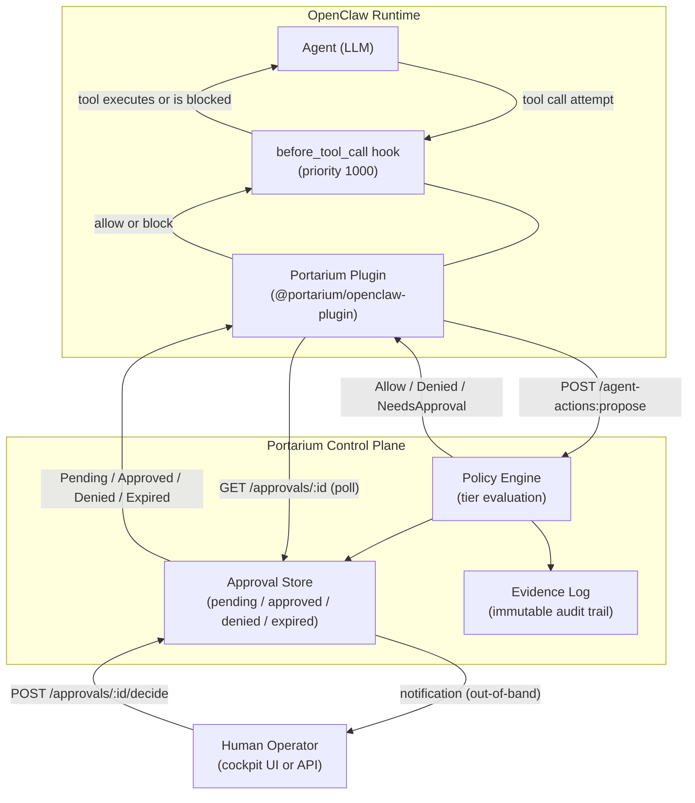
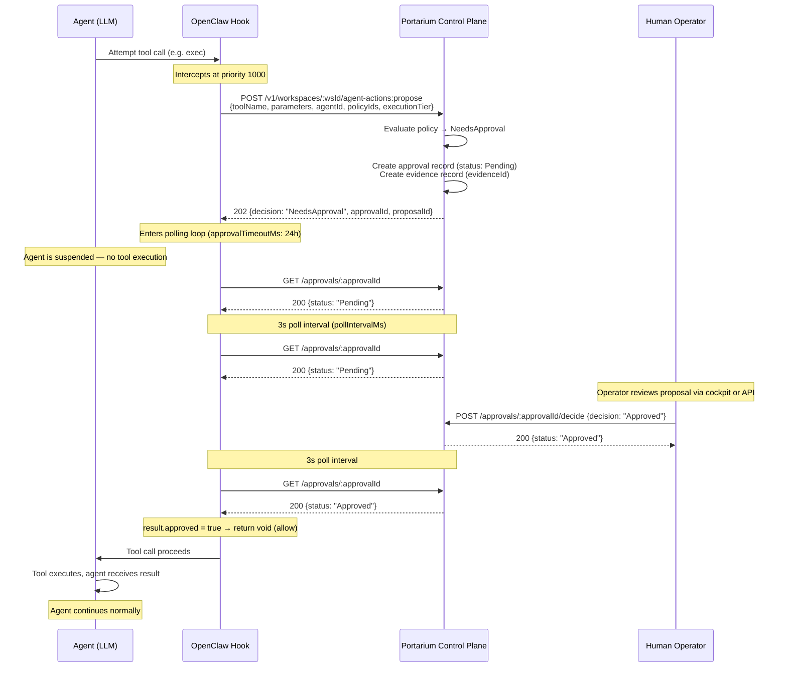
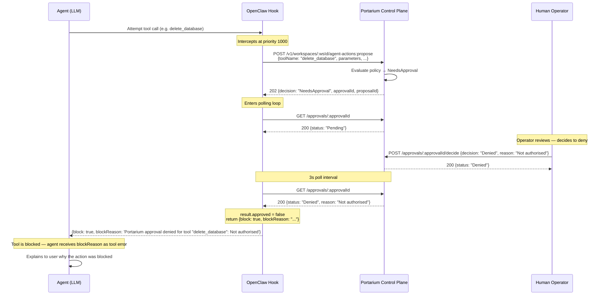
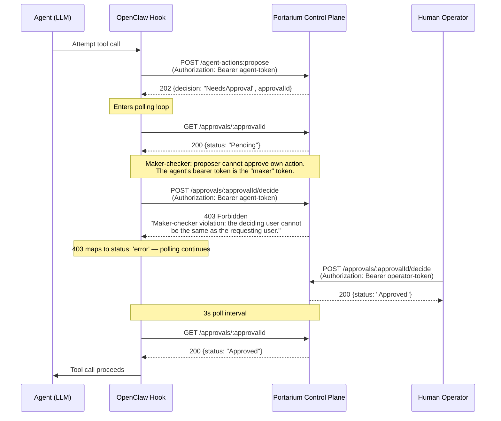
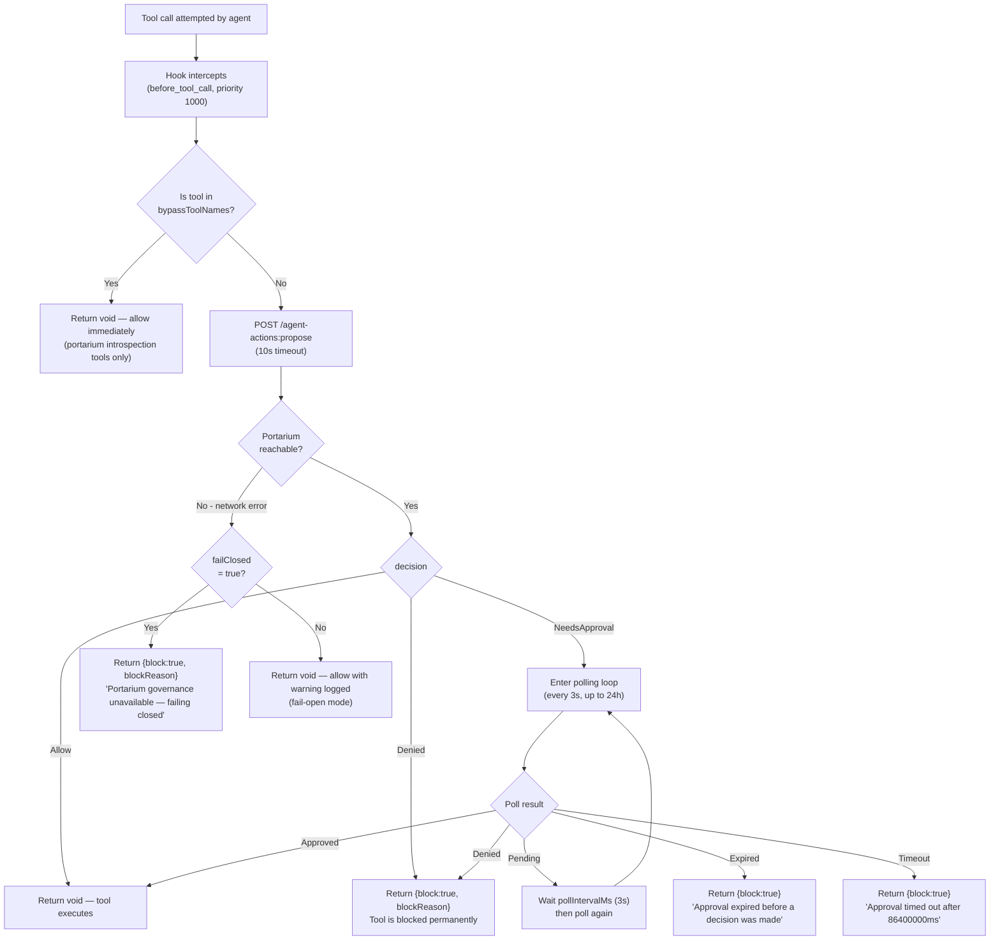

# Portarium OpenClaw Governance — Diagrams

## Diagram 1: Overall Architecture

## Diagram 2: Approval Flow Sequence

## Diagram 3: Denial Flow Sequence

## Diagram 4: Maker-Checker Enforcement

## Diagram 5: Fail-Closed vs Fail-Open

## Diagram 6: Timing Diagram (State Timeline)

```mermaid
gantt
  title Governance Approval Timeline (typical human-approval scenario)
  dateFormat x
  axisFormat %Lms

  section Agent
  Generate response and attempt tool call :0, 500
  Suspended awaiting governance decision  :500, 9000
  Tool executes and agent continues       :9020, 9100

  section Plugin / Hook
  POST propose() call (< 10ms RTT)        :500, 510
  Polling loop active (3s intervals)      :510, 9000
  Poll detects Approved status            :9000, 9020

  section Control Plane
  Policy evaluation and approval created  :500, 510
  Approval record Pending                 :510, 8500
  Approval record Approved                :8500, 9100

  section Human Operator
  Receives notification                   :1000, 1500
  Reviews proposal details                :1500, 8000
  Submits decision (Approved)             :8000, 8500
```

_Note: The timeline above uses illustrative millisecond values. In real deployments,
the "Human Operator" section spans seconds to hours depending on how quickly the
operator responds. The plugin polling overhead is bounded by `pollIntervalMs` (3000ms
default) — detection latency after approval is at most one poll interval._
